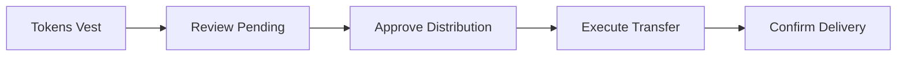

## Overview

When tokens vest according to their schedule, they become eligible for distribution. This guide covers how to process distributions and deliver tokens to recipients.

## Distribution Workflow

## Viewing Pending Distributions

<Steps>
<Step title="Navigate to Distributions">
  From the TGA dashboard, click **Distributions** in the sidebar.
</Step>

<Step title="Review Pending">
  The **Pending** tab shows all vested tokens awaiting distribution:
  - Recipient name and wallet
  - Token amount
  - Vesting date
  - Grant reference
</Step>
</Steps>

## Processing a Distribution

### Single Distribution

<Steps>
<Step title="Select Distribution">
  Click on a pending distribution to view details.
</Step>

<Step title="Verify Details">
  Confirm the recipient wallet address and token amount are correct.

  <Warning>
  Token transfers are irreversible. Always verify wallet addresses before proceeding.
  </Warning>
</Step>

<Step title="Approve and Execute">
  Click **Approve Distribution** to initiate the transfer.
</Step>

<Step title="Confirm Transaction">
  Review the transaction details and confirm to execute the on-chain transfer.
</Step>
</Steps>

### Batch Distributions

Process multiple distributions at once:

1. Navigate to **Distributions** > **Pending**
2. Select multiple distributions using checkboxes
3. Click **Batch Approve**
4. Review the batch summary
5. Confirm to execute all transfers

<Tip>
Use batch distributions for efficiency when processing monthly or quarterly vesting events.
</Tip>

## Distribution Statuses

| Status | Description |
|--------|-------------|
| **Pending** | Tokens vested and awaiting approval |
| **Approved** | Distribution approved, transfer in progress |
| **Processing** | On-chain transaction submitted |
| **Completed** | Tokens successfully delivered |
| **Failed** | Transfer failed (see error details) |

## Scheduling Automatic Distributions

Enable automatic distributions for hands-off processing:

1. Go to **Settings** > **Distribution Preferences**
2. Enable **Auto-Distribute Vested Tokens**
3. Set approval thresholds (optional)
4. Configure notification preferences

<Note>
Automatic distributions still require sufficient token balance in your distribution wallet.
</Note>

## Handling Failed Distributions

If a distribution fails:

1. Check the error message in distribution details
2. Common issues:
   - Insufficient token balance
   - Invalid wallet address
   - Network congestion
3. Resolve the issue
4. Click **Retry Distribution**

## Distribution Reports

Generate reports for accounting and compliance:

1. Navigate to **Reports** > **Distributions**
2. Select date range
3. Choose export format (CSV, PDF)
4. Download report

Reports include:
- Recipient details
- Token amounts and types
- Transaction hashes
- Distribution dates

## Next Steps

<CardGroup cols={2}>
  <Card title="Creating Grants" icon="file-plus" href="/admin/creating-grants">
    Set up new token grants
  </Card>
  <Card title="Vesting Schedules" icon="calendar" href="/admin/vesting-schedules">
    Configure vesting parameters
  </Card>
</CardGroup>
