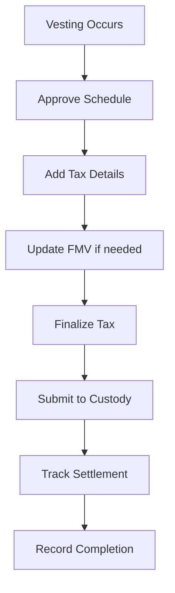

## Overview

When tokens vest, they go through a multi-step process before reaching the recipient's wallet. This guide walks through every step with API calls.



---

## Step 1: Get Pending Schedules

Check what vestings need approval:

```typescript
const { pendingSchedules } = await tokuAPI('GET',
  'getPendingSchedules?scheduleTypes=VESTING&lookaheadMonths=1'
);

for (const schedule of pendingSchedules) {
  console.log(`${schedule.recipientName}: ${schedule.units} tokens on ${schedule.vestDate}`);
}
```

---

## Step 2: Approve Schedules

Approve a batch of pending vestings:

```typescript
const scheduleIDs = pendingSchedules.map(s => s.scheduleID);

await tokuAPI('POST', 'batchApproveSchedules', {
  scheduleIDs,
  scheduleType: 'VESTING',
  performanceFactor: 1.0  // 1.0 = 100% of scheduled amount
});
```

---

## Step 3: View Tax Grouping

Get approved schedules ready for tax details:

```typescript
const { groupedSchedules } = await tokuAPI('GET',
  'getSchedulesAwaitingTaxGrouping?scheduleTypes=VESTING'
);
// Grouped by recipient for efficient tax processing
```

---

## Step 4: Add Tax Details

Choose one method per recipient group:

### Option A: No Tax (FMV tracking only)

```typescript
await tokuAPI('POST', 'addNoTaxDetails', {
  scheduleIDs: ['schedule-uuid-1', 'schedule-uuid-2'],
  scheduleType: 'VESTING',
  taxCurrencyCode: 'USD',
  fmvPerUnit: 0.50  // Fair market value per token
});
```

### Option B: Manual Tax Withholding

```typescript
await tokuAPI('POST', 'addManualTaxDetails', {
  scheduleIDs: ['schedule-uuid-1', 'schedule-uuid-2'],
  scheduleType: 'VESTING',
  taxCurrencyCode: 'USD',
  fmvPerUnit: 0.50,
  withholdingPercentage: 37  // 37% tax withholding
});
```

### Option C: Bulk Processing (mixed methods)

```typescript
await tokuAPI('POST', 'bulkDistributionProcessing', {
  items: [
    { scheduleID: 'id-1', scheduleType: 'VESTING', taxMethod: 'NO_TAX', fmvPerUnit: 0.50, taxCurrencyCode: 'USD' },
    { scheduleID: 'id-2', scheduleType: 'VESTING', taxMethod: 'MANUAL_TAX', fmvPerUnit: 0.50, taxRate: 37, taxCurrencyCode: 'USD' }
  ]
});
```

---

## Step 5: Update FMV (Optional)

If the token price changed before finalization:

```typescript
await tokuAPI('POST', 'batchUpdateFMV', {
  taxReferenceIDs: ['tax-ref-uuid-1', 'tax-ref-uuid-2'],
  scheduleType: 'VESTING',
  newFmv: 0.55  // Updated price
});
```

---

## Step 6: Finalize Tax Details

Move schedules to ready-for-settlement:

```typescript
// Check what's awaiting finalization
const { taxFinalizationGroups } = await tokuAPI('GET',
  'getSchedulesAwaitingTaxFinalization?scheduleTypes=VESTING'
);

// Finalize
await tokuAPI('POST', 'batchFinalizeTaxDetails', {
  taxReferenceIDs: taxFinalizationGroups.map(g => g.taxReferenceID),
  scheduleType: 'VESTING'
});
```

To reject and send back to tax grouping:

```typescript
await tokuAPI('POST', 'batchRejectTaxDetails', {
  taxReferenceIDs: ['tax-ref-uuid'],
  scheduleType: 'VESTING',
  reason: 'FMV needs update'
});
```

---

## Step 7: Submit to Custody

Check eligibility, then submit:

```typescript
// Check if settlement can be submitted
const { allowed, reason } = await tokuAPI('GET',
  'canSubmitScheduleSettlement?taxReferenceID=tax-ref-uuid'
);

if (allowed) {
  // Submit to Fireblocks or Anchorage
  const { transactionID } = await tokuAPI('POST', 'submitScheduleSettlement', {
    taxReferenceID: 'tax-ref-uuid',
    providerName: 'FIREBLOCKS',  // or 'ANCHORAGE'
    custodyWalletID: 'wallet-uuid'  // optional: specific vault
  });
}
```

---

## Step 8: Track Settlement Status

```typescript
const status = await tokuAPI('GET',
  'getScheduleSettlementStatus?taxReferenceID=tax-ref-uuid'
);

console.log(status);
// { hasTransaction: true, status: "PROCESSING", canSubmit: false, canRetry: false }
```

If it fails, retry:

```typescript
if (status.canRetry) {
  await tokuAPI('POST', 'retryScheduleSettlement', {
    taxReferenceID: 'tax-ref-uuid'
  });
}
```

---

## Step 9: Record Completion

After on-chain confirmation:

```typescript
await tokuAPI('POST', 'settleTaxReference', {
  taxReferenceID: 'tax-ref-uuid',
  scheduleType: 'VESTING',
  settlementDate: '2026-04-15T00:00:00.000Z',
  transactionHash: '0xabc123...',
  transactionLink: 'https://etherscan.io/tx/0xabc123...'
});
```

For batch recording:

```typescript
await tokuAPI('POST', 'batchSettleSchedules', {
  scheduleType: 'VESTING',
  settlements: [
    { taxReferenceID: 'ref-1', settlementDate: '2026-04-15T00:00:00.000Z', transactionHash: '0x...' },
    { taxReferenceID: 'ref-2', settlementDate: '2026-04-15T00:00:00.000Z', transactionHash: '0x...' }
  ]
});
```

---

## Step 10: View Settlement History

```typescript
const { settlements, total, hasMore } = await tokuAPI('GET',
  'getAllSettlementsForOrg?statusFilter=completed&page=1&pageSize=50'
);
```

---

## Error Recovery

### Revert tax details (send back to grouping)
```typescript
await tokuAPI('POST', 'revertTaxDetails', {
  taxReferenceIDs: ['tax-ref-uuid'],
  scheduleType: 'VESTING'
});
```

### Revert schedule approval (send back to pending)
```typescript
await tokuAPI('POST', 'revertScheduleApproval', {
  scheduleIDs: ['schedule-uuid'],
  scheduleType: 'VESTING'
});
```
