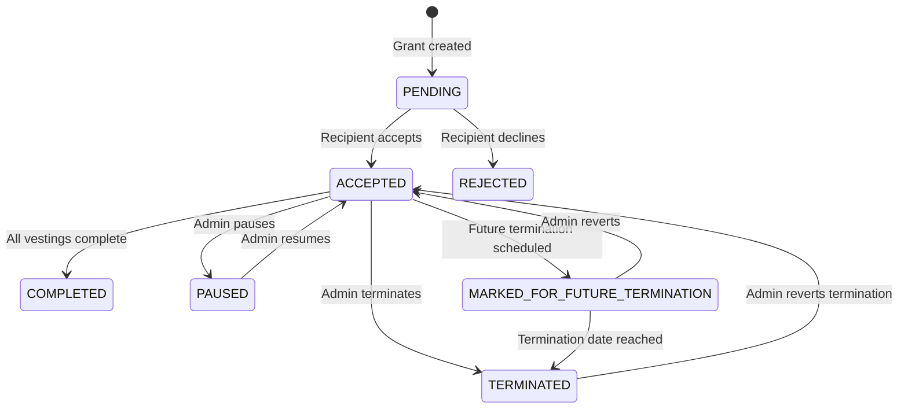

## Grant State Machine

Every grant moves through a defined set of statuses. Understanding these transitions is critical for building a reliable integration.



## Status Reference

| Status | Meaning | Can Transition To |
|--------|---------|-------------------|
| `PENDING` | Grant created, waiting for recipient to accept | `ACCEPTED`, `REJECTED` |
| `ACCEPTED` | Active and vesting | `COMPLETED`, `TERMINATED`, `PAUSED`, `MARKED_FOR_FUTURE_TERMINATION` |
| `REJECTED` | Recipient declined the grant | Terminal state |
| `COMPLETED` | All vesting periods finished | Terminal state |
| `TERMINATED` | Terminated early; future vestings cancelled | `ACCEPTED` (via revert) |
| `PAUSED` | Vesting temporarily suspended | `ACCEPTED` (via resume) |
| `MARKED_FOR_FUTURE_TERMINATION` | Termination scheduled for a future date | `TERMINATED`, `ACCEPTED` (via revert) |

---

## Creating a Grant

When you call [addSingleGrant](/api/grants/add-single-grant), the grant is created in `PENDING` status. The recipient receives an email notification.

```typescript
const grant = await tokuAPI('POST', 'addSingleGrant', {
  grantName: 'Q1 Token Grant',
  grantConfigurationID: 'config-uuid',
  grantAmount: 50000,
  recipientID: 'role-in-org-uuid',
  vestingStartDate: '2026-01-01T00:00:00.000Z',
  vestingFrequencyType: 'MONTHLY',
  vestingPeriods: 48,
  vestingCliffPeriods: 12,
  vestingCliffPercentage: 25
});
// grant.grantID = "550e8400-..."
// Status: PENDING
```

---

## Vesting Calculation

Once a grant reaches `ACCEPTED`, vestings are calculated automatically:

### Standard 4-Year Schedule (48 months, 12-month cliff, 25% cliff)

| Event | Month | Tokens | Cumulative |
|-------|-------|--------|------------|
| Grant starts | 0 | 0 | 0 |
| Cliff vests | 12 | 12,500 (25%) | 12,500 |
| Monthly vest | 13 | ~1,042 | 13,542 |
| Monthly vest | 14 | ~1,042 | 14,583 |
| ... | ... | ... | ... |
| Fully vested | 48 | ~1,042 | 50,000 |

### Monitoring Vesting Progress

```typescript
const grants = await tokuAPI('GET', 'listGrants');
for (const g of grants) {
  console.log(`${g.grantName}: ${g.percentageOfUnitsVested}% vested`);
  // "Q1 Token Grant: 16.67% vested"
}
```

The `percentageOfUnitsVested` field updates as vestings occur. Poll periodically to track progress.

---

## Termination

### Immediate Termination

Terminates the grant and recalculates vestings — only tokens vested before the termination date are retained.

```typescript
await tokuAPI('POST', 'terminateGrant', {
  grantID: 'grant-uuid',
  terminationDate: '2026-06-30T00:00:00.000Z'
});
// Status: TERMINATED
```

### Future Termination

Set a termination date in the future. The grant remains active until that date.

```typescript
await tokuAPI('POST', 'terminateGrant', {
  grantID: 'grant-uuid',
  terminationDate: '2026-12-31T00:00:00.000Z' // 6 months from now
});
// Status: MARKED_FOR_FUTURE_TERMINATION
```

### Bulk Termination (Employee Departure)

Terminate all grants when an employee leaves:

```typescript
const result = await tokuAPI('POST', 'terminateEmployeeGrants', {
  externalEmployeeID: 'EMP-001',
  terminationDate: '2026-06-30T00:00:00.000Z'
  // grantIDs omitted = terminate ALL active grants
});
// { terminatedGrantIDs: ["..."], alreadyTerminatedGrantIDs: [] }
```

Or terminate specific grants only:

```typescript
await tokuAPI('POST', 'terminateEmployeeGrants', {
  externalEmployeeID: 'EMP-001',
  terminationDate: '2026-06-30T00:00:00.000Z',
  grantIDs: ['specific-grant-uuid']
});
```

---

## Reverting a Termination

Made a mistake? Revert a termination to restore the grant and regenerate future vestings.

### Single Grant

```typescript
await tokuAPI('POST', 'revertGrantTermination', {
  grantID: 'terminated-grant-uuid'
});
// Status returns to: ACCEPTED
```

### Bulk Revert

```typescript
const result = await tokuAPI('POST', 'revertEmployeeGrants', {
  externalEmployeeID: 'EMP-001',
  grantIDs: ['grant-1', 'grant-2']
});
// { revertedGrantIDs: [...], alreadyActiveGrantIDs: [...] }
```

<Warning>
Reverting a termination regenerates all future vestings from the original schedule. Any settlements or distributions that were already processed for the terminated vestings are not affected.
</Warning>

---

## Edge Cases

### Grant with zero token amount
Fiat-only grants have `grantAmount: 0`. The `grantAmountInFiat` field holds the fiat value.

### Multiple grants per employee
An employee can have multiple independent grants, each with its own vesting schedule. Use `externalEmployeeID` or `roleInOrgID` to find all grants for an employee.

### Terminated then reverted
When a grant is reverted, it returns to `ACCEPTED` with the original vesting schedule fully restored. The termination is as if it never happened.

### Future termination then reverted
A `MARKED_FOR_FUTURE_TERMINATION` grant can be reverted before the termination date arrives. It returns to `ACCEPTED` immediately.

---

## Polling Strategy

Since webhooks are not yet available, poll for status changes:

| What to Check | Endpoint | Recommended Interval |
|---------------|----------|---------------------|
| Grant status changes | `listGrants` | Every 5 minutes |
| New vesting events | `listGrants` (check `percentageOfUnitsVested`) | Every 15 minutes |
| Wallet verification status | `getPendingWalletRequests` | Every 2 minutes |
