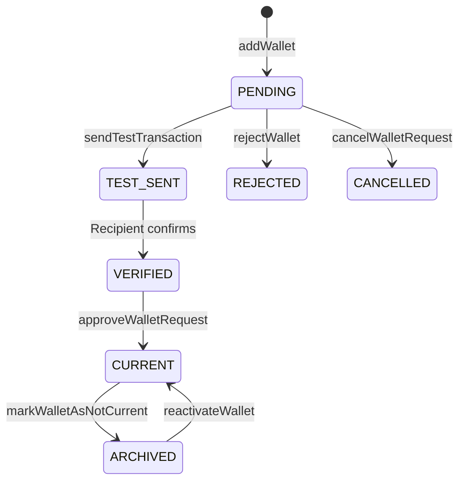

## Overview

Before tokens can be distributed, each recipient's wallet must be verified. Verification uses test transactions to confirm the recipient controls the wallet address.

## Wallet State Machine



---

## Step 1: Add a Wallet

```typescript
const wallet = await tokuAPI('POST', 'addWallet', {
  name: 'Primary ETH Wallet',
  walletAddress: '0x1234567890abcdef1234567890abcdef12345678',
  network: 'Ethereum',
  orgNetworkID: 'network-uuid',    // from getNetworksNew
  tokenTypeID: 'token-type-uuid'   // from getTokenTypesNew
});
// Returns: { walletID: "..." }
```

## Step 2: Send Test Transaction

Triggers a small token transfer to the wallet address:

```typescript
await tokuAPI('POST', 'sendTestTransaction', {
  walletID: wallet.walletID
});
```

The system sends a configurable amount of tokens. The recipient receives an email notification with a link to confirm.

## Step 3: Recipient Confirms Receipt

The recipient logs into TGA and confirms they received the test amount. From the API side, you can check the status:

```typescript
// Check for wallets pending approval
const pending = await tokuAPI('GET', 'getTestTxnApprovalPendingWallets');
```

## Step 4: Approve the Wallet

Once the recipient confirms, approve the wallet:

```typescript
await tokuAPI('POST', 'approveWalletRequest', {
  walletRequestID: 'request-uuid',
  verifiedAmount: '0.001'  // optional: amount the recipient confirmed
});
// Wallet status → CURRENT (active for distributions)
```

---

## Bulk Verification

For multiple wallets at once:

```typescript
// 1. Bulk upload wallets
await tokuAPI('POST', 'bulkUploadMultipleWallets', {
  wallets: [
    { recipientID: 'role-1', walletAddress: '0xabc...', networkName: 'Ethereum', walletType: 'Hot Wallet' },
    { recipientID: 'role-2', walletAddress: '0xdef...', networkName: 'Ethereum', walletType: 'Hot Wallet' }
  ]
});

// 2. Send test transactions in bulk
await tokuAPI('POST', 'processBulkTestTransactions', {
  walletIDs: ['wallet-1', 'wallet-2'],
  walletNetworkName: 'Ethereum'
});
```

---

## Handling Rejections

If a wallet fails verification:

```typescript
// Reject the wallet
await tokuAPI('POST', 'rejectWalletRequest', {
  walletRequestID: 'request-uuid'
});
// Status → REJECTED
```

The recipient can then submit a new wallet address and restart the verification process.

---

## Deactivating & Reactivating Wallets

```typescript
// Deactivate (move to historical)
await tokuAPI('POST', 'markWalletAsNotCurrent', {
  walletID: 'wallet-uuid'
});
// Status → ARCHIVED

// Reactivate
await tokuAPI('POST', 'reactivateWallet', {
  walletID: 'wallet-uuid'
});
// Status → CURRENT
```

---

## Querying Wallet Status

| Endpoint | Returns |
|----------|---------|
| `getAllWallets` | All wallets across all recipients |
| `getEmployeeWallets` | Current wallets for one employee |
| `getEmployeeHistoricalWallets` | Archived wallets for one employee |
| `getPendingWallets` | Wallets awaiting verification |
| `getPendingWalletRequests` | All pending wallet requests |
| `getTestTxnApprovalPendingWallets` | Wallets with confirmed test txns awaiting admin approval |
| `getVerifiedWalletTestRequests` | Verified wallet requests |
| `getPendingWalletTestRequests` | Unconfirmed test transactions |

---

## Resending Test Transaction Email

If a recipient didn't receive the notification:

```typescript
await tokuAPI('POST', 'resendTestTxnEmailToWalletOwner', {
  walletID: 'wallet-uuid'
});
```
