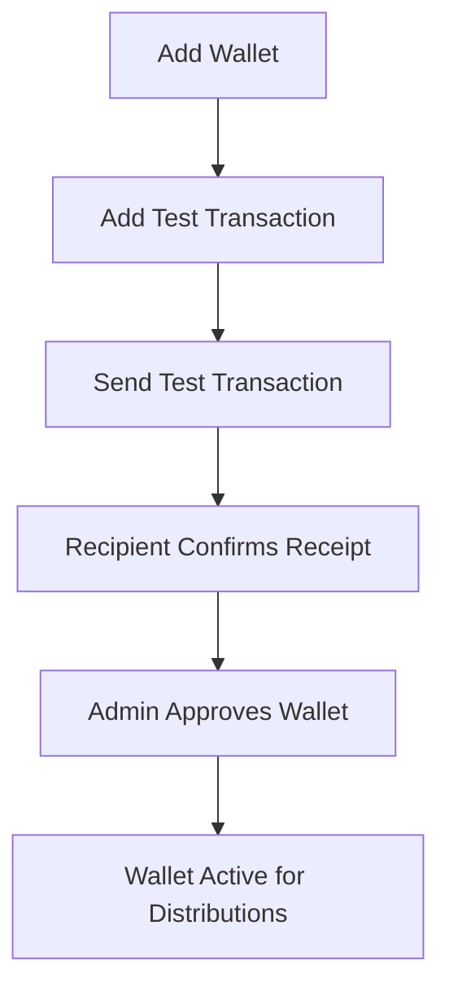

## Overview

The Wallets API manages blockchain wallets that receive token distributions. Before tokens can be distributed, wallets must be added, verified via test transactions, and approved by an administrator.

---

## List All Wallets

Retrieves all wallets across all recipients in your organization.

```
GET /api/tokuApi/v1/getAllWallets
```

**Example:**
```bash
curl https://app.toku.com/api/tokuApi/v1/getAllWallets \
  -H "Authorization: Bearer YOUR_API_TOKEN" \
  -H "x-role-type: CLIENT_ORG_ADMIN"
```

---

## Get Current Wallet

Retrieves the current active wallet for a specific user.

```
GET /api/tokuApi/v1/getCurrentWallet
```

**Query Parameters:**
| Parameter | Type | Required | Description |
|-----------|------|----------|-------------|
| `roleInOrgID` | uuid | Yes | The user's role-in-org identifier |

**Example:**
```bash
curl "https://app.toku.com/api/tokuApi/v1/getCurrentWallet?roleInOrgID=ROLE_UUID" \
  -H "Authorization: Bearer YOUR_API_TOKEN" \
  -H "x-role-type: CLIENT_ORG_ADMIN"
```

---

## Get User Current Wallets

Retrieves all current wallets for users in the organization.

```
GET /api/tokuApi/v1/getUserCurrentWallets
```

---

## Get Historical Wallets

Retrieves historical (deactivated) wallets for a user.

```
GET /api/tokuApi/v1/getHistoricalWallets
```

---

## Get All Historical Wallets

Retrieves all historical wallets across the organization.

```
GET /api/tokuApi/v1/getAllHistoricalWallets
```

---

## Get Employee Wallets

Retrieves current wallets for a specific employee.

```
GET /api/tokuApi/v1/getEmployeeWallets
```

---

## Get Employee Historical Wallets

Retrieves historical wallets for a specific employee.

```
GET /api/tokuApi/v1/getEmployeeHistoricalWallets
```

---

## Get All Wallets For All Recipients

Retrieves wallets for all grant recipients in the organization.

```
GET /api/tokuApi/v1/getAllWalletsForAllRecipients
```

---

## Get Pending Wallets

Retrieves wallets awaiting approval.

```
GET /api/tokuApi/v1/getPendingWallets
```

---

## Get Pending Wallet Request

Retrieves a specific pending wallet request for a user.

```
GET /api/tokuApi/v1/getPendingWalletRequest
```

---

## Get Pending Wallet Requests

Retrieves all pending wallet requests in the organization.

```
GET /api/tokuApi/v1/getPendingWalletRequests
```

---

## Get Wallet Types

Retrieves the wallet types configured for your organization.

```
GET /api/tokuApi/v1/getWalletTypes
```

**Example:**
```bash
curl https://app.toku.com/api/tokuApi/v1/getWalletTypes \
  -H "Authorization: Bearer YOUR_API_TOKEN" \
  -H "x-role-type: CLIENT_ORG_ADMIN"
```

---

## Get Token Types

Retrieves the token types configured for your organization.

```
GET /api/tokuApi/v1/getTokenTypes
```

---

## Get Token Types (v2)

Retrieves token types using the new API format.

```
GET /api/tokuApi/v1/getTokenTypesNew
```

---

## Get Networks

Retrieves the blockchain networks configured for your organization.

```
GET /api/tokuApi/v1/getNetworks
```

---

## Get Networks (v2)

Retrieves networks using the new API format.

```
GET /api/tokuApi/v1/getNetworksNew
```

---

## Get Organization Wallet Info

Retrieves wallet configuration details for the organization (custody setup, supported networks, etc.).

```
GET /api/tokuApi/v1/getOrgWalletInfo
```

---

## Get Wallet References for Grants

Retrieves wallet references linked to all grants.

```
GET /api/tokuApi/v1/getAllWalletReferencesForAllGrants
```

---

## Get Wallet References with Networks

Retrieves wallet references with their associated network information.

```
GET /api/tokuApi/v1/getWalletReferencesWithNetworks
```

---

## Get Test Transaction Approval Pending Wallets

Retrieves wallets where test transactions have been sent and are awaiting admin approval.

```
GET /api/tokuApi/v1/getTestTxnApprovalPendingWallets
```

---

## Get Verified Wallet Test Requests

Retrieves wallet requests where the test transaction has been verified.

```
GET /api/tokuApi/v1/getVerifiedWalletTestRequests
```

---

## Get Pending Wallet Test Requests

Retrieves wallet requests where the test transaction is still pending.

```
GET /api/tokuApi/v1/getPendingWalletTestRequests
```

---

## Add Wallet

Adds a new wallet for a recipient.

```
POST /api/tokuApi/v1/addWallet
```

**Request Body:**
| Field | Type | Required | Description |
|-------|------|----------|-------------|
| `address` | string | Yes | Blockchain wallet address |
| `networkID` | uuid | Yes | Network identifier (from `getNetworks`) |
| `walletTypeID` | uuid | Yes | Wallet type identifier (from `getWalletTypes`) |
| `roleInOrgID` | uuid | Yes | Recipient's role-in-org ID |

**Example:**
```bash
curl -X POST https://app.toku.com/api/tokuApi/v1/addWallet \
  -H "Authorization: Bearer YOUR_API_TOKEN" \
  -H "x-role-type: CLIENT_ORG_ADMIN" \
  -H "Content-Type: application/json" \
  -d '{
    "address": "0x1234567890abcdef1234567890abcdef12345678",
    "networkID": "network-uuid",
    "walletTypeID": "wallet-type-uuid",
    "roleInOrgID": "role-in-org-uuid"
  }'
```

---

## Update Wallet

Updates an existing wallet.

```
POST /api/tokuApi/v1/updateWallet
PUT /api/tokuApi/v1/updateWallet
```

Both POST and PUT methods are supported.

---

## Mark Wallet As Not Current

Deactivates a wallet (moves it to historical).

```
POST /api/tokuApi/v1/markWalletAsNotCurrent
```

---

## Reactivate Wallet

Reactivates a previously deactivated wallet.

```
POST /api/tokuApi/v1/reactivateWallet
```

---

## Approve Wallet

Approves a wallet after verification.

```
POST /api/tokuApi/v1/approveWallet
```

---

## Approve Wallet Request

Approves a pending wallet request.

```
POST /api/tokuApi/v1/approveWalletRequest
```

---

## Reject Wallet

Rejects a wallet submission.

```
POST /api/tokuApi/v1/rejectWallet
```

---

## Reject Wallet Request

Rejects a pending wallet request.

```
POST /api/tokuApi/v1/rejectWalletRequest
```

---

## Cancel Wallet Request

Cancels a pending wallet request.

```
POST /api/tokuApi/v1/cancelWalletRequest
```

---

## Bulk Upload Wallets

Uploads multiple wallets in a single request.

```
POST /api/tokuApi/v1/bulkUploadMultipleWallets
```

**Request Body:** Array of wallet objects, each containing `address`, `networkID`, `walletTypeID`, and `roleInOrgID`.

---

## Add Test Transaction

Creates a test transaction for wallet verification.

```
POST /api/tokuApi/v1/addTestTransaction
```

---

## Send Test Transaction

Sends a test transaction to verify wallet ownership.

```
POST /api/tokuApi/v1/sendTestTransaction
```

---

## Add Test Transaction to Wallet Request

Attaches a test transaction to a wallet request.

```
POST /api/tokuApi/v1/addTestTxnToWallet
```

---

## Resend Test Transaction Email

Resends the test transaction notification email to the wallet owner.

```
POST /api/tokuApi/v1/resendTestTxnEmailToWalletOwner
```

---

## Process Bulk Test Transactions

Processes test transactions for multiple wallets.

```
POST /api/tokuApi/v1/processBulkTestTransactions
```

---

## Configure Wallet Distribution for Grant

Sets how tokens should be distributed across a recipient's wallets for a specific grant.

```
POST /api/tokuApi/v1/configureWalletRefsDistributionForGrant
```

---

## Set Token Wallet Distribution

Configures token-level wallet distribution settings.

```
POST /api/tokuApi/v1/setTokenWalletRefsDistribution
```

---

## Update Test Transaction Configuration

Updates the test transaction configuration settings.

```
PUT /api/tokuApi/v1/updateTestTransactionConfiguration
```

---

## Delete Wallet Type

Removes a wallet type from the organization.

```
DELETE /api/tokuApi/v1/deleteWalletType
```

---

## Delete Network

Removes a network from the organization.

```
DELETE /api/tokuApi/v1/deleteNetwork
```

---

## Wallet Verification Flow

The typical wallet verification flow is:



1. **Add a wallet** using `addWallet`
2. **Create a test transaction** using `addTestTransaction`
3. **Send the test transaction** using `sendTestTransaction`
4. **Recipient confirms** they received the test amount
5. **Admin approves** using `approveWallet` or `approveWalletRequest`
6. Wallet is now eligible for token distributions
