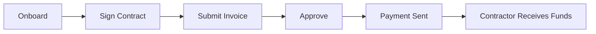

## What is Toku Contractor?

Toku Contractor is the platform for managing global contractor relationships. It helps organizations:

- Onboard contractors in 150+ countries
- Manage contracts and compliance
- Process payments in multiple currencies
- Handle invoicing and approvals
- Maintain contractor records and documentation

---

## Who Uses Toku Contractor?

### Clients (Administrators)
Organization admins use Toku Contractor to onboard contractors, manage engagements, and process payments.

<Card title="Client Guides" icon="user-gear" href="/contractor/client/onboarding-contractors">
  Learn how to manage contractors
</Card>

### Contractors
Contractors use Toku to submit invoices, track payments, and manage their profile.

<Card title="Contractor Guides" icon="user" href="/contractor/user/getting-started">
  Learn how to use the contractor portal
</Card>

---

## How It Works



---

## Key Features

<CardGroup cols={2}>
  <Card title="Global Onboarding" icon="globe">
    Onboard contractors in 150+ countries with compliant contracts.
  </Card>
  <Card title="Invoicing" icon="file-invoice">
    Contractors submit invoices, admins review and approve.
  </Card>
  <Card title="Flexible Payments" icon="money-bill-wave">
    Pay in local currency, USD, crypto, or stablecoins.
  </Card>
  <Card title="Compliance" icon="shield-check">
    Built-in contractor classification and compliance checks.
  </Card>
  <Card title="Contract Management" icon="file-signature">
    Create, sign, and store contractor agreements.
  </Card>
  <Card title="Expense Tracking" icon="receipt">
    Track and reimburse contractor expenses.
  </Card>
</CardGroup>

---

## Example: Paying a Contractor in Singapore

Acme Corp hires Wei, a UX designer based in Singapore, for a 6-month engagement at $8,000/month.

**1. Admin onboards Wei.** In Toku Contractor, the admin adds Wei's details, selects Singapore as the country, and generates a compliant contractor agreement. Wei signs electronically.

**2. Wei submits a monthly invoice.** At the end of the month, Wei logs into the contractor portal and submits an invoice for $8,000 with a description of work completed.

**3. Admin reviews and approves.** The finance team reviews the invoice in the Payments dashboard and clicks "Approve." Wei has elected to receive payment via bank transfer in SGD.

```json
{
  "invoiceID": "inv_3Rw7nQ",
  "contractor": "Wei Tan",
  "country": "Singapore",
  "amount": 8000.00,
  "currency": "USD",
  "paymentMethod": "Bank Transfer",
  "localCurrency": "SGD",
  "localAmount": 10720.00,
  "status": "Completed",
  "paidDate": "2025-02-03"
}
```

**4. Wei receives payment** in SGD directly to her bank account. Toku handles the currency conversion and ensures all tax documentation is properly filed for cross-border compliance.

---

## Payment Methods

| Method | Description |
|--------|-------------|
| **Bank Transfer** | Direct deposit to contractor's bank account |
| **PayPal** | Instant transfers via PayPal |
| **Crypto** | Payment in cryptocurrency |
| **Stablecoin** | Payment in USDC, USDT, or other stablecoins |

---

## Getting Started

<CardGroup cols={2}>
  <Card title="Onboard Contractors" icon="user-plus" href="/contractor/client/onboarding-contractors">
    Add your first contractor
  </Card>
  <Card title="Contractor Portal" icon="user" href="/contractor/user/getting-started">
    For contractors: get started
  </Card>
</CardGroup>
