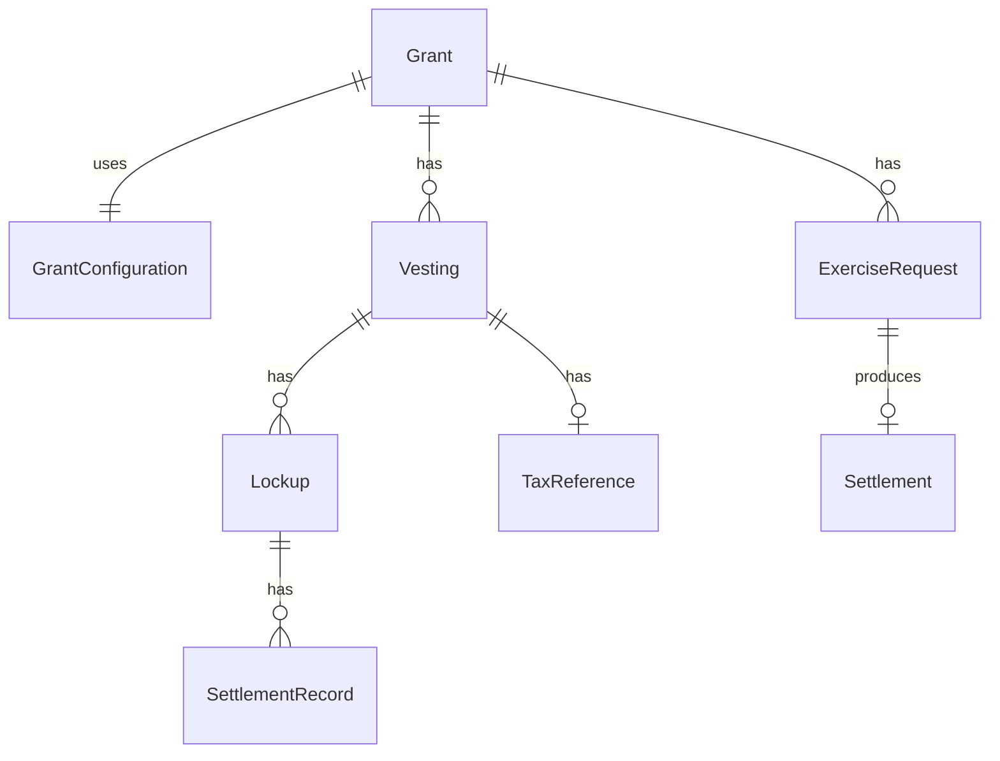

## Overview

The grants data model represents token compensation agreements, vesting schedules, and exercise activities.

## Grant

Core grant entity representing a token compensation agreement:

```typescript
model Grant {
    grantID: string @id
    grantName: string
    grantDate: Date
    numberOfUnits: Decimal
    vestingStartDate: Date

    // Configuration
    grantConfigurationID: string
    compensationType: 'TOKEN' | 'FIAT'

    // For exercisable grants
    strikePrice?: Decimal
    strikeCurrency?: string

    // Status
    status: GrantStatus

    // Relationships
    roleInOrgID: string
    roleInOrg: RoleInOrg
    grantConfiguration: GrantConfiguration
    vestings: Vesting[]
    exerciseRequests: ExerciseRequest[]
    walletReferences: WalletReference[]

    // Timestamps
    createdAt: DateTime
    updatedAt: DateTime
}
```

### Grant Status

```typescript
enum GrantStatus {
    PENDING      // Created, awaiting acceptance
    ACCEPTED     // Recipient accepted
    REJECTED     // Recipient declined
    COMPLETED    // All vested/settled
    TERMINATED   // Early termination
    PAUSED       // Vesting paused
}
```

## Grant Configuration (Grant Type)

Template defining grant behavior:

```typescript
model GrantConfiguration {
    grantConfigurationID: string @id
    orgID: string
    name: string
    kind: GrantConfigurationKind

    // Vesting
    vestingFrequencyType: VestingFrequency
    vestingPeriods: number
    vestingCliffPeriods: number
    vestingCliffPercentage?: Decimal

    // Exercise
    isExercisable: boolean
    useStrike: boolean
    exerciseFormFile?: string
    signingTabs?: Json

    // Settlement
    grantAssetType: 'TOKEN' | 'FIAT'
    isCashCompensation: boolean
    redemptionHold?: number
    redemptionCap?: Decimal

    // Relationships
    grants: Grant[]
}
```

### Grant Configuration Kind

```typescript
enum GrantConfigurationKind {
    RTU           // Restricted Token Units
    RTA           // Restricted Token Awards
    TOKEN_BONUS   // Token Bonus
    TPA           // Token Purchase Agreement
    OPTION        // Token Option
    WARRANT       // Warrant
    LTIP          // Long-Term Incentive Plan
    TSA           // Token Sale Agreement
    FTIA          // Future Token Interest Agreement
    PHANTOMUNITS  // Phantom Units
    FOUNDERROUND  // Founder Round
    FTI           // Future Token Interest
    TOKENSUB      // Token Subscription
    PERFORMANCE   // Performance Grant
}
```

## Vesting

Individual vesting event within a grant:

```typescript
model Vesting {
    vestingID: string @id
    grantID: string
    sequence: number

    // Amounts
    vestedUnits: Decimal
    accruedUnits: Decimal

    // Timing
    vestingDate: Date

    // Status
    status: VestingStatus

    // Settlement
    settlementID?: string
    taxReferenceID?: string

    // Relationships
    grant: Grant
    settlement?: Settlement
    taxReference?: TaxReference

    // Timestamps
    createdAt: DateTime
    updatedAt: DateTime
}
```

### Vesting Status

```typescript
enum VestingStatus {
    PENDING     // Scheduled, not yet vested
    VESTED      // Tokens available
    EXERCISED   // For options: exercised
    SETTLED     // Tokens delivered
    CANCELLED   // Vesting cancelled
    WITHHELD    // Held for tax
}
```

## Exercise Request

For exercisable grants (OPTIONS, WARRANTS, etc.):

```typescript
model ExerciseRequest {
    exerciseRequestID: string @id
    grantID: string
    roleInOrgID: string

    // Exercise details
    numberOfUnitsToExercise: Decimal
    exercisePrice: Decimal
    exerciseDate: Date

    // Status
    status: ExerciseRequestStatus

    // Documentation
    documentID?: string

    // Settlement
    settlementMethod: 'TOKEN' | 'CASH'

    // Relationships
    grant: Grant
    roleInOrg: RoleInOrg

    // Timestamps
    createdAt: DateTime
    updatedAt: DateTime
}
```

### Exercise Request Status

```typescript
enum ExerciseRequestStatus {
    PENDING_SIGNATURE      // Awaiting DocuSign
    PENDING_TOKU_ACCEPTANCE // Signed, awaiting review
    APPROVED              // Approved, pending settlement
    REJECTED              // Denied
    COMPLETED             // Tokens delivered
    CANCELLED             // Cancelled
}
```

## Lockup

Post-vesting holding period:

```typescript
model Lockup {
    lockupID: string @id
    vestingID: string
    roleInOrgID: string

    // Amounts
    unlockUnits: Decimal

    // Timing
    unlockDate: Date

    // Status
    status: LockupStatus

    // Relationships
    vesting: Vesting
    taxReference?: TaxReference
    settlementRecords: SettlementRecord[]
}
```

## Tax Reference

Tax withholding for vesting events:

```typescript
model TaxReference {
    taxReferenceID: string @id
    vestingID?: string
    roleInOrgID: string

    // Withholding
    unitsToWithhold: Decimal
    unitsToDistribute: Decimal
    totalUnits: Decimal

    // Valuation
    fmvAtVesting: Decimal
    taxCurrency: string

    // Status
    status: 'PENDING' | 'APPROVED' | 'REJECTED' | 'COMPLETED'

    // Relationships
    vesting?: Vesting
    lockups: Lockup[]
    fireblocksTransactions: FireblocksTransaction[]
}
```

## Entity Relationships



## Common Queries

### Get Grant with Vestings

```typescript
const grant = await prisma.grant.findUnique({
    where: { grantID },
    include: {
        grantConfiguration: true,
        vestings: {
            orderBy: { sequence: 'asc' }
        },
        roleInOrg: {
            include: { person: true }
        }
    }
});
```

### Get Pending Exercises

```typescript
const exercises = await prisma.exerciseRequest.findMany({
    where: {
        status: {
            in: ['PENDING_SIGNATURE', 'PENDING_TOKU_ACCEPTANCE']
        }
    },
    include: {
        grant: true,
        roleInOrg: { include: { person: true } }
    }
});
```

### Get Upcoming Vestings

```typescript
const vestings = await prisma.vesting.findMany({
    where: {
        status: 'PENDING',
        vestingDate: {
            lte: addDays(new Date(), 30)
        }
    },
    include: {
        grant: {
            include: { grantConfiguration: true }
        }
    }
});
```
