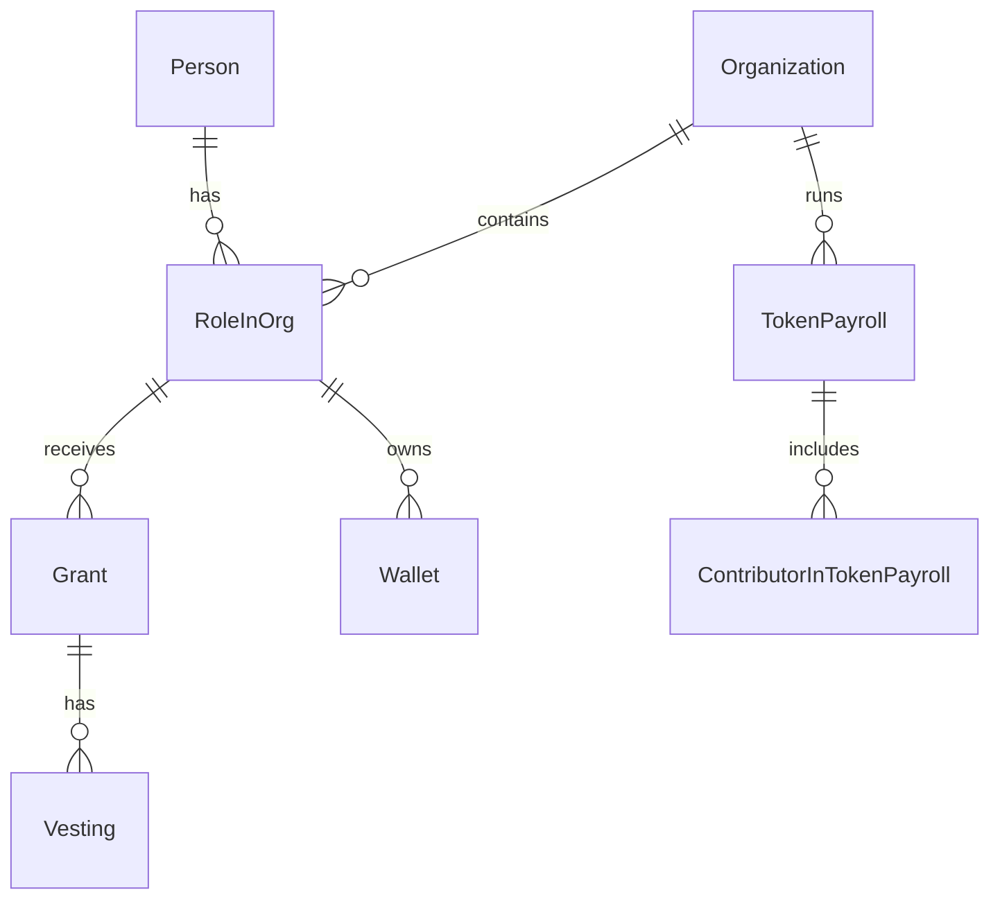

## Overview

TGA uses PostgreSQL with Prisma ORM, implementing a multi-schema architecture for data isolation and organization. This guide provides an overview of the data model structure.

## Database Architecture

### Multi-Schema Design

TGA uses multiple PostgreSQL schemas for logical separation:

| Schema | Purpose |
|--------|---------|
| `person_owned` | Person-scoped data (users, preferences) |
| `org_owned` | Organization-scoped data (grants, settings) |
| `role_in_org_owned` | Role-specific data (wallets, vestings) |
| `workdao` | Legacy payroll system data |
| `payroll` | Payroll processing data |
| `tax_engine` | Tax calculation data |
| `authentication` | Auth and session data |
| `global` | Shared reference data |

### Schema Configuration

```prisma
datasource db {
  provider = "postgresql"
  url      = env("DATABASE_URL")
  schemas  = [
    "workdao",
    "payroll",
    "tax_engine",
    "authentication",
    "person_owned",
    "org_owned",
    "role_in_org_owned",
    "global"
  ]
}
```

## Core Entity Relationships



## Key Entities

### Person

Central identity entity:

```typescript
model Person {
    personID: string
    givenName: string
    familyName: string
    email: string

    // Relationships
    users: User[]           // Login accounts
    rolesInOrg: RoleInOrg[] // Org memberships
}
```

### Organization

Tenant container:

```typescript
model Organization {
    orgID: string
    name: string
    tokenTicker: string

    // Relationships
    rolesInOrg: RoleInOrg[]
    grants: Grant[]
    tokenPayrolls: TokenPayroll[]
    integrations: Integration[]
}
```

### RoleInOrg

Links person to organization with role:

```typescript
model RoleInOrg {
    roleInOrgID: string
    personID: string
    orgID: string
    role: Role              // USER, INVESTOR, ADMIN, etc.

    // Relationships
    grants: Grant[]
    wallets: Wallet[]
    vestings: Vesting[]
}
```

## Data Ownership Patterns

### Person-Owned Data

Data belonging to individuals across organizations:

- User preferences
- Authentication tokens
- Personal documents

### Org-Owned Data

Data belonging to organizations:

- Grant configurations
- Payroll settings
- Integration credentials

### Role-Owned Data

Data specific to a person's role in an organization:

- Grants received
- Wallets configured
- Vesting records
- Tax references

## Prisma Client Extension

TGA uses Prisma client extensions for automatic org-scoping:

```typescript
const authorisedPrisma = prisma.$extends({
    query: {
        $allModels: {
            async findMany({ model, args, query }) {
                // Automatically filter by orgID
                if (isOrgOwnedModel(model)) {
                    args.where = { ...args.where, orgID: credentials.orgID };
                }
                return query(args);
            }
        }
    }
});
```

## ID Conventions

All entities use UUIDs:

```typescript
model Example {
    exampleID: string @id @default(uuid())
    // Snake case in database
    @@map("example")
}
```

### Mapping Convention

| Prisma | Database |
|--------|----------|
| `exampleID` | `example_id` |
| `createdAt` | `created_at` |
| `updatedAt` | `updated_at` |

## Timestamps

Standard timestamp fields:

```typescript
model Example {
    createdAt: DateTime @default(now())
    updatedAt: DateTime @updatedAt
}
```

## Soft Deletes

Some entities use soft deletes:

```typescript
model Example {
    isArchived: boolean @default(false)
    archivedAt: DateTime?
}
```

## Related Guides

- **[Grants Data Model](/data-models/grants)** - Grant, Vesting, Exercise
- **[Payroll Data Model](/data-models/payroll)** - TokenPayroll, Settlement
- **[Wallets Data Model](/data-models/wallets)** - Wallet, WalletReference
- **[Users Data Model](/data-models/users)** - Person, User, RoleInOrg
