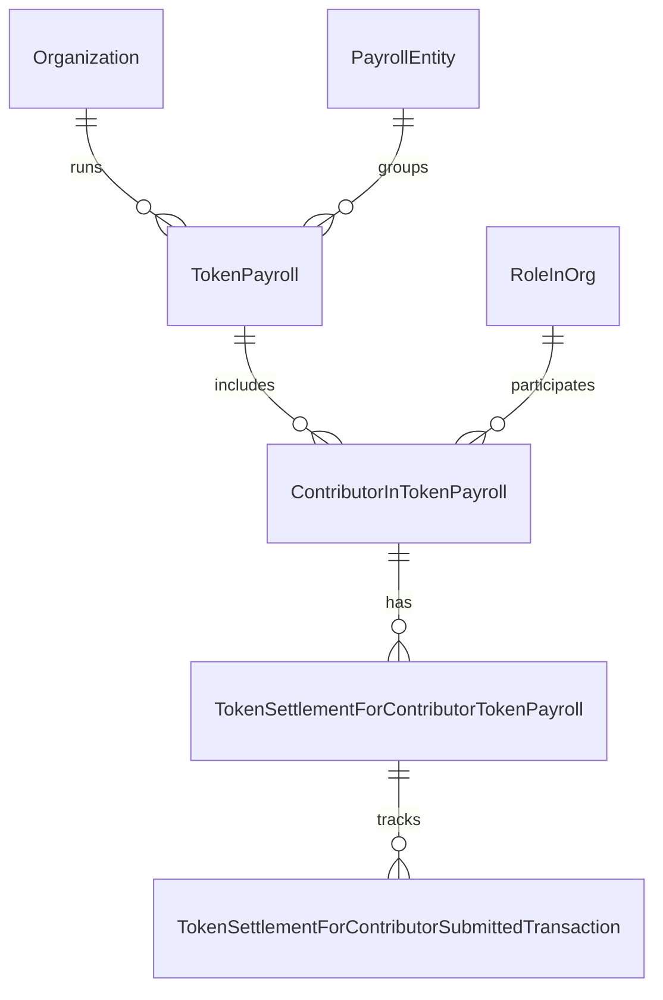

## Overview

The payroll data model represents token compensation payroll runs, contributors, and settlement records.

## Token Payroll

Represents a payroll run:

```typescript
model TokenPayroll {
    tokenPayrollID: string @id
    orgID: string
    name?: string

    // Period
    payPeriodStart: Date
    payPeriodEnd: Date
    payDate: Date

    // Configuration
    fiatCurrency: string
    type: PayrollType
    state: TgaPayrollState

    // Token selection
    selectedTokenTypeID?: string
    selectedTokenType?: TokenType

    // HRIS integration
    externalPayrollID?: string
    payrollSyncedSource?: string
    importedData?: Json

    // Completion flags
    isTokenPayrollComplete: boolean
    isFiatPayrollComplete: boolean
    fundingEmailSent: boolean

    // Relationships
    org: Organization
    payrollEntity?: PayrollEntity
    contributorsInTokenPayroll: ContributorInTokenPayroll[]

    // Timestamps
    createdAt: DateTime
    updatedAt: DateTime
}
```

### Payroll Type

```typescript
enum PayrollType {
    ON_CYCLE        // Regular scheduled payroll
    OFF_CYCLE       // Ad-hoc payroll
    INVOICE_PAYMENT // Contractor invoice settlements
}
```

### Payroll State

```typescript
enum TgaPayrollState {
    DRAFT       // Being prepared
    LOCKED      // Past cutoff, no changes
    IN_PROGRESS // Settlements in progress
    COMPLETED   // All settled
}
```

## Contributor In Token Payroll

Employee/contractor in a payroll run:

```typescript
model ContributorInTokenPayroll {
    contributorInTokenPayrollID: string @id
    tokenPayrollID: string
    roleInOrgID: string

    // Amounts
    totalPayrollAmount: Decimal
    totalDeductionAmount: Decimal
    netPayrollAmount: Decimal
    currency: string

    // Token override
    tokenTypeID?: string
    tokenType?: TokenType

    // Relationships
    tokenPayroll: TokenPayroll
    roleInOrg: RoleInOrg
    settlementOrders: TokenSettlementForContributorTokenPayroll[]

    // Timestamps
    createdAt: DateTime
    updatedAt: DateTime
}
```

## Token Settlement

Settlement record for a contributor:

```typescript
model TokenSettlementForContributorTokenPayroll {
    settlementOrderForContributorTokenPayrollID: string @id
    contributorInTokenPayrollID: string
    roleInOrgID: string

    // Token details
    tokenID: string
    address: string
    tokenAmount: Decimal

    // Fiat reference
    fiatAmount: Decimal
    currencyCode: string

    // Exchange rate
    exchangeRate: Decimal
    exchangeRateSource?: ExchangeRateSource
    exchangeRateRefetchedAt?: DateTime

    // Transaction
    transactionHash?: string
    transactionLink?: string

    // Status
    dateCreated: DateTime
    dateFulfilled?: DateTime
    deductionsPosted: boolean
    exportedAt?: DateTime

    // Invoice link (if invoice payment)
    invoicePaymentID?: string

    // Relationships
    contributorInTokenPayroll: ContributorInTokenPayroll
    token: TokenType
    submittedTransactions: TokenSettlementForContributorSubmittedTransaction[]
}
```

### Exchange Rate Source

```typescript
enum ExchangeRateSource {
    COINMARKETCAP
    ORACLE_ERP
    MANUAL
}
```

## Submitted Transaction

Tracks transaction submission to custody providers:

```typescript
model TokenSettlementForContributorSubmittedTransaction {
    tokenSettlementForContributorSubmittedTransactionID: string @id
    settlementOrderForContributorTokenPayrollID: string
    type: TokenSettlementSubmittedTransactionType
    status: SubmittedTransactionStatus

    // Links
    linkToTransaction?: string

    // Timestamps
    aprovedOnDate?: DateTime
    rejectedOnDate?: DateTime
    createdAt: DateTime

    // Provider-specific
    coinbasePrimeSubmittedTransaction?: CoinbasePrimeSubmittedTransaction
    squadsSubmittedTransaction?: SquadsSubmittedTransaction
    fireblocksSubmittedTransaction?: FireblocksSubmittedTransaction
}
```

### Transaction Type

```typescript
enum TokenSettlementSubmittedTransactionType {
    COINBASE_PRIME
    SQUADS
    FIREBLOCKS
    MANUAL
}
```

## Payroll Entity

Legal entity for payroll grouping:

```typescript
model PayrollEntity {
    payrollEntityID: string @id
    orgID: string
    name: string
    country: string
    reportingCurrency: string

    // Relationships
    tokenPayrolls: TokenPayroll[]
}
```

## Payroll Settings

Organization payroll configuration:

```typescript
model PayrollSettings {
    payrollSettingsID: string @id
    orgID: string

    // Cutoff
    payrollCutOffDaysBeforeApprovalDate: number

    // Minimum wage
    minimumFiatPayInUSD?: Decimal

    // Relationships
    org: Organization
}
```

## Entity Relationships



## Common Queries

### Get Payroll with Contributors

```typescript
const payroll = await prisma.tokenPayroll.findUnique({
    where: { tokenPayrollID },
    include: {
        contributorsInTokenPayroll: {
            include: {
                roleInOrg: {
                    include: { person: true }
                },
                settlementOrders: {
                    include: { token: true }
                }
            }
        },
        selectedTokenType: true
    }
});
```

### Get Pending Settlements

```typescript
const pendingSettlements = await prisma.tokenSettlementForContributorTokenPayroll.findMany({
    where: {
        dateFulfilled: null,
        transactionHash: null
    },
    include: {
        contributorInTokenPayroll: {
            include: { tokenPayroll: true }
        },
        token: { include: { Network: true } }
    }
});
```

### Get Payrolls by State

```typescript
const draftPayrolls = await prisma.tokenPayroll.findMany({
    where: {
        state: TgaPayrollState.DRAFT,
        payDate: {
            gte: new Date()
        }
    },
    orderBy: { payDate: 'asc' }
});
```
