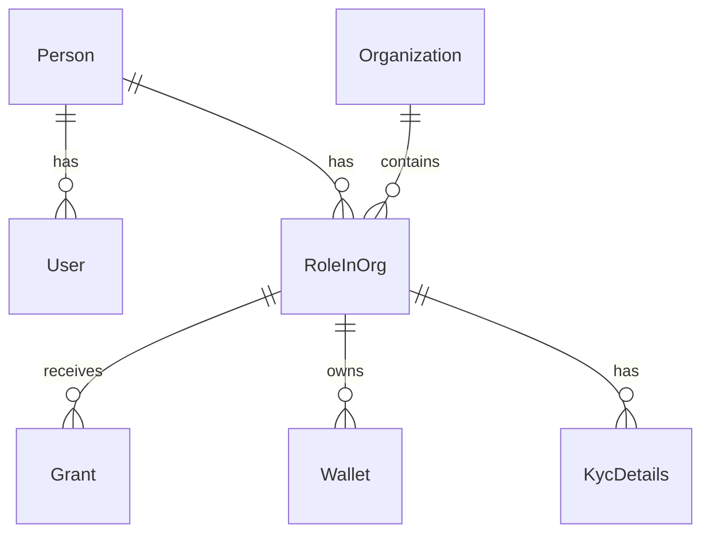

## Overview

The users data model represents people, their authentication accounts, organization memberships, and role-based access.

## Person

Central identity entity:

```typescript
model Person {
    personID: string @id
    givenName: string
    familyName: string
    email?: string
    phone?: string

    // Demographics (optional)
    dateOfBirth?: Date
    nationality?: string
    taxResidency?: string

    // Relationships
    users: User[]
    rolesInOrg: RoleInOrg[]

    // Timestamps
    createdAt: DateTime
    updatedAt: DateTime

    @@schema("person_owned")
}
```

## User

Authentication account:

```typescript
model User {
    userID: string @id
    personID: string
    loginEmail: string @unique
    passwordHash?: string

    // Auth providers
    auth0ID?: string
    privyID?: string
    clerkID?: string

    // Status
    isActive: boolean
    lastLoginAt?: DateTime

    // Relationships
    person: Person

    // Timestamps
    createdAt: DateTime
    updatedAt: DateTime

    @@schema("authentication")
}
```

## Organization

Tenant entity:

```typescript
model Organization {
    orgID: string @id
    name: string
    legalName?: string
    tokenTicker?: string
    tokenName?: string

    // Configuration
    autoVestingEnabled: boolean
    kycRequired: boolean
    defaultTimezone: string

    // Branding
    logoUrl?: string
    primaryColor?: string

    // Relationships
    rolesInOrg: RoleInOrg[]
    grants: Grant[]
    grantConfigurations: GrantConfiguration[]
    tokenPayrolls: TokenPayroll[]
    networks: OrgNetwork[]
    integrations: Integration[]
    payrollSettings: PayrollSettings[]

    // Timestamps
    createdAt: DateTime
    updatedAt: DateTime

    @@schema("org_owned")
}
```

## RoleInOrg

Links person to organization with specific role:

```typescript
model RoleInOrg {
    roleInOrgID: string @id
    personID: string
    orgID: string
    role: Role

    // Employment details
    externalEmployeeID?: string
    positionID?: string
    payrollGroup?: string
    hireDate?: Date
    terminationDate?: Date
    isTerminated: boolean

    // Compensation
    baseSalary?: Decimal
    baseSalaryCurrency?: string
    payFrequency?: PayFrequency

    // Relationships
    person: Person
    org: Organization
    grants: Grant[]
    wallets: Wallet[]
    vestings: Vesting[]
    exerciseRequests: ExerciseRequest[]
    kycDetails: KycDetails[]

    // Timestamps
    createdAt: DateTime
    updatedAt: DateTime

    @@unique([personID, orgID, role])
    @@schema("role_in_org_owned")
}
```

## Role

User role enum:

```typescript
enum Role {
    TOKU_ADMIN        // Platform super admin
    CLIENT_ORG_ADMIN  // Organization admin
    FINANCE_ADMIN     // Finance/payroll admin
    USER              // Employee/grant recipient
    INVESTOR          // Investor
    SUB_INVESTOR      // Sub-investor
    SUB_RECIPIENT     // Sub-recipient
}
```

## KYC Details

Identity verification records:

```typescript
model KycDetails {
    kycDetailsID: string @id
    roleInOrgID: string
    kycID: string          // Persona inquiry ID

    // Status
    status: KycStatus

    // Timestamps
    submittedAt?: DateTime
    approvedAt?: DateTime
    rejectedAt?: DateTime
    expiredAt?: DateTime

    // Relationships
    roleInOrg: RoleInOrg

    // Timestamps
    createdAt: DateTime
    updatedAt: DateTime
}
```

### KYC Status

```typescript
enum KycStatus {
    NOT_STARTED
    PENDING
    APPROVED
    REJECTED
    EXPIRED
}
```

## Entity Relationships



## Access Control Pattern

TGA uses role-based access control:

```typescript
// Check user has required role
function hasRole(roleInOrg: RoleInOrg, requiredRole: Role): boolean {
    const roleHierarchy = {
        [Role.TOKU_ADMIN]: 100,
        [Role.CLIENT_ORG_ADMIN]: 80,
        [Role.FINANCE_ADMIN]: 60,
        [Role.USER]: 40,
        [Role.INVESTOR]: 30,
        [Role.SUB_INVESTOR]: 20,
        [Role.SUB_RECIPIENT]: 10
    };

    return roleHierarchy[roleInOrg.role] >= roleHierarchy[requiredRole];
}
```

## Common Queries

### Get Person with All Roles

```typescript
const person = await prisma.person.findUnique({
    where: { personID },
    include: {
        users: true,
        rolesInOrg: {
            include: {
                org: true
            }
        }
    }
});
```

### Get Organization Members

```typescript
const members = await prisma.roleInOrg.findMany({
    where: {
        orgID,
        isTerminated: false
    },
    include: {
        person: true
    },
    orderBy: {
        person: { familyName: 'asc' }
    }
});
```

### Get User by Login Email

```typescript
const user = await prisma.user.findUnique({
    where: { loginEmail: email },
    include: {
        person: {
            include: {
                rolesInOrg: {
                    include: { org: true }
                }
            }
        }
    }
});
```

### Get Admins for Organization

```typescript
const admins = await prisma.roleInOrg.findMany({
    where: {
        orgID,
        role: {
            in: [Role.CLIENT_ORG_ADMIN, Role.FINANCE_ADMIN]
        },
        isTerminated: false
    },
    include: {
        person: {
            include: { users: true }
        }
    }
});
```
