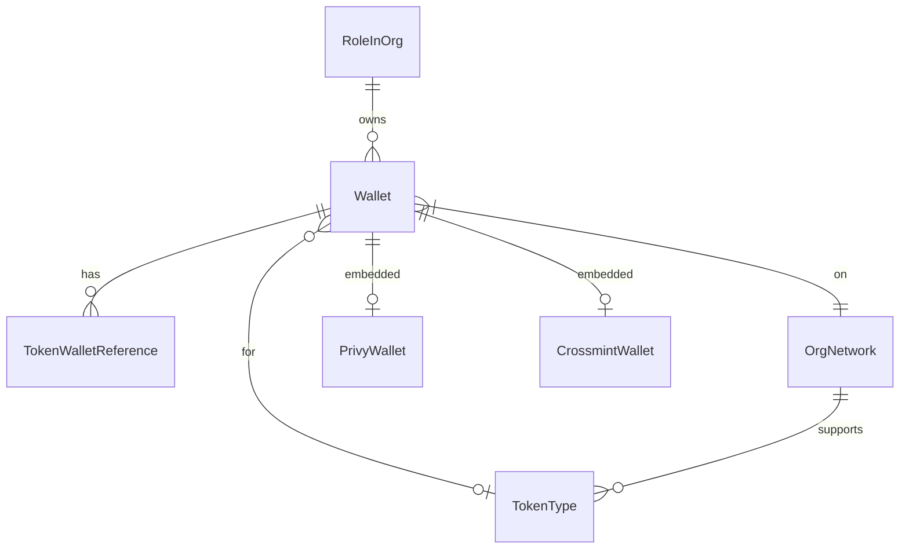

## Overview

The wallets data model represents user wallets, token allocations, and custody provider integrations.

## Wallet

User wallet for receiving tokens:

```typescript
model Wallet {
    walletID: string @id
    roleInOrgID: string
    address: string
    walletName?: string

    // Network/Token
    orgNetworkID: string
    tokenTypeID?: string

    // Status
    status: WalletStatus
    isCurrent: boolean

    // Verification
    testTransactionID?: string
    verifiedAt?: DateTime

    // Relationships
    roleInOrg: RoleInOrg
    orgNetwork: OrgNetwork
    tokenType?: TokenType
    tokenWalletReferences: TokenWalletReference[]

    // Embedded wallet links
    privyWallets: PrivyWallet[]
    crossmintWallets: CrossmintWallet[]

    // Timestamps
    createdAt: DateTime
    updatedAt: DateTime
}
```

### Wallet Status

```typescript
enum WalletStatus {
    PENDING              // Submitted, awaiting verification
    PENDING_TXN_APPROVAL // Test transaction sent
    VERIFIED             // Verified and active
    ARCHIVED             // Deactivated
    CANCELLED            // Request cancelled
    REJECTED             // Request rejected
}
```

## Token Wallet Reference

Links wallet to compensation allocation:

```typescript
model TokenWalletReference {
    walletReferenceID: string @id
    walletID: string
    roleInOrgID: string

    // Distribution
    distributionType: DistributionType
    distributionRatio?: Decimal
    fixedAmount?: Decimal

    // Relationships
    wallet: Wallet
    roleInOrg: RoleInOrg

    // Timestamps
    createdAt: DateTime
    updatedAt: DateTime
}
```

### Distribution Type

```typescript
enum DistributionType {
    PERCENTAGE    // Percentage of paycheck
    FIXED_AMOUNT  // Fixed amount per period
}
```

## Stablecoin Agreement

Historical allocation record:

```typescript
model StablecoinAgreement {
    stablecoinAgreementID: string @id
    roleInOrgID: string
    walletID: string

    // Distribution
    distributionType?: DistributionType
    distributionRatio?: Decimal
    fixedAmount?: Decimal

    // Relationships
    wallet: Wallet
    roleInOrg: RoleInOrg

    // Timestamps
    createdAt: DateTime
}
```

## Org Network

Network configuration per organization:

```typescript
model OrgNetwork {
    networkID: string @id
    orgID: string
    name: string

    // Chain details
    chainType: ChainType
    evmChainID?: number
    rpcUrl?: string
    blockExplorerBaseUrl?: string

    // Safe configuration
    multiSendCallOnlyAddress?: string
    safeSingletonAddress?: string
    safeFactoryAddress?: string
    safeAppBaseUrl?: string

    // Display
    icon?: string
    eipsName?: string
    meshConnectNetworkID?: string

    // Relationships
    wallets: Wallet[]
    tokenTypes: TokenType[]
}
```

### Chain Type

```typescript
enum ChainType {
    EVM
    SOLANA
    BITCOIN
    RIPPLE
}
```

## Token Type

Token configuration:

```typescript
model TokenType {
    tokenTypeID: string @id
    orgID: string
    networkID: string
    name: string
    currencyCode: string

    // Contract details
    address?: string
    decimalPlaces?: number
    coinMarketCapID?: string

    // Display
    icon?: string

    // Status
    isTokenEnabled: boolean

    // Relationships
    Network: OrgNetwork
    wallets: Wallet[]
    settlements: TokenSettlementForContributorTokenPayroll[]
}
```

## Privy Wallet

Privy embedded wallet link:

```typescript
model PrivyWallet {
    privyWalletID: string @id
    walletID: string
    privyUserID: string

    // Relationships
    wallet: Wallet
}
```

## Crossmint Wallet

Crossmint embedded wallet link:

```typescript
model CrossmintWallet {
    crossmintWalletID: string @id
    walletID: string
    crossmintUserID: string
    email: string

    // Relationships
    wallet: Wallet
}
```

## Entity Relationships



## Common Queries

### Get User Wallets

```typescript
const wallets = await prisma.wallet.findMany({
    where: {
        roleInOrgID,
        status: {
            notIn: [WalletStatus.CANCELLED, WalletStatus.REJECTED]
        }
    },
    include: {
        tokenType: true,
        orgNetwork: true,
        tokenWalletReferences: true
    }
});
```

### Get Verified Wallets for Payroll

```typescript
const verifiedWallets = await prisma.wallet.findMany({
    where: {
        roleInOrgID: { in: contributorRoleInOrgIDs },
        status: WalletStatus.VERIFIED,
        isCurrent: true
    },
    include: {
        tokenWalletReferences: true,
        tokenType: true,
        orgNetwork: true
    }
});
```

### Get Pending Wallet Requests

```typescript
const pendingRequests = await prisma.wallet.findMany({
    where: {
        orgID,
        status: {
            in: [WalletStatus.PENDING, WalletStatus.PENDING_TXN_APPROVAL]
        }
    },
    include: {
        roleInOrg: {
            include: { person: true }
        }
    }
});
```

### Get Allocations at Date

```typescript
// For payroll cutoff date handling
const allocations = await prisma.stablecoinAgreement.findMany({
    where: {
        roleInOrgID: { in: roleInOrgIDs },
        createdAt: { lte: cutoffDate }
    },
    orderBy: { createdAt: 'desc' },
    include: {
        wallet: {
            include: {
                tokenType: true,
                orgNetwork: true
            }
        }
    }
});
```
