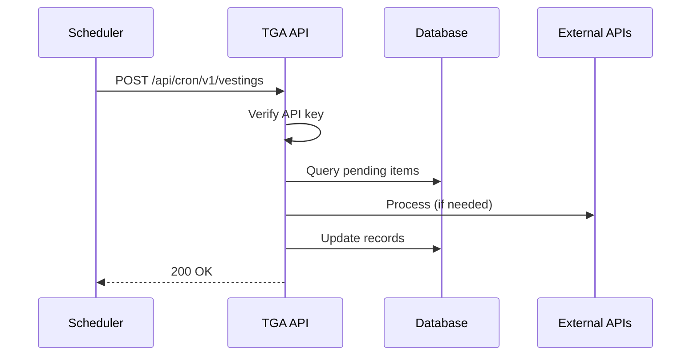

## Overview

TGA uses cron jobs for scheduled tasks like vesting processing, balance updates, and payroll state management. Cron jobs are implemented as Next.js API routes protected by API keys.

## Cron Job Architecture



## Available Cron Jobs

| Endpoint | Frequency | Purpose |
|----------|-----------|---------|
| `/api/cron/v1/vestings` | Hourly | Process vesting events |
| `/api/cron/v1/tokenPayrollStatesUpdates` | Hourly | Update payroll states |
| `/api/cron/v1/anchorageSettlement` | Every 15min | Process Anchorage settlements |
| `/api/cron/v1/custodyWalletReconciliation` | Daily | Reconcile custody balances |
| `/api/cron/v1/custodyWalletTokenBalanceUpdate` | Hourly | Update wallet balances |
| `/api/cron/v1/applyPendingAllocations` | Hourly | Apply pending wallet allocations |
| `/api/cron/v1/stakingBalanceUpdate` | Hourly | Update staking balances |
| `/api/cron/v1/tokenBalanceUpdate` | Hourly | Update token balances |
| `/api/cron/v1/bulkEmailJob` | Every 5min | Process email queue |
| `/api/cron/v1/payrollNotification` | Daily | Send payroll reminders |

## Cron Job Structure

### Basic Structure

```typescript
import { NextApiRequest, NextApiResponse } from 'next';
import { Role } from '@prisma/client';
import { originalPrisma, prisma } from 'server/database';

export default async function handler(
    req: NextApiRequest,
    res: NextApiResponse
) {
    // 1. Verify API key
    const token = req.headers['authorization']?.split(' ')[1];
    if (!token || token !== process.env.CRON_API_KEY) {
        return res.status(401).json({ error: 'Unauthorized' });
    }

    // 2. Setup context
    const creds = {
        orgID: '',
        role: Role.TOKU_ADMIN,
        loggedInUser: { userID: '', email: '' },
        person: { personID: '', name: '', givenName: '' },
        roleInOrgID: '',
        invitedByInvestorID: null,
        invitedByRecipientID: null,
        investorEntityID: null,
        allRolesForPerson: []
    };

    const authorisedPrisma = originalPrisma.$extends({});

    // 3. Process
    try {
        const result = await processJob(authorisedPrisma, creds);
        return res.status(200).json({ success: true, result });
    } catch (error) {
        console.error('Cron job failed:', error);
        return res.status(500).json({ error: error.message });
    }
}
```

## Vestings Cron Job

Processes pending vesting events:

```typescript
// /api/cron/v1/vestings.ts
export default async function handler(req, res) {
    // Verify token
    if (token !== process.env.VESTING_CRON_API_KEY) {
        return res.status(401).json({ error: 'Invalid token' });
    }

    // Get orgs with auto-vesting enabled
    const orgsWithAutoVesting = await originalPrisma.organization.findMany({
        where: { autoVestingEnabled: true }
    });

    // Process each org
    for (const org of orgsWithAutoVesting) {
        const vestingService = new VestingService(creds, authorisedPrisma);

        // Find grants ready for vesting
        const grantsToVest = await vestingService.getGrantsReadyForVesting(
            org.orgID
        );

        // Process each grant
        for (const grant of grantsToVest) {
            await vestingService.processVestingForGrant(grant.grantID);
        }
    }

    return res.status(200).json({ success: true });
}
```

## Token Payroll States Update

Updates payroll states based on dates and completion:

```typescript
// /api/cron/v1/tokenPayrollStatesUpdates.ts
export default async function handler(req, res) {
    // Verify token
    if (token !== process.env.TOKEN_PAYROLL_STATE_UPDATE_KEY) {
        return res.status(401).json({ error: 'Invalid token' });
    }

    // Get all organizations
    const organizations = await authorisedPrisma.organization.findMany({
        include: {
            payrollSettings: true,
            tokenPayrolls: {
                include: {
                    contributorsInTokenPayroll: {
                        include: { settlementOrders: true }
                    }
                }
            }
        }
    });

    // Process each org
    for (const org of organizations) {
        for (const payroll of org.tokenPayrolls) {
            await updatePayrollState(payroll, org.payrollSettings);
        }
    }

    return res.status(200).json({
        totalOrgs: organizations.length,
        updatedPayrolls: results.updatedPayrolls
    });
}
```

## Custody Wallet Reconciliation

Reconciles custody provider balances:

```typescript
// /api/cron/v1/custodyWalletReconciliation.ts
export default async function handler(req, res) {
    // Get orgs with custody integrations
    const orgsWithCustody = await getOrgsWithCustodyIntegrations();

    for (const org of orgsWithCustody) {
        // Fireblocks reconciliation
        if (org.fireblocksIntegration) {
            await reconcileFireblocksBalances(org);
        }

        // Anchorage reconciliation
        if (org.anchorageIntegration) {
            await reconcileAnchorageBalances(org);
        }
    }

    return res.status(200).json({ success: true });
}
```

## Environment Variables

Each cron job has its own API key:

```bash
# Cron job API keys
VESTING_CRON_API_KEY=your-vesting-key
TOKEN_PAYROLL_STATE_UPDATE_KEY=your-payroll-key
CUSTODY_RECONCILIATION_KEY=your-reconciliation-key
BULK_EMAIL_JOB_KEY=your-email-key
```

## Scheduler Configuration

### Using External Scheduler (e.g., Vercel Cron)

```json
// vercel.json
{
  "crons": [
    {
      "path": "/api/cron/v1/vestings",
      "schedule": "0 * * * *"
    },
    {
      "path": "/api/cron/v1/tokenPayrollStatesUpdates",
      "schedule": "0 * * * *"
    },
    {
      "path": "/api/cron/v1/custodyWalletReconciliation",
      "schedule": "0 0 * * *"
    }
  ]
}
```

### Using AWS EventBridge

```json
{
  "schedule": "rate(1 hour)",
  "target": {
    "url": "https://your-domain.com/api/cron/v1/vestings",
    "headers": {
      "Authorization": "Bearer ${VESTING_CRON_API_KEY}"
    }
  }
}
```

## Monitoring

### Logging

```typescript
console.log(`[${jobName}] Starting job at ${new Date().toISOString()}`);
console.log(`[${jobName}] Processing ${items.length} items`);
console.log(`[${jobName}] Completed: ${successes} success, ${failures} failed`);
```

### Error Alerting

```typescript
try {
    await processJob();
} catch (error) {
    console.error(`[${jobName}] Fatal error:`, error);

    // Send alert (Slack, PagerDuty, etc.)
    await alertService.sendAlert({
        severity: 'critical',
        job: jobName,
        error: error.message
    });

    throw error;
}
```

## Best Practices

1. **Idempotency** - Jobs should be safe to run multiple times
2. **Error handling** - Catch and log errors, don't crash
3. **Timeouts** - Set reasonable timeouts for external calls
4. **Batching** - Process large datasets in batches
5. **Locking** - Prevent concurrent runs if needed
6. **Monitoring** - Log progress and alert on failures

## Troubleshooting

<AccordionGroup>
<Accordion title="Cron job not running">
**Cause:** Scheduler misconfiguration or API key issue.

**Solutions:**
1. Verify scheduler is configured correctly
2. Check API key matches environment variable
3. Review scheduler logs
</Accordion>

<Accordion title="Job timing out">
**Cause:** Processing too many items or slow external APIs.

**Solutions:**
1. Add pagination/batching
2. Increase timeout setting
3. Optimize database queries
</Accordion>

<Accordion title="Duplicate processing">
**Cause:** Job running multiple times concurrently.

**Solutions:**
1. Implement distributed locking
2. Add idempotency checks
3. Use database transactions
</Accordion>
</AccordionGroup>
