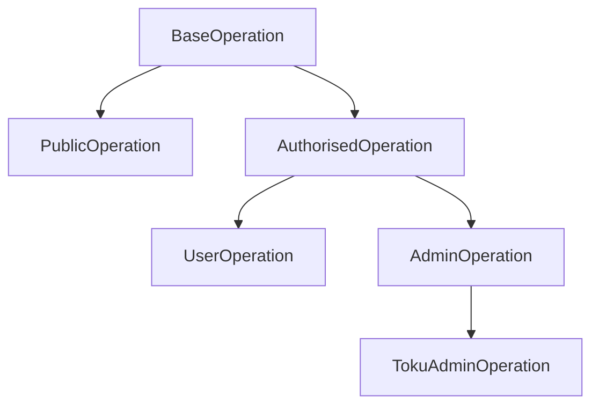

## Overview

TGA uses a hierarchical operation framework built on tRPC. Operations define API endpoints with built-in authorization, validation, and database access.

## Operation Hierarchy



| Class | Auth Required | Org Scoped | Use Case |
|-------|---------------|------------|----------|
| `PublicOperation` | No | No | Public endpoints |
| `AuthorisedOperation` | Yes | Yes | General authenticated |
| `UserOperation` | Yes | Yes | User-specific actions |
| `AdminOperation` | Yes | Yes | Admin actions |
| `TokuAdminOperation` | Yes | No | Platform admin |

## Base Operation Structure

```typescript
abstract class BaseOperation<TRequest, TResponse> {
    // Parse and validate request
    abstract parseRequest(payload: JsonPayload): TRequest;

    // Handle the operation
    abstract handleRequest(
        request: TRequest,
        context: OperationContext
    ): Promise<TResponse>;
}
```

## Authorised Operation

Most operations extend `AuthorisedOperation`:

```typescript
export class MyOperation extends AuthorisedOperation<
    MyRequest,
    MyResponse
> {
    parseRequest(payload: JsonPayload): MyRequest {
        return z.object({
            id: z.string().uuid(),
            name: z.string().min(1)
        }).parse(payload);
    }

    async handleRequest(
        request: MyRequest,
        authorisedContext: AuthorisedContext
    ): Promise<MyResponse> {
        // Access org-scoped Prisma
        const { authorisedPrisma } = authorisedContext;

        // Access credentials
        const { credentials } = authorisedContext;

        // Perform operation
        const result = await authorisedPrisma.entity.findMany({
            where: { id: request.id }
            // orgID filter automatically applied
        });

        return { data: result };
    }
}
```

## Authorised Context

The context provides:

```typescript
interface AuthorisedContext {
    // Org-scoped Prisma client
    authorisedPrisma: PrismaClient;

    // User credentials
    credentials: {
        orgID: string;
        roleInOrgID: string;
        role: Role;
        loggedInUser: {
            userID: string;
            email: string;
        };
        person: {
            personID: string;
            name: string;
        };
    };

    // Services
    services: {
        stakingService: StakingService;
        vestingService: VestingService;
        // ... other services
    };
}
```

## Admin Operation

For admin-only actions:

```typescript
export class MyAdminOperation extends AdminOperation<
    MyRequest,
    MyResponse
> {
    // Automatically requires CLIENT_ORG_ADMIN or higher role
    async handleRequest(
        request: MyRequest,
        authorisedContext: AuthorisedContext
    ): Promise<MyResponse> {
        // Admin-specific logic
    }
}
```

## User Operation

For user-specific actions:

```typescript
export class MyUserOperation extends UserOperation<
    MyRequest,
    MyResponse
> {
    // Requires USER role or higher
    async handleRequest(
        request: MyRequest,
        authorisedContext: AuthorisedContext
    ): Promise<MyResponse> {
        // User-specific logic
    }
}
```

## Request Validation

Use Zod for request validation:

```typescript
import * as z from 'zod';

parseRequest(payload: JsonPayload): MyRequest {
    return z.object({
        // Required fields
        grantID: z.string().uuid(),

        // Optional fields
        name: z.string().optional(),

        // Enums
        status: z.enum(['ACTIVE', 'INACTIVE']),

        // Numbers with constraints
        amount: z.number().positive(),

        // Dates
        startDate: z.string().datetime(),

        // Nested objects
        config: z.object({
            enabled: z.boolean()
        }).optional()
    }).parse(payload);
}
```

## Error Handling

Use `TokuError` for business errors:

```typescript
import { TokuError } from 'server/framework/base-operation';

async handleRequest(request, context) {
    const grant = await context.authorisedPrisma.grant.findUnique({
        where: { grantID: request.grantID }
    });

    if (!grant) {
        throw new TokuError('Grant not found');
    }

    if (grant.status !== 'ACCEPTED') {
        throw new TokuError('Grant must be accepted to perform this action');
    }

    // Continue with operation
}
```

## Registering Operations

Operations are registered in the tRPC router:

```typescript
// src/server/operations/grants/index.ts
export { GetGrant } from './getGrant';
export { CreateGrant } from './createGrant';
export { UpdateGrant } from './updateGrant';

// src/server/trpc/routers/grants.ts
import { GetGrant, CreateGrant, UpdateGrant } from 'server/operations/grants';

export const grantsRouter = router({
    get: operationProcedure(GetGrant),
    create: operationProcedure(CreateGrant),
    update: operationProcedure(UpdateGrant),
});
```

## Calling Operations

From the frontend:

```typescript
// Query
const { data } = trpc.grants.get.useQuery({ grantID });

// Mutation
const mutation = trpc.grants.create.useMutation();
await mutation.mutateAsync({ name, units });
```

## Best Practices

### 1. Keep Operations Focused

One operation = one action:

```typescript
// Good: Separate operations
class GetGrant extends AuthorisedOperation { }
class UpdateGrant extends AdminOperation { }
class DeleteGrant extends AdminOperation { }

// Bad: Combined operation
class GrantCRUD extends AuthorisedOperation { }
```

### 2. Use Services for Complex Logic

```typescript
async handleRequest(request, context) {
    // Use service for complex business logic
    const result = await context.services.grantService.processGrant(
        request.grantID
    );
    return result;
}
```

### 3. Validate Early

```typescript
parseRequest(payload: JsonPayload): MyRequest {
    // Validate all inputs upfront
    const request = schema.parse(payload);

    // Additional validation
    if (request.startDate > request.endDate) {
        throw new TokuError('Start date must be before end date');
    }

    return request;
}
```

### 4. Type Everything

```typescript
// Define clear types
type GetGrantRequest = {
    grantID: string;
};

type GetGrantResponse = {
    grant: Grant;
    vestings: Vesting[];
};

export class GetGrant extends AuthorisedOperation<
    GetGrantRequest,
    GetGrantResponse
> { }
```

## Related Guides

- **[Services](/developers/services)** - Service layer patterns
- **[Data Models](/data-models/overview)** - Database schemas
