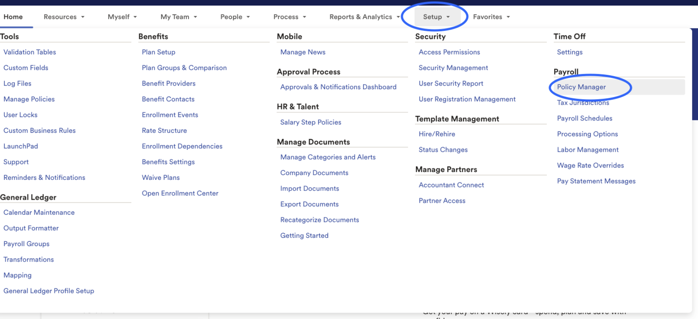
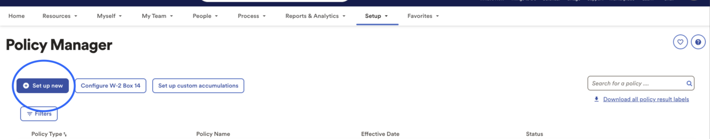
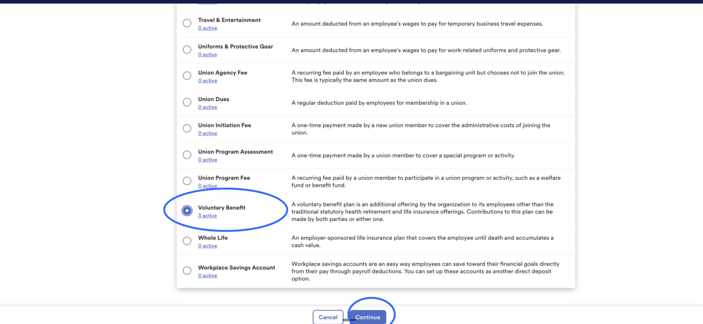
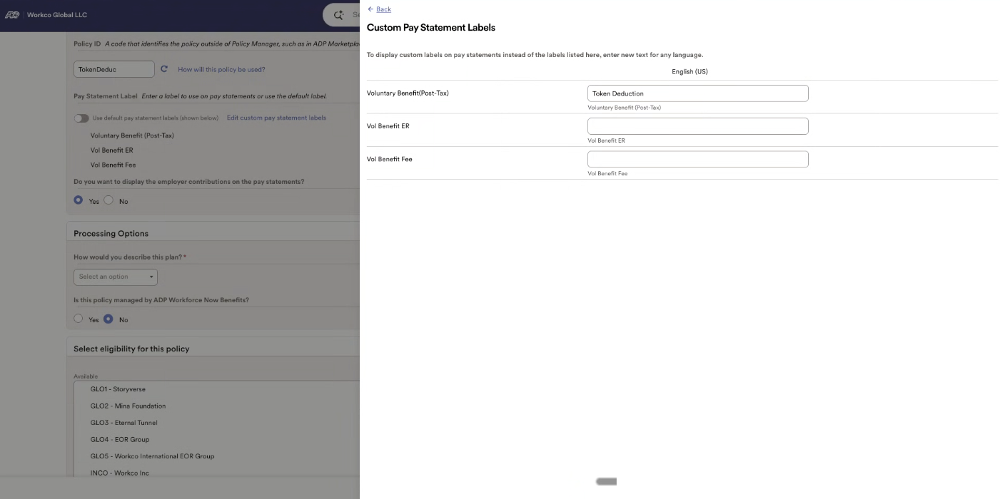
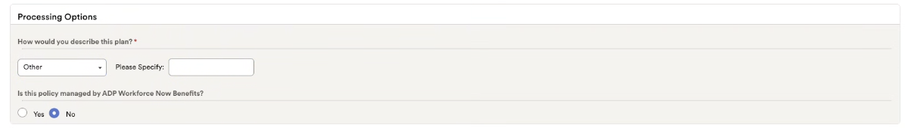
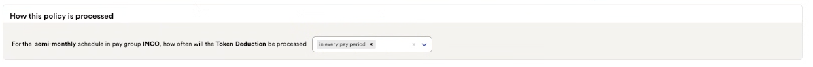

# Toku: ADP Create Token Deduction

This is a complete guide for creating a token net deduction in ADP Workforce Now

1. Go to [https://workforcenow.cloud.adp.com/](https://workforcenow.cloud.adp.com/) , and click on Setup > Payroll > Policy Manager
    
    
    
2. Click Set Up New
    
    
    
3. Select the radio button for Voluntary Benefit > Continue
    
    
    
4. Enter the policy info as shown here, and select relevant pay groups, and for "how is this policy processed" select policy be processed **in every pay period.** This will ensure the codes are set up correctly, and that its applicable to the correct groups, and that it's applicable for all pay periods.
    1. Policy Name: “Token Deduction” 
    2. Short Name: “Token Deduction” 
    3. Policy ID: “TokenDeduc” 
    4. Pay Statement Label
        1. Turn off toggle “Use default pay statement label”
        2. Voluntary Benefit (Post-Tax): “Token Deduction”
            
            
            
    5. How would you describe this plan? 
        1. Other
        2. Please Specify: “Post-Tax Token Deduction”
        3. Is this policy managed by ADP Workforce Now Benefits? “No”
            
            
            
    6. Pay Groups
        1. Select the applicable pay groups for your business
    7. How is this policy processed
        1. select “In every pay period”
            
            
            
        2. Select “Submit”

CONFIDENTIALITY NOTICE: resource and any attachments are only for the use of the intended recipient and may contain information that is privileged, confidential or exempt from disclosure under applicable law. If you are not the intended recipient, any disclosure, distribution or other use of this resource or attachments is prohibited. If you have received this resource in error, please delete and notify the sender immediately. Thank you.