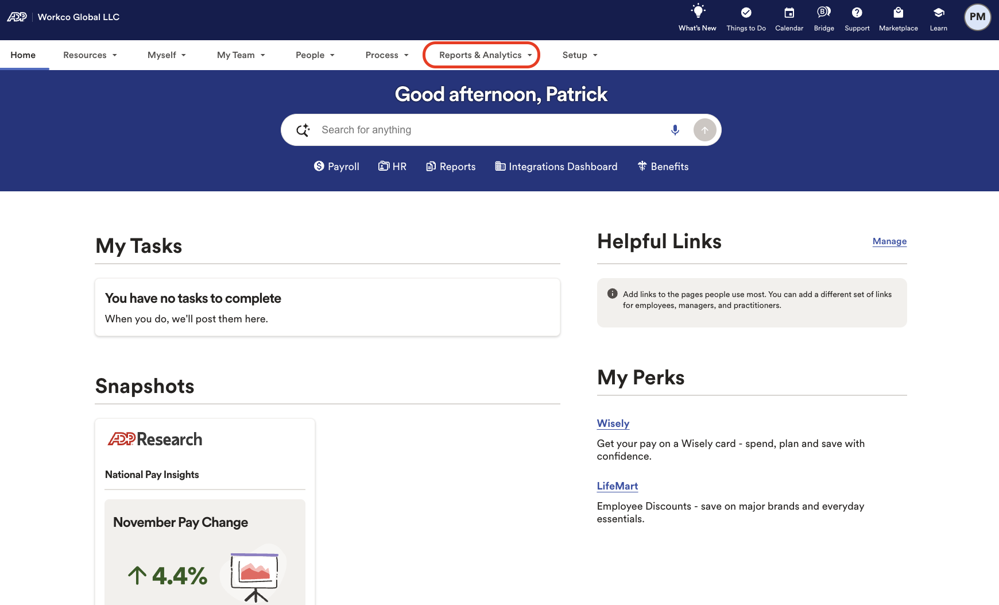
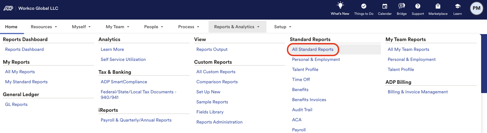
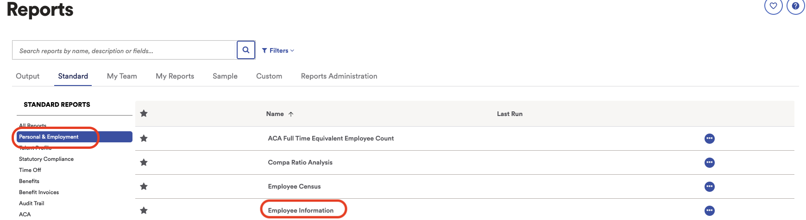
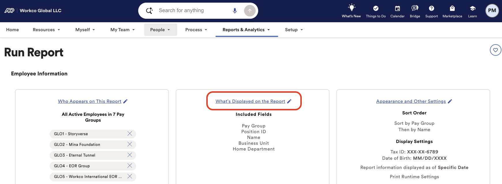
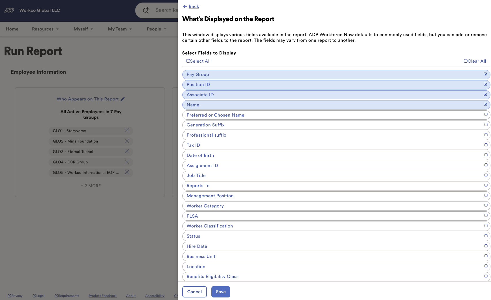
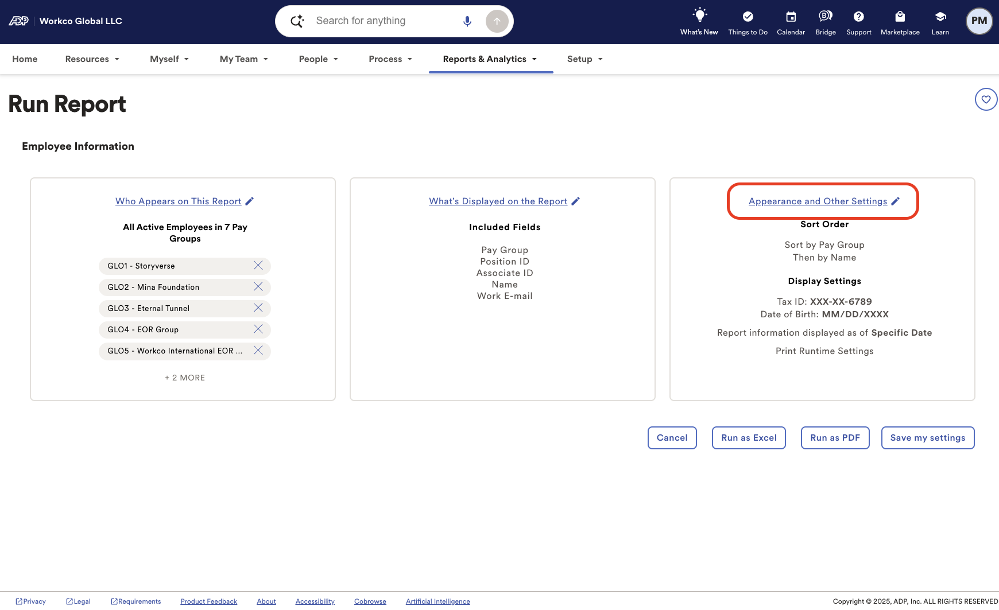
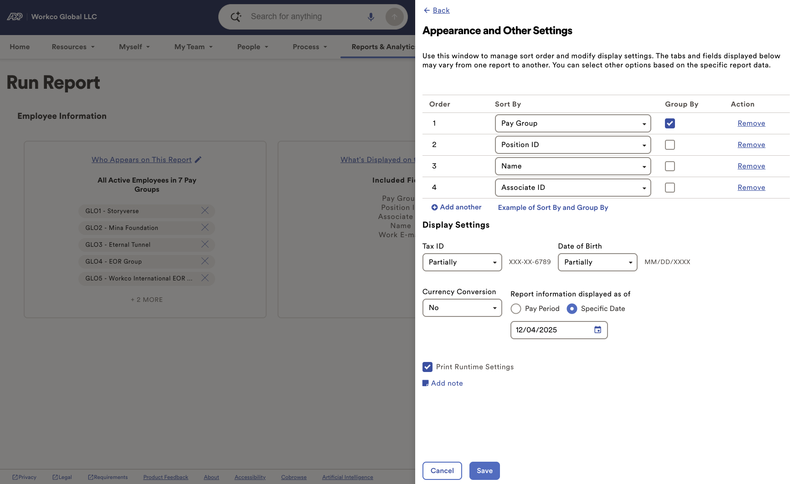
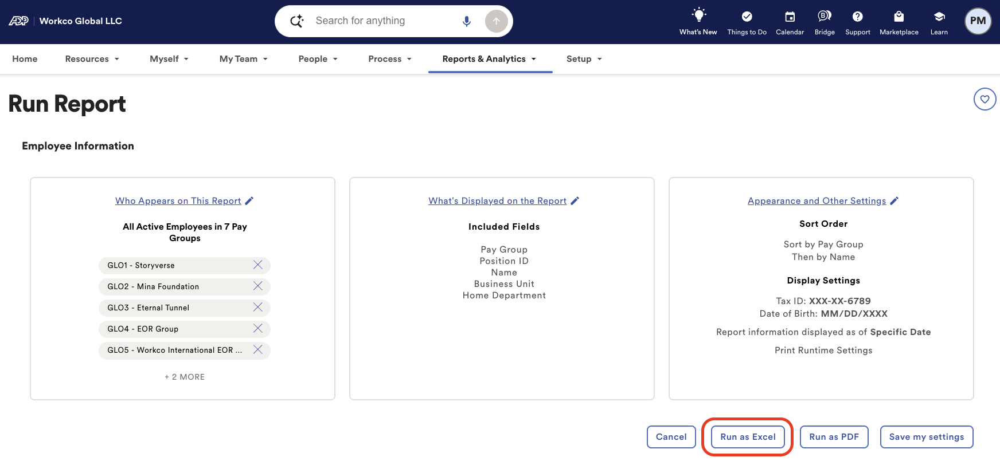
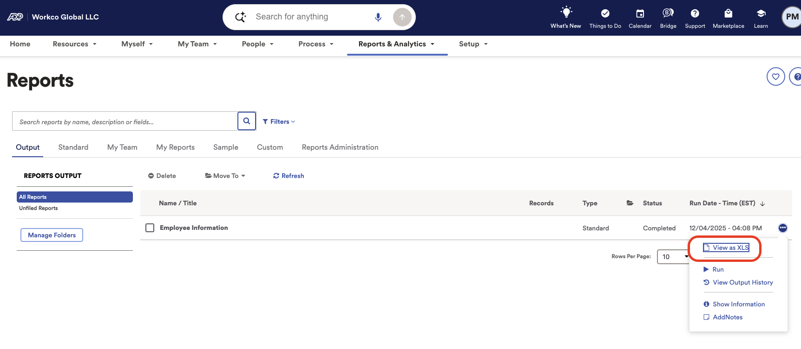

# Toku: ADP Export Employees

This is a guide to export Position ID and Associate IDs from ADP Workforce Now

1. Go to [https://workforcenow.cloud.adp.com/theme/index.html#/home](https://workforcenow.cloud.adp.com/theme/index.html#/home)
2. Select “Reports & Analytics”
    
    
    
3. Select “All Standard Reports”
    
    
    
4. Select “Personal & Employment” then “Employee Information”
    
    
    
5. Select “What’s Displayed on this Report”
    
    
    
6. Select the following fields
    1. Pay Group
    2. Position ID
    3. Associate ID
    4. Name
    5. Work E-Email
    6. Hit “Save”
        
        
        
7. Select “Appearance and Other Settings”
    
    
    
8. Select the following fields
    1. Pay Group
    2. Position ID
    3. Associate ID
    4. Name
    5. Work Email (If available)
    6. Hit “Save”
        
        
        
9. Select “Run as Excel”
    
    
    
10. Select “View as XLSX” to download
    
    
    

CONFIDENTIALITY NOTICE: resource and any attachments are only for the use of the intended recipient and may contain information that is privileged, confidential or exempt from disclosure under applicable law. If you are not the intended recipient, any disclosure, distribution or other use of this resource or attachments is prohibited. If you have received this resource in error, please delete and notify the sender immediately. Thank you.