# Toku: UKG Stablecoin Payroll Integration Guide

This is a complete step-by-step guide to integrate your UKG payroll with Toku.

### Toku Installation Instructions

Please follow these steps in order to establish the connection between UKG and Toku. Payroll runs will be created within Toku after the connection is established. 

Note: Employee data will only come through on the based on if an employee profile has been created through an HCM integration such as Workday, BambooHR, Oracle, ect.

1. Configure UKG
- **Locate API connection credentials**
    
    First you will need to locate your API credential to establish the connection to your UKG tenant. Follow the steps below to save locate the information needed, you can copy these as you will need these later:
    
    Navigate to **Security > Web Services**.
    
    - **User API key**
    - **Customer API key**
    - **Tenant ID**
    - Any one of the **service endpoint** URLs such as:
        - “Employee contacts service endpoint”
        - “Employee person service endpoint”
    
    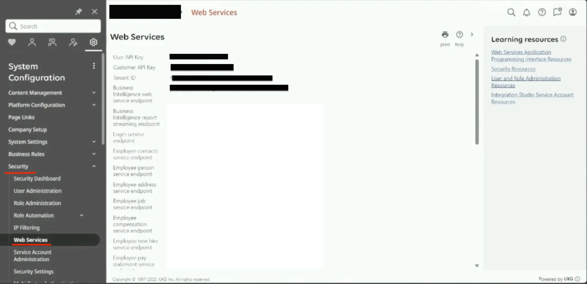
    
- **Adding a new service account**
    
    A service account is an account through which our Toku will be performing actions via external API. This allows you to ensure only the necessary information is being sent to Toku to perform Stablecoin payroll.
    
    1. Go to **Security > Service Account Administration**. 
    
    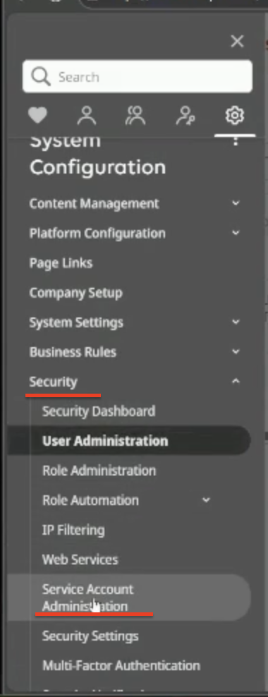
    
    1. Click on "Add" in the Service Account Administration page. 
    
    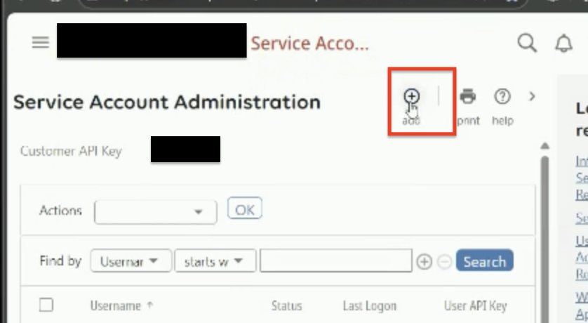
    
    1. Create a user name and password. 
        1. Username: `TOKU_SYSTEM` 
        2. Email: dev@toku.com
        3. Password: (Generate new password)
    2. Select the following fields at the following configuration in the **Web Service** section.
        1. `Employee Compensation Details` - View
        2. `Employee Person Details` -  View 
        3. `Custom Integrations` - View and Edit 
        4. `Deduction integration` - View
        5. `Payroll integration` - Add, View and Edit 
        6. `Employee Export` - View
        7. `Employee employment information` - View
        8. `Employee compensation` - View and Edit
        9. `Company Configuration Integration` - View
        10. `Personnel Integration` - View
        
        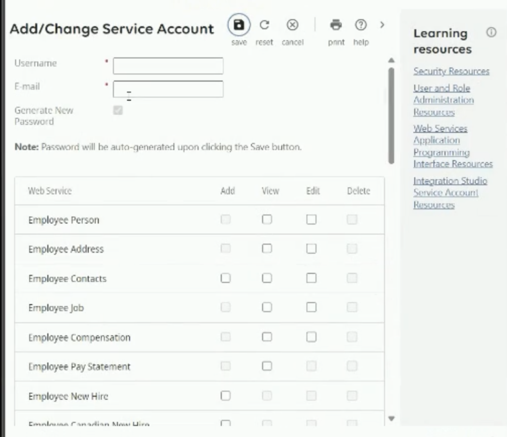
        
        *Note: The “view” fields are required for Toku to ensure we are able to match the employee on this payroll with the corresponding employee in your HCM system (Workday, BambooHR, Oracle, ect.)*
        
        *Note: The “edit” fields are required for Toku to insert Stablecoin deductions directly on upcoming payrolls for each employee.*
        
        **Make sure that you have a record of the following information:**
        
        - **User name: (from step 3)**
        - **Password: (from step 3)**
        - **User API Key: (to the right of the the newly created user)**
        - **Customer API Key: (at the top of Service Account Administration panel)**
        
- **Create a deduction plan**
    
    We will now create a custom post tax deduction that is exclusively used for these stablecoin deductions. This allows you to indicate clearly that this deduction is tied to the voluntary action the employee has taken within Toku.
    
    1. Go To **Business Rules**
    
    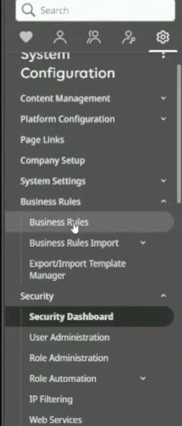
    
    1. Search for “**deductions**” → Click on “**Deduction/Benefits Plans**”
        
        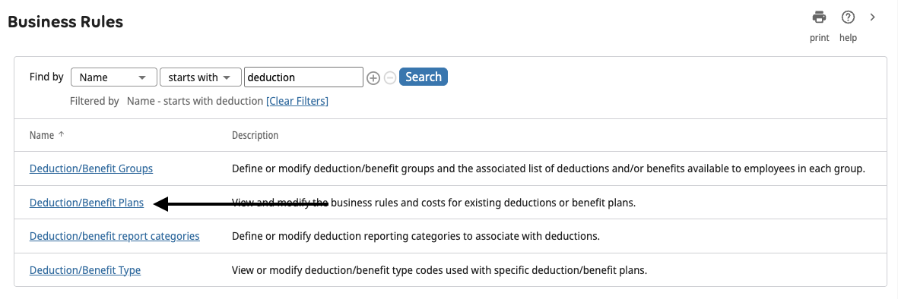
        
    
    1. Add Deduction/Benefit Plan
        
        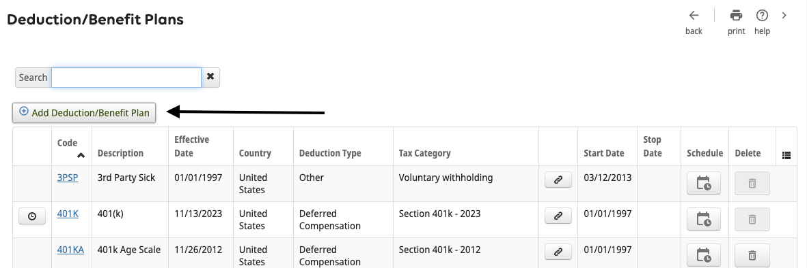
        
    
    1. Select today as the effective date
    2. Add Details
        1. Description - Stablecoin Deduction
        2. Description Type - Other
        3. Tax Category - Voluntary Withholding
        4. Deduction start and stop dates
        5. Start - Today
        6. Enrollment Disclaimer - “This is the voluntary amount already paid in stablecoins through Toku.” Click Next (Top right corner)
            
            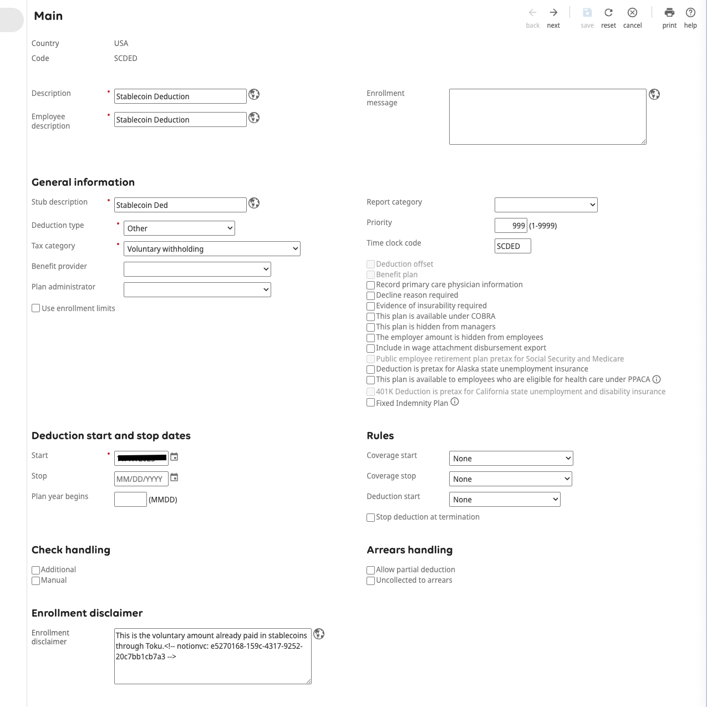
            
    3. Click Next
    4. In the Calculations page - 
        1. Under Employee, select the “Use rate at employee level” checkbox
        2. In the “Amount” row for the “Calculation Rules” column -  there's a drop down. Select “Flat amount” 
        
        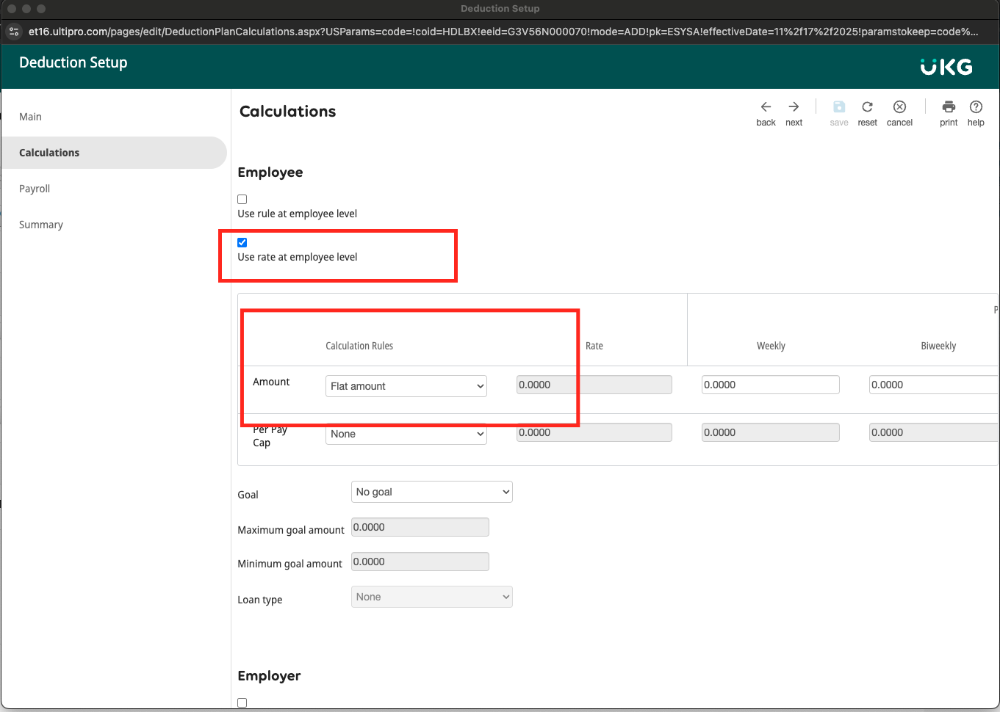
        
        Click Next 
        
    5. Select the Paychecks per pay period, we want this deduction to be posted in the “**Scheduled Pay Periods by Default”.** Click Next.
    
    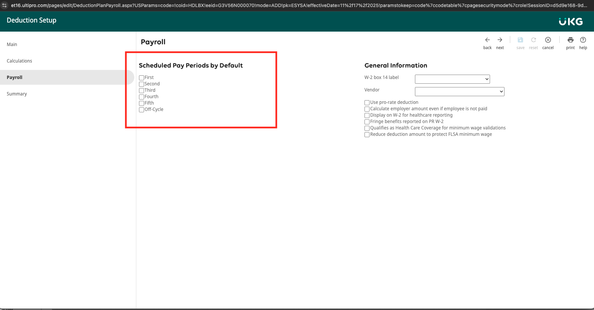
    
    1. The review screen comes up, click “Save” 
        
        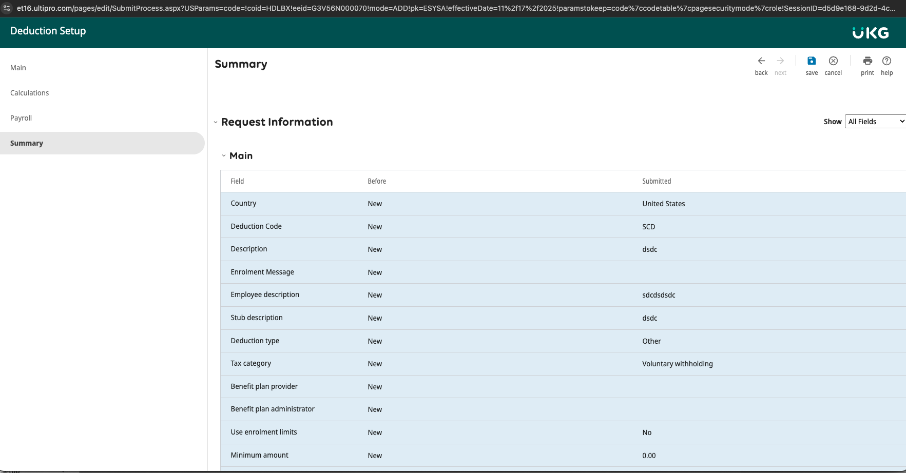
        
- **Add Deduction plan to the required Deduction group**
    
    As part of this we need to add the deduction plan we created to the required deduction group.
    
    1. Go To **Business Rules**
    
    
    
    1. Search for “**deductions**” → Click on “**Deduction/Benefit Groups**”
    2.  Select the deduction group (Country) that we want to add a Deduction code to.
        
        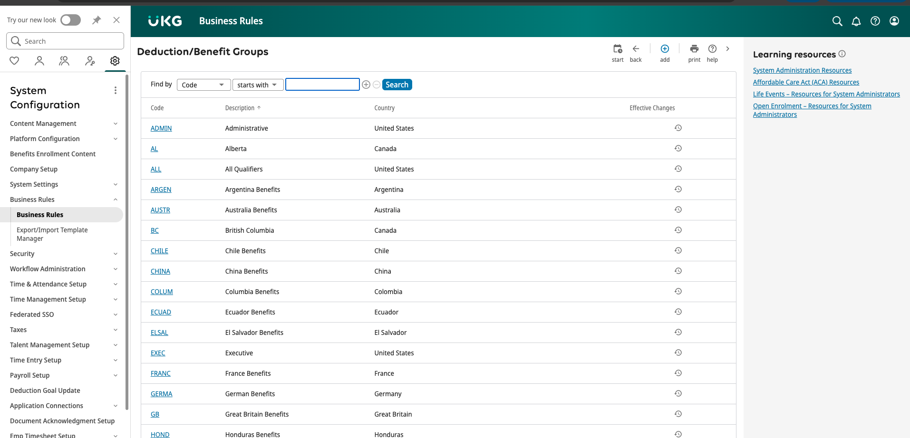
        
    3.  For the deduction group under the “**Plans**” table click “**Add**”
    
    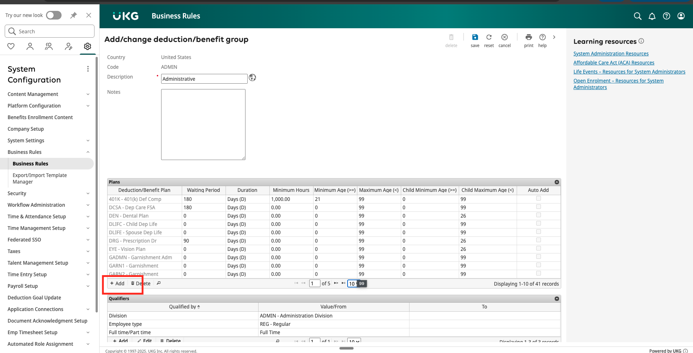
    
    1.  In the “**Add record**” pop up for the “**Deductions/Benefit Plan**” field click the drop down and select the SCDED deduction code which we created in the previous step. Click “Add”
        
        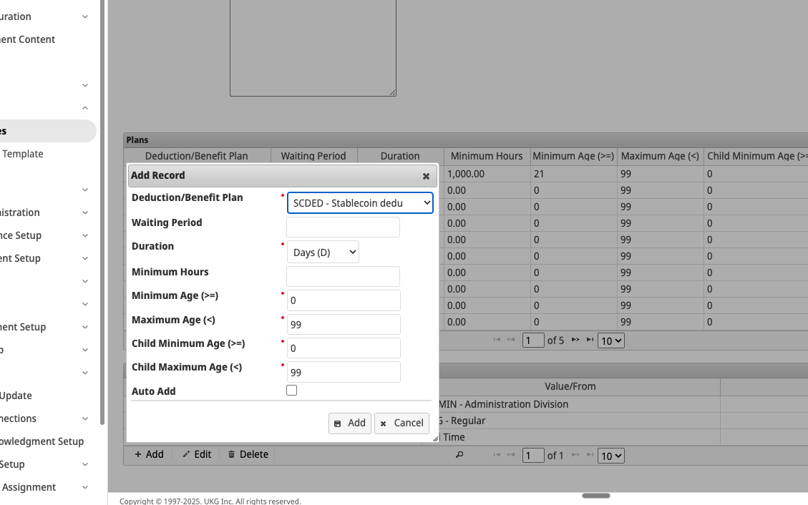
        
    2. Save the changes to the deduction group

1. Establish UKG connection on the Toku Platform 
- **Adding the API connection and service account credentials on the Toku platform**
    
    
    1. Login into your Toku profile at [https://tga.toku.com/login?product=stablecoin_payroll](https://tga.toku.com/login?product=stablecoin_payroll) under the “Stablecoin payroll” tab
    
    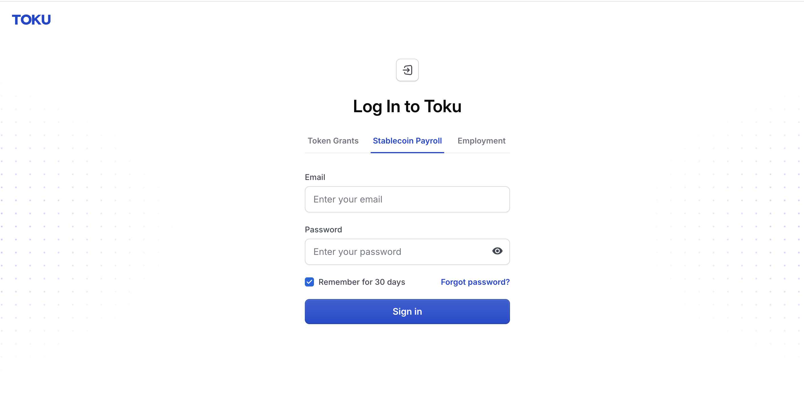
    
    1. Click on **Settings** in the left side navbar
    
    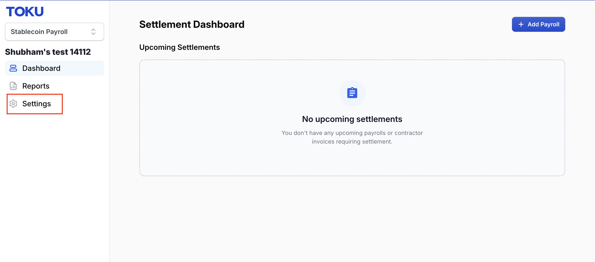
    
    1. Click on **Payroll Integrations** Card 
    
    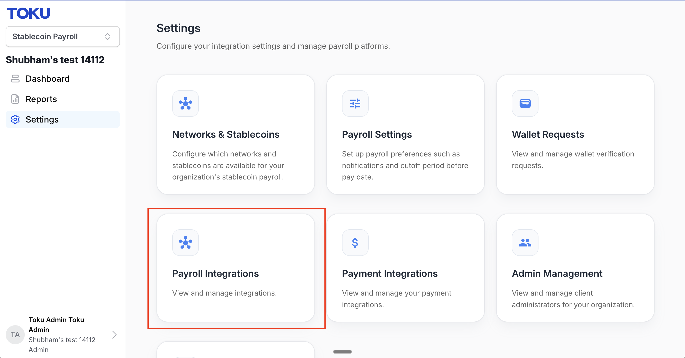
    
    1.  Click on **Add New Integration** 
    
    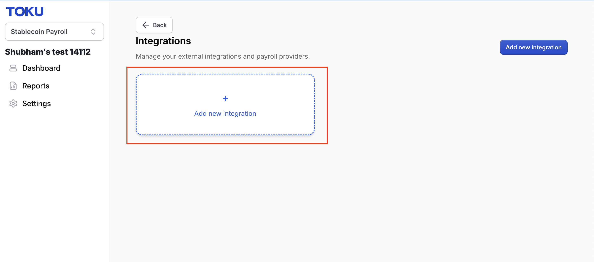
    
    1. click on the **UKG** card  in the Select integration pop-up
    
    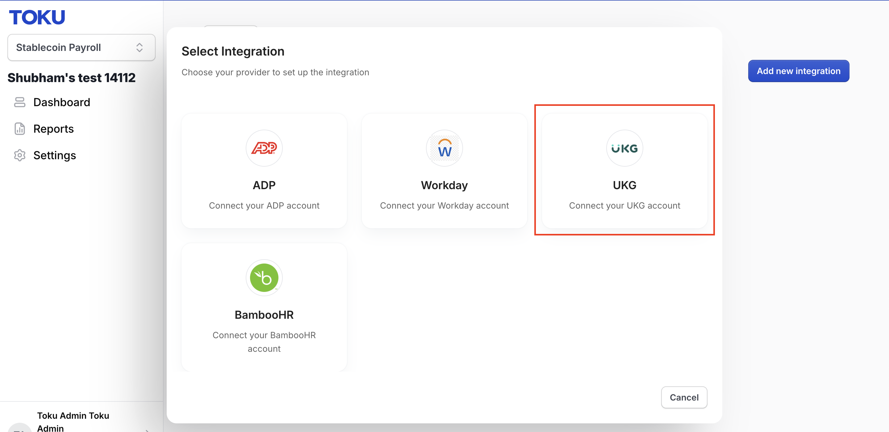
    
    1. It opens the **Integration purpose** pop-up which asks you whether this integration should be the source of growth for your employees sync. 
    
    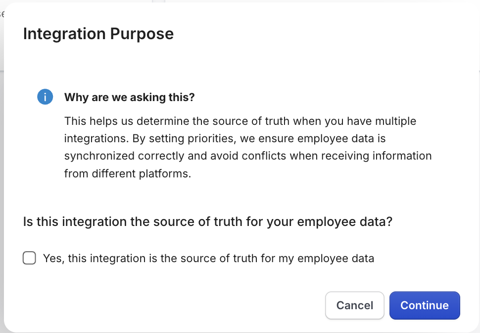
    
    *Note: Do not select the checkbox if you will be integrating and HCM where your employees are stored.*
    
    1.  Add the credentials and deduction to the form and click Save.
        1. The S**ervice Endpoint URL, Tenant ID, User API key, Customer API key** can be found in the [steps 1.1](https://www.notion.so/Toku-Stablecoin-Payroll-for-UKG-29c0b95a751d80ae98ade366642f460e?pvs=21) ([**1.1 - Finding your API connection credential**](https://www.notion.so/Toku-Stablecoin-Payroll-for-UKG-29c0b95a751d80ae98ade366642f460e?pvs=21)) of this guide.
        2. The **Service account user name and Service account password** can be found in the [steps 1.2 (**1.2 - Adding a new service account**](https://www.notion.so/Toku-Stablecoin-Payroll-for-UKG-29c0b95a751d80ae98ade366642f460e?pvs=21)) of this guide. 
        3. The **Deduction code** can be found in the [step 2.1 (**2.1 Adding a deduction group**)](https://www.notion.so/Toku-Stablecoin-Payroll-for-UKG-29c0b95a751d80ae98ade366642f460e?pvs=21) of this guide
    
    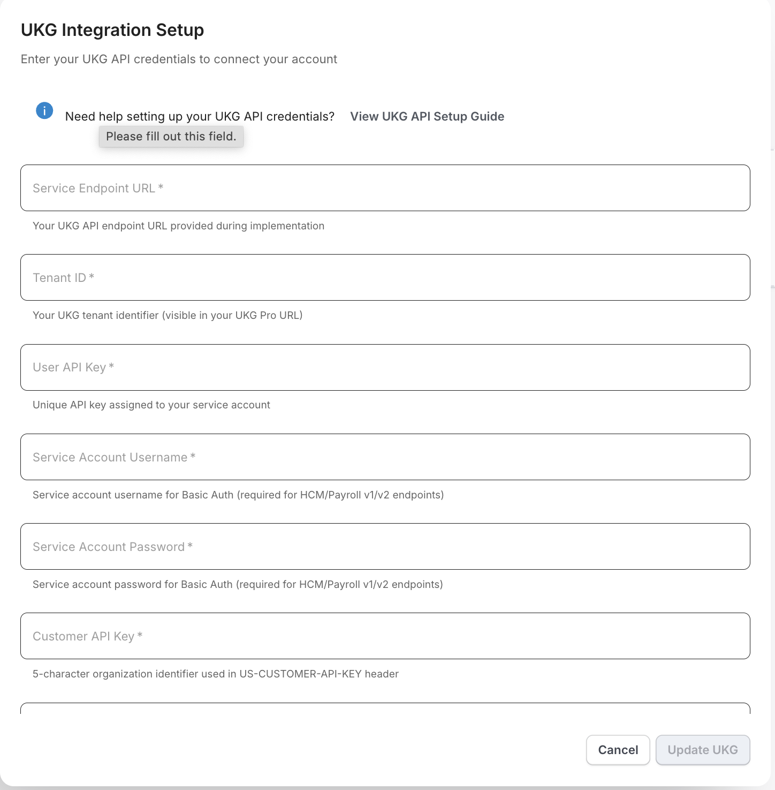
    
    1. Select “Update UKG” to establish the connection
    
    You are all set! Your integration will now update once every 15 minutes to pull upcoming payrolls into Toku
    

CONFIDENTIALITY NOTICE: resource and any attachments are only for the use of the intended recipient and may contain information that is privileged, confidential or exempt from disclosure under applicable law. If you are not the intended recipient, any disclosure, distribution or other use of this resource or attachments is prohibited. If you have received this resource in error, please delete and notify the sender immediately. Thank you.