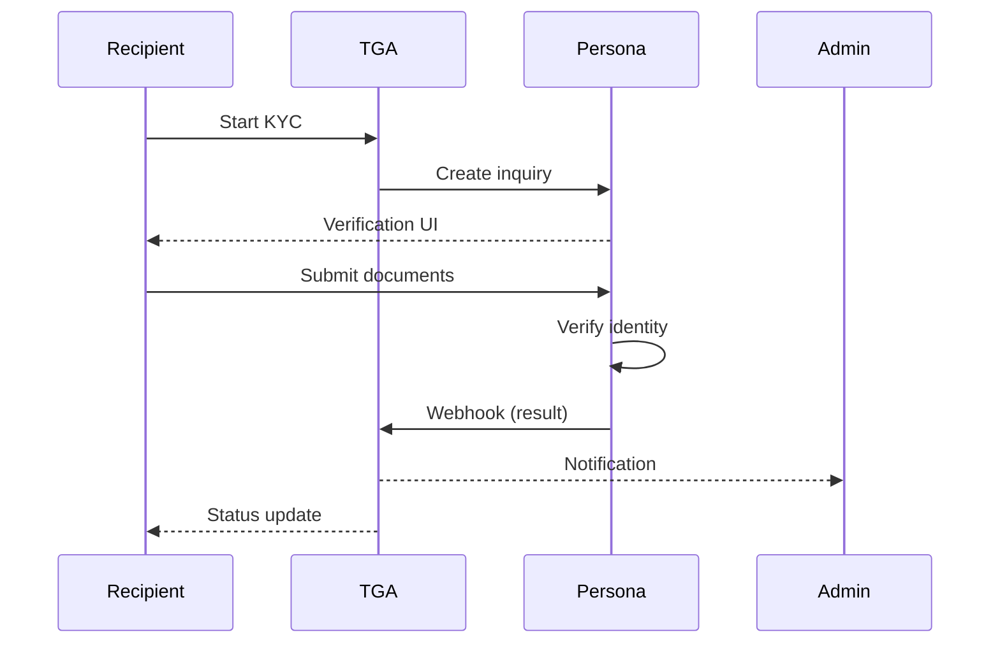

## Overview

TGA integrates with Persona for identity verification (KYC - Know Your Customer). This ensures recipients are properly identified before receiving token compensation, helping organizations meet regulatory requirements.

## KYC Flow



## Verification Statuses

| Status | Description |
|--------|-------------|
| `NOT_STARTED` | KYC not initiated |
| `PENDING` | Verification in progress |
| `APPROVED` | Identity verified |
| `DECLINED` | Verification failed |
| `NEEDS_REVIEW` | Manual review required |
| `EXPIRED` | Verification expired |

## KYC Requirements

### When KYC is Required

Organizations can require KYC for:

| Trigger | Description |
|---------|-------------|
| Grant acceptance | Before accepting grants |
| Exercise | Before exercising options |
| Settlement | Before receiving tokens |
| Threshold | Above certain amounts |

### Configuration

```typescript
interface KYCConfiguration {
    orgID: string;
    isKYCRequired: boolean;
    requirementTriggers: KYCTrigger[];
    thresholdAmount?: Decimal;
    expirationDays?: number;
}
```

## Persona Integration

### How It Works

1. **Inquiry Creation**: TGA creates a Persona inquiry for the user
2. **Verification Flow**: User completes verification in Persona UI
3. **Result Processing**: Persona sends webhook with result
4. **Status Update**: TGA updates user's KYC status

### Inquiry Types

| Type | Documents |
|------|-----------|
| **Basic** | Government ID |
| **Enhanced** | ID + proof of address |
| **Full** | ID + address + selfie |

### Integration Configuration

```typescript
interface PersonaIntegration {
    orgID: string;
    templateID: string;      // Persona template
    apiKey: string;          // Encrypted
    webhookSecret: string;   // Encrypted
}
```

## Verification Process

### Step 1: Initiate KYC

```typescript
// Create Persona inquiry
const inquiry = await kycService.createInquiry({
    roleInOrgID,
    templateID: config.templateID
});

// Returns Persona inquiry URL
```

### Step 2: User Completes Verification

User is redirected to Persona to:

1. Upload government ID
2. Take selfie (if required)
3. Provide additional documents

### Step 3: Receive Result

Persona sends webhook with verification result:

```typescript
interface PersonaWebhookPayload {
    data: {
        id: string;              // Inquiry ID
        type: 'inquiry';
        attributes: {
            status: PersonaStatus;
            referenceId: string;  // roleInOrgID
        };
    };
}
```

### Step 4: Update Status

TGA updates the user's KYC status:

```typescript
await kycService.updateKYCStatus({
    roleInOrgID,
    status: 'APPROVED',
    verifiedAt: new Date(),
    inquiryID
});
```

## Admin Review

### Manual Review Cases

Some verifications require manual review:

| Scenario | Action Required |
|----------|-----------------|
| Document unclear | Request new submission |
| Name mismatch | Verify with user |
| Fraud indicator | Decline and flag |
| Expired ID | Request current ID |

### Review Interface

Admins can:

- View pending reviews
- Approve or decline
- Request additional documents
- Add notes

## Compliance Features

### Audit Trail

All KYC activities are logged:

```typescript
interface KYCAuditLog {
    eventID: string;
    roleInOrgID: string;
    eventType: 'STARTED' | 'SUBMITTED' | 'APPROVED' | 'DECLINED';
    timestamp: Date;
    details: object;
}
```

### Document Retention

| Document | Retention |
|----------|-----------|
| Verification record | 7 years |
| ID images | As required by law |
| Audit logs | Permanent |

## Re-verification

### When Required

- Verification expired
- Document expired
- Name change
- Address change
- Regulatory requirement

### Process

```typescript
// Check if re-verification needed
const needsReverification = await kycService.checkReverificationNeeded(
    roleInOrgID
);

// Trigger re-verification
if (needsReverification) {
    await kycService.createInquiry({
        roleInOrgID,
        reason: 'EXPIRATION'
    });
}
```

## Blockers

### KYC-Blocked Actions

When KYC is required but not completed:

| Action | Behavior |
|--------|----------|
| Accept grant | Blocked until KYC complete |
| Exercise options | Blocked until KYC complete |
| Receive settlement | Blocked until KYC complete |

### Notifications

Users receive reminders:

- Initial KYC required notification
- Reminder emails
- Deadline warnings
- Expiration notices

## Best Practices

1. **Clear communication** - Explain why KYC is required
2. **Early verification** - Encourage KYC completion during onboarding
3. **Monitor status** - Track pending verifications
4. **Support users** - Help with verification issues
5. **Regular review** - Check for expiring verifications

## Troubleshooting

<AccordionGroup>
<Accordion title="Verification stuck in pending">
**Cause:** User didn't complete Persona flow.

**Solutions:**
1. Check Persona dashboard for inquiry status
2. Send reminder to user
3. Provide support if user has issues
</Accordion>

<Accordion title="Verification declined">
**Cause:** Failed identity checks.

**Solutions:**
1. Review decline reason in Persona
2. Request new verification if appropriate
3. Manual review if needed
</Accordion>

<Accordion title="Webhook not received">
**Cause:** Webhook configuration issue.

**Solutions:**
1. Verify webhook URL in Persona settings
2. Check webhook secret matches
3. Review TGA webhook logs
</Accordion>

<Accordion title="User can't start verification">
**Cause:** Configuration or integration issue.

**Solutions:**
1. Verify Persona API key is valid
2. Check template ID is correct
3. Review error logs for details
</Accordion>
</AccordionGroup>
