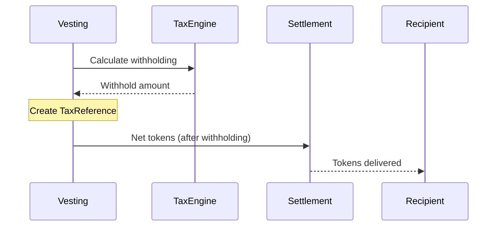
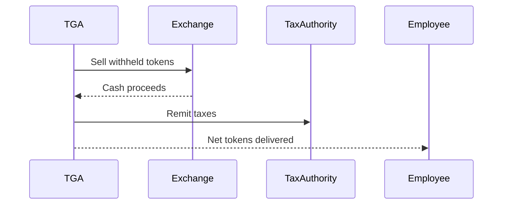

## Overview

TGA provides tax withholding capabilities for token compensation, helping organizations meet tax obligations when employees receive tokens. The system calculates withholding amounts based on jurisdiction, compensation type, and individual tax profiles.

## Tax Events

Token compensation can trigger tax events at various points:

| Event | Taxable? | Description |
|-------|----------|-------------|
| **Vesting** | Often | FMV at vesting may be taxable income |
| **Exercise** | Often | Spread between strike and FMV |
| **Settlement** | Sometimes | Depends on grant type and jurisdiction |
| **Sale** | Yes | Capital gains on appreciation |

## Tax Withholding Flow



## Tax Reference

Each vesting with tax withholding creates a tax reference:

```typescript
interface TaxReference {
    taxReferenceID: string;
    vestingID: string;
    roleInOrgID: string;

    // Withholding
    unitsToWithhold: Decimal;
    taxCurrency: string;
    fmvAtVesting: Decimal;

    // Status
    status: 'PENDING' | 'APPROVED' | 'REJECTED';

    // Calculation details
    calculationDate: Date;
    taxRate: Decimal;
    jurisdictionCode: string;
}
```

## Configuration

### Tax Calculator Setup

Organizations configure tax calculation parameters:

```typescript
interface TaxConfiguration {
    orgID: string;
    jurisdictions: JurisdictionConfig[];
    defaultWithholdingRate?: Decimal;
    roundingMethod: 'UP' | 'DOWN' | 'NEAREST';
}

interface JurisdictionConfig {
    countryCode: string;
    stateCode?: string;
    federalRate: Decimal;
    stateRate?: Decimal;
    localRate?: Decimal;
}
```

### Grant Type Configuration

Configure withholding per grant type:

| Grant Type | Withholding Approach |
|------------|---------------------|
| RTU | Withhold at vesting |
| OPTION | Withhold at exercise |
| TOKEN_BONUS | Withhold at settlement |
| PHANTOMUNITS | Cash settlement |

## Employee Tax Profile

Each employee has a tax profile:

```typescript
interface EmployeeTaxProfile {
    roleInOrgID: string;

    // Location
    countryCode: string;
    stateCode?: string;

    // Tax identifiers
    taxID?: string;

    // Withholding elections
    additionalWithholding?: Decimal;
    exemptions?: number;

    // Status
    w4OnFile: boolean;
}
```

## Withholding Calculation

### At Vesting

```typescript
// Calculate tax at vesting
const taxCalculation = await taxEngine.calculateVestingTax({
    vestingID,
    vestedUnits,
    fmvAtVesting,
    employeeTaxProfile
});

// Result:
{
    grossValue: 10000,          // FMV × units
    federalWithholding: 2200,   // 22%
    stateWithholding: 500,      // 5%
    netValue: 7300,
    unitsToWithhold: 27         // Tokens to withhold
}
```

### Token Withholding

Convert tax amount to token withholding:

```typescript
// Calculate tokens to withhold
const tokensToWithhold = taxAmount / fmvPerToken;

// Example:
// Tax owed: $2,700
// FMV: $100/token
// Withhold: 27 tokens
```

## Sell-to-Cover

Organizations can configure sell-to-cover for tax withholding:

| Method | Description |
|--------|-------------|
| **Sell-to-cover** | Sell tokens to pay taxes |
| **Net settlement** | Deliver fewer tokens |
| **Employee pays** | Employee sends payment |

### Sell-to-Cover Flow



## Reporting

### Tax Reports

| Report | Description |
|--------|-------------|
| **Withholding Summary** | Total withholding by period |
| **By Employee** | Individual withholding details |
| **By Jurisdiction** | Breakdown by tax jurisdiction |
| **Remittance Report** | Taxes to remit |

### Employee Tax Statements

Generate tax documents:

| Document | Purpose |
|----------|---------|
| **W-2** | Annual wage statement |
| **1099** | Contractor payments |
| **Form 3921** | ISO exercises |
| **Form 3922** | ESPP purchases |

## Integration with Payroll

Tax withholding syncs with HRIS for reporting:

```typescript
// Export tax withholding to HRIS
await deductionExportService.exportWithholding({
    payrollID,
    withholdings: taxReferences
});
```

## Jurisdiction Handling

### Multi-Jurisdiction

Handle employees in different locations:

| Jurisdiction | Considerations |
|--------------|----------------|
| US Federal | Standard rates |
| US State | State-specific rates |
| International | Country tax treaties |
| Remote workers | Tax presence rules |

### Tax Treaties

Some jurisdictions have special handling:

```typescript
interface TaxTreaty {
    countryA: string;
    countryB: string;
    withholding: {
        dividends?: Decimal;
        interest?: Decimal;
        royalties?: Decimal;
    };
}
```

## Best Practices

1. **Accurate FMV** - Use defensible fair market value
2. **Timely withholding** - Calculate at vesting/exercise
3. **Employee communication** - Notify of tax implications
4. **Documentation** - Maintain calculation records
5. **Professional advice** - Consult tax professionals

## Troubleshooting

<AccordionGroup>
<Accordion title="Incorrect withholding amount">
**Cause:** Tax rate or FMV incorrect.

**Solutions:**
1. Verify employee tax profile
2. Check FMV at calculation date
3. Review jurisdiction settings
</Accordion>

<Accordion title="Missing tax reference">
**Cause:** Tax calculation not triggered.

**Solutions:**
1. Check grant type configuration
2. Verify vesting was processed
3. Review tax engine logs
</Accordion>

<Accordion title="Employee disputes withholding">
**Cause:** Various possible causes.

**Solutions:**
1. Review calculation details
2. Check employee W-4 on file
3. Verify FMV source
4. Consult with tax team
</Accordion>

<Accordion title="Tax remittance mismatch">
**Cause:** Calculation or rounding difference.

**Solutions:**
1. Reconcile withholding records
2. Check rounding configuration
3. Review timing differences
</Accordion>
</AccordionGroup>

<Note>
Tax matters are complex and jurisdiction-specific. Always consult qualified tax professionals for your specific situation.
</Note>
