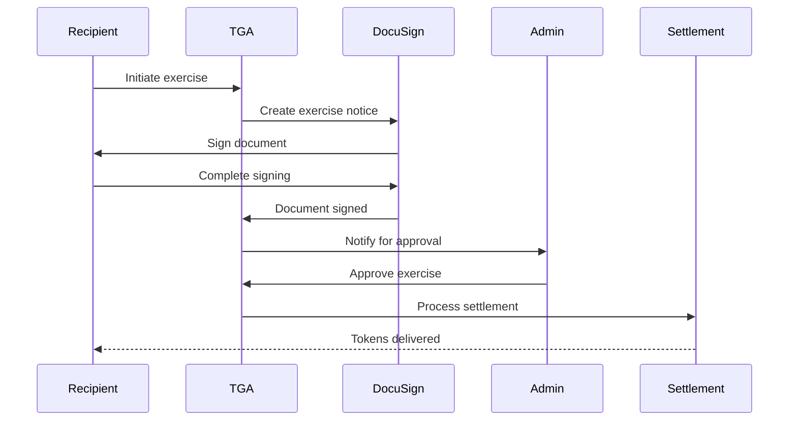

## Overview

For exercisable grants (OPTIONS, WARRANTS, TPA), recipients must exercise their right to purchase tokens at the strike price. This guide covers the exercise process.

## What is an Exercise?

An exercise is the action of:
1. Paying the strike price
2. Receiving the underlying tokens
3. Completing required documentation

## Exercise Eligibility

### Requirements

| Requirement | Description |
|-------------|-------------|
| **Vested tokens** | Only vested units can be exercised |
| **Grant status** | Grant must be ACCEPTED |
| **Exercise window** | Within any exercise window restrictions |
| **KYC status** | May require completed KYC |
| **Wallet configured** | Must have receiving wallet set up |

### Exercisable Grant Types

| Type | Exercise Required |
|------|-------------------|
| OPTION | Yes |
| WARRANT | Yes |
| TPA | Yes |
| TSA | Yes |
| TOKENSUB | Yes |
| RTU | No |
| TOKEN_BONUS | No |

## Exercise Flow



## Exercise Request Statuses

| Status | Description |
|--------|-------------|
| `PENDING_SIGNATURE` | Awaiting DocuSign completion |
| `PENDING_TOKU_ACCEPTANCE` | Signed, awaiting admin review |
| `APPROVED` | Approved, pending settlement |
| `REJECTED` | Exercise request denied |
| `COMPLETED` | Tokens delivered |
| `CANCELLED` | Request cancelled |

## Exercise Process

### Step 1: Initiate Exercise

<Steps>
<Step title="View Grants">
  Navigate to your grants and select an exercisable grant.
</Step>

<Step title="Select Units to Exercise">
  Choose how many vested units to exercise.
  - Must be within vested amount
  - Consider tax implications
</Step>

<Step title="Review Terms">
  Review:
  - Strike price per unit
  - Total exercise cost
  - Settlement method
</Step>

<Step title="Submit Request">
  Submit the exercise request to generate DocuSign document.
</Step>
</Steps>

### Step 2: Sign Exercise Notice

1. DocuSign envelope created with exercise details
2. Document pre-filled with:
   - Recipient name
   - Grant details
   - Number of units
   - Exercise date
   - Payment method
3. Recipient signs electronically
4. Signed document stored

### Step 3: Admin Approval

Admins review the exercise request:

| Check | Description |
|-------|-------------|
| Vested units | Sufficient vested balance |
| Documentation | DocuSign completed |
| Payment | Payment received (if required) |
| Compliance | No blockers |

### Step 4: Settlement

After approval:
1. Tokens calculated (units - any tax withholding)
2. Settlement transaction created
3. Tokens transferred to recipient wallet
4. Exercise marked complete

## Strike Price

The strike price is the cost per token for exercise:

```typescript
// Exercise cost calculation
const exerciseCost = numberOfUnits * strikePrice;

// Example
// 1,000 units × $0.10 strike = $100 total cost
```

### Payment Methods

| Method | Description |
|--------|-------------|
| **Wire transfer** | Traditional bank payment |
| **Crypto payment** | Pay in stablecoin |
| **Cashless exercise** | Sell tokens to cover cost |

## Exercise Windows

Some grants restrict when exercises can occur:

| Restriction | Description |
|-------------|-------------|
| **Blackout periods** | No exercises during certain periods |
| **Exercise window** | Limited time to exercise after vesting |
| **Redemption hold** | Days to wait after vesting |

## Tax Considerations

Exercises may trigger tax events:

| Tax Type | Trigger |
|----------|---------|
| **Exercise spread** | Difference between FMV and strike |
| **Capital gains** | When tokens are later sold |
| **Withholding** | Employer may withhold taxes |

<Note>
Consult a tax professional for advice specific to your jurisdiction and situation.
</Note>

## Partial Exercises

You can exercise a portion of vested units:

```
Vested: 10,000 units
Exercise: 5,000 units

Result:
- 5,000 units exercised and settled
- 5,000 units remain available for future exercise
```

## Bulk Exercises

Admins can process multiple exercises in batch:

1. Select pending exercise requests
2. Approve in bulk
3. Settlement processes together

## Exercise Reports

### My Exercises

Recipients can view:
- Pending exercises
- Exercise history
- Settlement status

### Admin Exercise Report

Admins can view:
- All pending exercises
- Exercise requests by status
- Settlement reconciliation

## Troubleshooting

<AccordionGroup>
<Accordion title="'Insufficient vested balance'">
**Cause:** Trying to exercise more units than vested.

**Solution:**
1. Check vesting schedule
2. Wait for more units to vest
3. Exercise only available units
</Accordion>

<Accordion title="DocuSign not loading">
**Cause:** DocuSign configuration issue.

**Solutions:**
1. Check grant type has exercise form configured
2. Verify DocuSign integration is active
3. Try refreshing the page
</Accordion>

<Accordion title="Exercise stuck in pending approval">
**Cause:** Awaiting admin action.

**Solutions:**
1. Contact organization admin
2. Check if additional information needed
3. Review any blocking compliance issues
</Accordion>

<Accordion title="Settlement not completing">
**Cause:** Settlement process issue.

**Possible reasons:**
- Insufficient tokens in custody
- Wallet configuration issue
- Tax withholding calculation pending

**Solutions:**
1. Contact admin to check settlement queue
2. Verify wallet is properly configured
3. Check for any tax holds
</Accordion>
</AccordionGroup>

## Exercise Request Model

```typescript
interface ExerciseRequest {
    exerciseRequestID: string;
    grantID: string;
    roleInOrgID: string;

    // Exercise details
    numberOfUnitsToExercise: Decimal;
    exercisePrice: Decimal;
    exerciseDate: Date;

    // Status
    status: ExerciseRequestStatus;

    // Documentation
    documentID?: string;  // Signed exercise notice

    // Settlement
    settlementMethod: 'TOKEN' | 'CASH';
}
```
