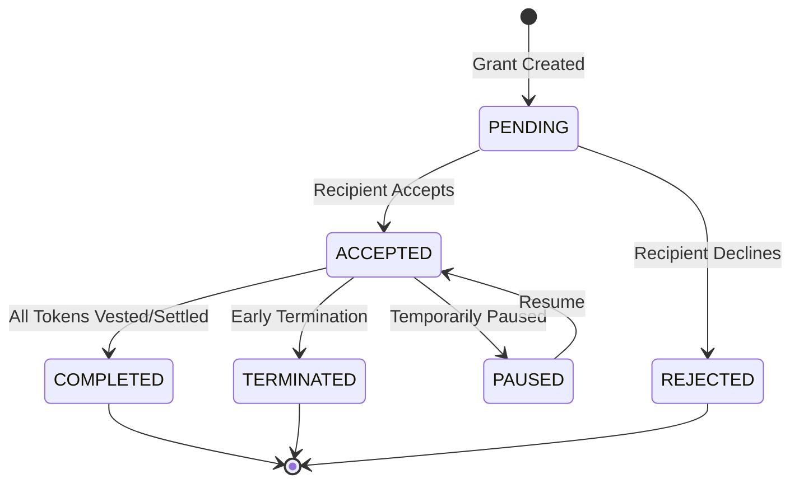
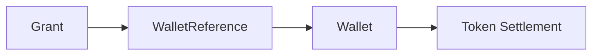

## Overview

Token grants are the core of TGA, enabling organizations to distribute token-based compensation to employees, advisors, and other stakeholders. This guide covers the fundamental concepts of the grant system.

## What is a Token Grant?

A token grant is a promise to deliver tokens to a recipient over time, typically subject to:

- **Vesting Schedule** - Tokens unlock gradually over a period
- **Cliff Period** - Initial period before any tokens vest
- **Exercise Requirements** - For options, recipients must exercise their right
- **Settlement** - Final delivery of tokens to recipient's wallet

## Grant Lifecycle



## Grant Statuses

| Status | Description |
|--------|-------------|
| `PENDING` | Grant created, awaiting recipient acceptance |
| `ACCEPTED` | Recipient accepted, vesting active |
| `REJECTED` | Recipient declined the grant |
| `COMPLETED` | All tokens vested and/or settled |
| `TERMINATED` | Grant ended early (e.g., employee departure) |
| `PAUSED` | Vesting temporarily suspended |

## Key Concepts

### Grant Configuration (Grant Type)

A template defining grant behavior:

| Property | Description |
|----------|-------------|
| `kind` | Type of grant (RTU, OPTION, etc.) |
| `vestingFrequencyType` | How often tokens vest |
| `vestingPeriods` | Total vesting periods |
| `vestingCliffPeriods` | Periods before first vest |
| `isExercisable` | Requires exercise action |
| `useStrike` | Has a strike/exercise price |

### Vesting

The process of tokens becoming available to the recipient:

```typescript
// Example: 4-year vesting with 1-year cliff
{
    vestingPeriods: 48,           // Monthly for 4 years
    vestingCliffPeriods: 12,      // 1 year cliff
    vestingFrequencyType: 'MONTHLY'
}
```

### Settlement

Delivery of vested tokens:

| Method | Description |
|--------|-------------|
| `TOKEN` | Tokens transferred to wallet |
| `CASH` | Cash equivalent paid |

## Grant Data Model

```typescript
interface Grant {
    grantID: string;
    grantName: string;
    grantDate: Date;
    numberOfUnits: Decimal;
    vestingStartDate: Date;

    // Configuration
    grantConfigurationID: string;  // Links to Grant Type
    compensationType: 'TOKEN' | 'FIAT';

    // For options
    strikePrice?: Decimal;
    strikeCurrency?: string;

    // Status
    status: GrantStatus;

    // Relationships
    roleInOrgID: string;           // The recipient
    vestings: Vesting[];           // Vesting records
    walletReferences: WalletReference[];
}
```

## Recipient Wallet Configuration

Grants link to recipient wallets for settlement:



### Distribution Ratio

Multiple wallets can receive portions of a grant:

```typescript
{
    walletID: 'wallet-1',
    distributionRatio: 0.7  // 70% to this wallet
},
{
    walletID: 'wallet-2',
    distributionRatio: 0.3  // 30% to this wallet
}
```

## Grant Tags

Organize grants with tags:

| Tag Type | Example |
|----------|---------|
| `geography` | US, UK, EU |
| `cost_centre` | Engineering, Sales |
| `custom` | Any custom categorization |

## Related Features

- **[Grant Types](/features/grants/grant-types)** - Different kinds of grants
- **[Vesting](/features/grants/vesting)** - Vesting schedule details
- **[Exercises](/features/grants/exercises)** - Option exercise process
- **[Distributions](/admin/distributions)** - Settlement and delivery

## Common Operations

### Creating a Grant

1. Select or create a Grant Type
2. Choose the recipient
3. Set grant details (units, date, vesting)
4. Configure wallet reference
5. Submit for approval

### Modifying a Grant

| Change | Allowed When |
|--------|--------------|
| Wallet reference | Any time |
| Grant name | Before settlement |
| Terminate | Before completion |
| Pause/Resume | During active vesting |

### Terminating a Grant

When an employee leaves:
1. Grant status changes to `TERMINATED`
2. Unvested tokens forfeit
3. Vested tokens remain claimable
4. Settlement rules apply per configuration
