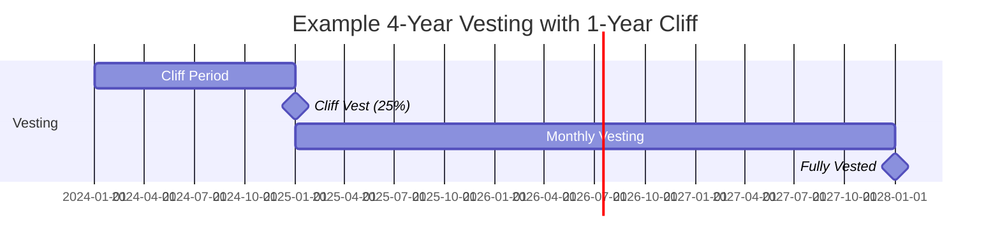
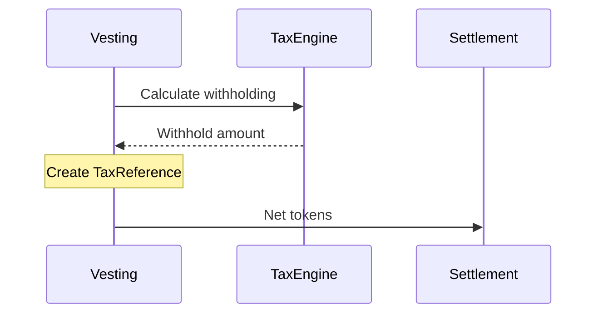

## Overview

Vesting is the process by which granted tokens become available to the recipient over time. TGA supports flexible vesting schedules to match your compensation strategy.

## Vesting Concepts

### Key Terms

| Term | Definition |
|------|------------|
| **Vesting Period** | Single time unit in the schedule |
| **Cliff** | Initial waiting period before first vest |
| **Cliff Percentage** | Percentage that vests at cliff |
| **Vested** | Tokens available to claim |
| **Unvested** | Tokens not yet available |

### Vesting Timeline



## Vesting Schedule Types

### Monthly Vesting (Most Common)

Tokens vest each month after the cliff:

```typescript
// 4-year monthly with 1-year cliff
{
    vestingFrequencyType: 'MONTHLY',
    vestingPeriods: 48,
    vestingCliffPeriods: 12,
    vestingCliffPercentage: 25
}

// Result:
// Month 0-11: No vesting (cliff period)
// Month 12: 25% vests (cliff release)
// Month 13-48: ~2.08% vests monthly
```

### Quarterly Vesting

Tokens vest each quarter:

```typescript
{
    vestingFrequencyType: 'QUARTERLY',
    vestingPeriods: 16,  // 4 years
    vestingCliffPeriods: 4  // 1 year
}
```

### Annual Vesting

Tokens vest once per year:

```typescript
{
    vestingFrequencyType: 'YEARLY',
    vestingPeriods: 4,
    vestingCliffPeriods: 1
}
```

### Custom Vesting

For non-standard schedules, use vesting templates:

```typescript
// Milestone-based vesting
vestingTemplateItems: [
    { sequenceNumber: 1, percentage: 10, date: '2024-06-01' },
    { sequenceNumber: 2, percentage: 20, date: '2024-12-01' },
    { sequenceNumber: 3, percentage: 30, date: '2025-06-01' },
    { sequenceNumber: 4, percentage: 40, date: '2025-12-01' }
]
```

## Vesting Statuses

| Status | Description |
|--------|-------------|
| `PENDING` | Scheduled but not yet vested |
| `VESTED` | Tokens available for settlement |
| `EXERCISED` | For options: exercise completed |
| `SETTLED` | Tokens delivered to wallet |
| `CANCELLED` | Vesting cancelled |
| `WITHHELD` | Tokens held for tax |

## Vesting Record Model

```typescript
interface Vesting {
    vestingID: string;
    grantID: string;
    sequence: number;           // Order in schedule

    // Amounts
    vestedUnits: Decimal;       // Units in this vest
    accruedUnits: Decimal;      // Cumulative vested

    // Dates
    vestingDate: Date;          // When tokens vest

    // Status
    status: VestingStatus;

    // Settlement
    settlementID?: string;      // Link to settlement
    taxReferenceID?: string;    // Link to tax record
}
```

## Cliff Mechanics

### What is a Cliff?

The cliff is a waiting period before any tokens vest. It's commonly used to:
- Ensure commitment before any equity
- Align with probation periods
- Reduce administrative overhead

### Cliff Release

At cliff completion:
1. Cliff percentage of total grant vests immediately
2. Remaining tokens follow regular schedule
3. Single vesting record created for cliff amount

### Example: 1-Year Cliff

```
Grant: 10,000 tokens
Cliff: 1 year (25%)
Vesting: 4 years monthly

Year 1:  No vesting
Month 12: 2,500 tokens vest (cliff)
Month 13: 208 tokens vest
Month 14: 208 tokens vest
...
Month 48: Final vest
```

## Vesting Calculations

### Standard Calculation

```typescript
// Per-period vesting after cliff
const totalUnits = grant.numberOfUnits;
const cliffUnits = totalUnits * (cliffPercentage / 100);
const remainingUnits = totalUnits - cliffUnits;
const periodsAfterCliff = vestingPeriods - cliffPeriods;
const unitsPerPeriod = remainingUnits / periodsAfterCliff;
```

### Rounding Considerations

TGA uses high precision (`Decimal(20,6)`) and handles rounding:
- Each period calculates exact amount
- Final period adjusts for any rounding remainder
- Ensures total equals granted amount

## Vesting Events

### Automatic Vesting

A cron job processes vesting on schedule:

1. Check for due vesting records
2. Update status to `VESTED`
3. Trigger settlement workflow
4. Notify recipient

### Manual Vesting Actions

Admins can:
- **Accelerate vesting** - Vest tokens early
- **Pause vesting** - Temporarily halt schedule
- **Cancel vesting** - Remove future vestings

## Tax Withholding

When tokens vest, tax may be withheld:



### Tax Reference

Each vesting can have associated tax withholding:

```typescript
{
    taxReferenceID: string;
    vestingID: string;
    unitsToWithhold: Decimal;
    taxCurrency: string;
    fmvAtVesting: Decimal;
    status: 'PENDING' | 'APPROVED' | 'REJECTED';
}
```

## Vesting Reports

### Vesting Schedule Report

View upcoming vestings:

| Date | Grant | Units | Cumulative |
|------|-------|-------|------------|
| 2024-03-01 | RTU-001 | 250 | 1,000 |
| 2024-04-01 | RTU-001 | 250 | 1,250 |
| 2024-04-01 | RTU-002 | 100 | 100 |

### Historical Vesting Report

View past vesting events with settlement status.

## Troubleshooting

<AccordionGroup>
<Accordion title="Vesting not processing on schedule">
**Possible Causes:**
- Cron job not running
- Grant in PAUSED status
- System date/timezone issues

**Solutions:**
1. Check vesting cron job logs
2. Verify grant status is ACCEPTED
3. Check organization timezone settings
</Accordion>

<Accordion title="Incorrect vesting amounts">
**Cause:** Configuration or rounding issues.

**Solutions:**
1. Review grant type configuration
2. Check cliff percentage settings
3. Verify total units matches expectation
</Accordion>

<Accordion title="Missing tax withholding">
**Cause:** Tax configuration not set up.

**Solutions:**
1. Configure tax calculator for jurisdiction
2. Set up tax profile for employee
3. Enable tax withholding in grant type
</Accordion>
</AccordionGroup>
