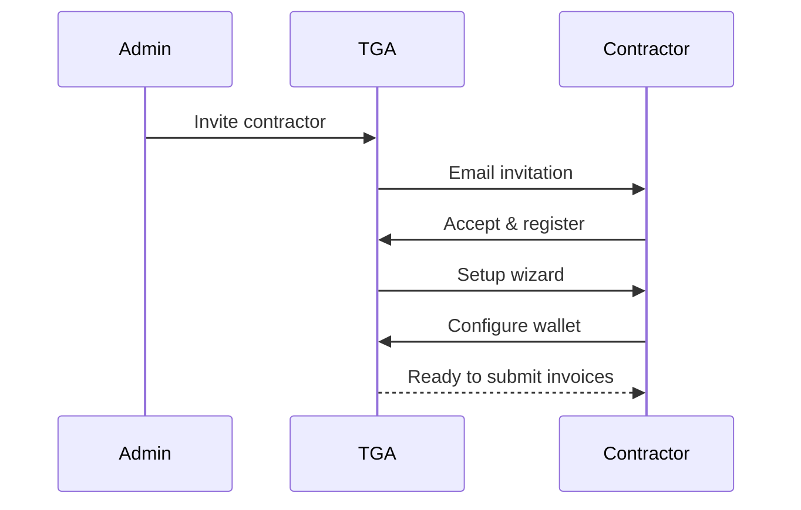
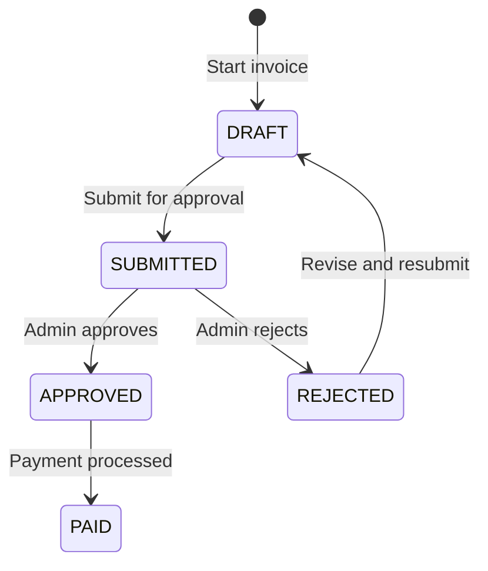

## Overview

The Contractor Portal enables contractors to manage their invoices, wallets, and payment preferences directly within TGA. This self-serve functionality reduces administrative overhead while giving contractors visibility into their payment status.

## Portal Features

| Feature | Description |
|---------|-------------|
| **Invoice submission** | Submit invoices for approval |
| **Payment tracking** | View payment status |
| **Wallet management** | Configure receiving wallets |
| **Transaction history** | View past payments |
| **Document access** | Download payment confirmations |

## Contractor Onboarding

### Registration Flow



### Setup Steps

<Steps>
<Step title="Accept Invitation">
  Contractor receives email invitation and creates account.
</Step>

<Step title="Complete Profile">
  Enter business details and tax information.
</Step>

<Step title="KYC Verification">
  Complete identity verification (if required).
</Step>

<Step title="Configure Wallet">
  Set up receiving wallet for payments.
</Step>

<Step title="Ready to Invoice">
  Begin submitting invoices for work.
</Step>
</Steps>

## Invoice Submission

### Creating an Invoice

Contractors can submit invoices through the portal:

```typescript
interface InvoiceSubmission {
    invoiceNumber: string;
    invoiceDate: Date;
    dueDate: Date;
    amount: Decimal;
    currency: string;
    description?: string;
    attachments?: File[];
}
```

### Submission Form

| Field | Required | Description |
|-------|----------|-------------|
| Invoice Number | Yes | Unique identifier |
| Invoice Date | Yes | Date of invoice |
| Due Date | Yes | Payment due date |
| Amount | Yes | Invoice amount |
| Currency | Yes | Payment currency |
| Description | No | Work description |
| Attachments | No | Supporting documents |

### Submission Workflow



## Payment Tracking

### Invoice Statuses

| Status | Meaning |
|--------|---------|
| `DRAFT` | Invoice in progress, not submitted |
| `SUBMITTED` | Awaiting admin approval |
| `APPROVED` | Approved, awaiting payment |
| `REJECTED` | Rejected with feedback |
| `PAID` | Payment completed |

### Tracking View

Contractors can see:

- Pending invoices
- Payment due dates
- Transaction status
- Transaction hash/link (when paid)

## Wallet Configuration

### Adding a Wallet

Contractors configure their receiving wallet:

```typescript
interface ContractorWallet {
    address: string;
    networkID: string;
    tokenTypeID: string;
    isVerified: boolean;
}
```

### Verification Process

1. Contractor submits wallet address
2. TGA sends small test transaction
3. Contractor confirms receipt
4. Wallet marked as verified

### Token Preferences

Contractors can select preferred payment token:

| Option | Description |
|--------|-------------|
| Organization default | Use org's preferred token |
| Specific token | Request specific token type |
| Multiple wallets | Split across tokens |

## Payment Notifications

### Email Notifications

Contractors receive emails for:

| Event | Notification |
|-------|--------------|
| Invoice approved | Approval confirmation |
| Payment processed | Payment confirmation |
| Invoice rejected | Rejection with reason |
| Wallet verified | Verification complete |

### In-App Notifications

Real-time updates within the portal:

- Status changes
- New messages from admin
- Payment confirmations

## Transaction History

### View Past Payments

```typescript
interface PaymentHistory {
    invoicePaymentID: string;
    amount: Decimal;
    tokenAmount: Decimal;
    exchangeRate: Decimal;
    paidAt: Date;
    transactionHash: string;
    transactionLink: string;
}
```

### Export Options

| Format | Use Case |
|--------|----------|
| CSV | Accounting software |
| PDF | Tax documentation |
| JSON | API integration |

## Self-Serve Features

### Profile Management

Contractors can update:

- Business name
- Contact information
- Tax details
- Banking information (for fiat fallback)

### Document Access

Available documents:

- Payment confirmations
- 1099 forms (if applicable)
- Contract documents
- Tax documentation

## Security Features

### Account Security

| Feature | Description |
|---------|-------------|
| 2FA | Two-factor authentication |
| Session management | Active session control |
| Audit log | Activity history |

### Data Privacy

- Contractors only see own data
- Secure document storage
- Encrypted communications

## Admin Controls

### Managing Contractors

Admins can:

| Action | Purpose |
|--------|---------|
| Invite | Add new contractors |
| Suspend | Temporarily disable access |
| Remove | Remove from organization |
| View activity | Review contractor actions |

### Invoice Review

Admins review contractor submissions:

1. View submitted invoices
2. Verify work completion
3. Approve or reject with comments
4. Process approved invoices

## Best Practices

1. **Complete onboarding** - Ensure profile and wallet setup before first invoice
2. **Submit promptly** - Submit invoices soon after work completion
3. **Accurate details** - Ensure invoice amounts match agreements
4. **Keep wallets updated** - Update wallet if address changes
5. **Monitor payments** - Track payment status regularly

## Troubleshooting

<AccordionGroup>
<Accordion title="Cannot submit invoice">
**Cause:** Profile incomplete or wallet not verified.

**Solutions:**
1. Complete all required profile fields
2. Verify receiving wallet
3. Check for any pending KYC requirements
</Accordion>

<Accordion title="Invoice rejected">
**Cause:** Issue identified during review.

**Solutions:**
1. Review rejection reason
2. Correct the issue
3. Resubmit with corrections
</Accordion>

<Accordion title="Payment not received">
**Cause:** Various possible causes.

**Solutions:**
1. Verify invoice status is PAID
2. Check transaction on block explorer
3. Confirm wallet address is correct
4. Contact admin for support
</Accordion>

<Accordion title="Wallet verification failed">
**Cause:** Test transaction not confirmed.

**Solutions:**
1. Check wallet for test transaction
2. Verify correct network selected
3. Retry verification process
</Accordion>
</AccordionGroup>
