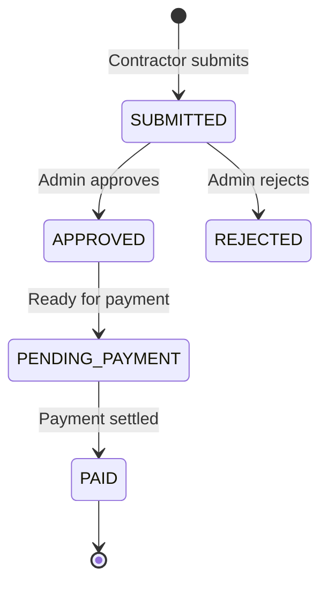
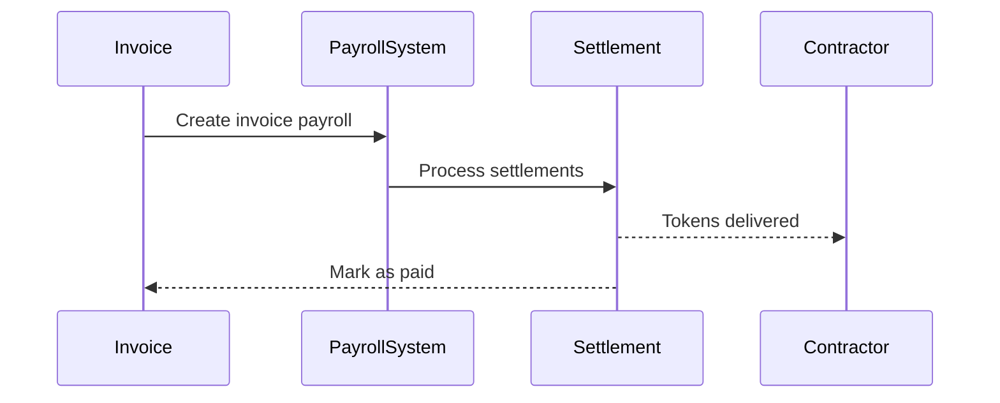

## Overview

TGA provides invoice management for contractor payments, enabling organizations to pay contractors in tokens or stablecoins. The system supports invoice submission, approval workflows, and settlement tracking.

## Invoice Workflow



## Key Concepts

### Invoice Payment

Represents an approved invoice awaiting payment:

```typescript
interface InvoicePayment {
    invoicePaymentID: string;
    roleInOrgID: string;
    orgID: string;

    // Amount
    amount: Decimal;
    currency: string;

    // Invoice details
    invoiceNumber: string;
    invoiceDate: Date;
    dueDate: Date;

    // Status
    status: InvoicePaymentStatus;
    paidAt?: Date;
}
```

### Invoice Token Transaction

Links invoice payment to token settlement:

```typescript
interface InvoiceTokenTransaction {
    invoicePaymentID: string;
    invoiceTokenTransactionID: string;
    roleInOrgID: string;

    // Token details
    tokenID: string;
    tokenName: string;
    tokenSymbol: string;
    address: string;

    // Amounts
    tokenAmount: number;
    sourceAmount: number;
    exchangeRate: number;
    sourceCurrencyCode: string;

    // Status
    isApproved: boolean;
    settlementId?: string;
    transactionHash?: string;
    dateFulfilled?: Date;
}
```

## Invoice Process

### Step 1: Submit Invoice

Contractors submit invoices through the self-serve portal or admins create on their behalf.

### Step 2: Review & Approve

Admins review submitted invoices:

```typescript
const invoices = await invoiceService.getInvoicePayments({
    status: 'SUBMITTED',
    orgID
});

// Approve invoice
await invoiceService.approveInvoicePayment(invoicePaymentID);
```

### Step 3: Token Transaction Creation

Once approved, token transactions are created:

```typescript
const transactions = await invoiceService.getInvoicePaymentTransactions(
    invoicePaymentID
);
```

### Step 4: Settlement

Invoice payments can be settled:

- **Individual** - One invoice at a time
- **Bulk** - Multiple invoices together
- **Payroll** - Grouped into invoice payroll

## Monthly Invoice Groups

Organize invoices by month for batch processing:

```typescript
interface MonthlyInvoiceGroup {
    month: string;           // "2024-01"
    year: number;
    invoiceCount: number;
    totalAmount: Decimal;
    currency: string;
    invoices: InvoicePayment[];
}
```

### Grouping Benefits

| Benefit | Description |
|---------|-------------|
| Batch processing | Process all monthly invoices together |
| Efficient settlement | Single batch transaction |
| Clear reporting | Month-by-month tracking |
| Simplified accounting | Monthly reconciliation |

## Invoice Payroll

Convert invoice groups to payroll for settlement:

```typescript
interface CreateTokenPayrollFromInvoiceSummaryRequest {
    month: string;
    year: number;
    tokenTypeID: string;
    payDate: Date;
}

const payroll = await invoiceToPayrollService.createTokenPayrollFromInvoiceSummary(
    request
);
```

### Payroll Type

Invoice payments create `INVOICE_PAYMENT` type payrolls:

| Property | Value |
|----------|-------|
| Type | INVOICE_PAYMENT |
| Contributors | Contractors with approved invoices |
| Token | Organization's configured token |
| Settlement | Via standard payroll settlement |

## Reports

### Available Reports

| Report | Description |
|--------|-------------|
| **Pending Invoices** | Invoices awaiting approval |
| **Approved Invoices** | Ready for payment |
| **Settlement Report** | Payment status tracking |
| **Monthly Summary** | Grouped by month |

### Settlement Report

```typescript
const report = await getInvoiceSettlementReport({
    startDate,
    endDate,
    status: 'ALL'
});

// Returns:
// - Total invoices
// - Total amount
// - Settled vs pending
// - By contractor breakdown
```

## Bulk Operations

### Bulk Invoice Submission

Submit multiple invoices at once:

```typescript
await invoiceService.submitBulkInvoicePayments({
    invoices: [
        { roleInOrgID, amount, currency, invoiceNumber, dueDate },
        // ... more invoices
    ]
});
```

### Bulk Payment

Process multiple invoices together:

```typescript
await invoiceService.getBulkInvoicePaymentTransactions({
    invoicePaymentIDs: ['inv-1', 'inv-2', 'inv-3']
});
```

## Wallet Validation

Verify contractors have valid wallets before payment:

```typescript
const validation = await getWalletValidationStatusForContractors({
    roleInOrgIDs: contractorIDs,
    tokenTypeID
});

// Returns validation status for each contractor:
// - hasVerifiedWallet: boolean
// - walletAddress: string
// - tokenSupported: boolean
```

## Integration with Payroll

Invoice payments integrate with the payroll system:



## Best Practices

1. **Regular processing** - Process invoices on a consistent schedule
2. **Batch by month** - Use monthly grouping for efficiency
3. **Verify wallets** - Confirm contractor wallets before payment
4. **Track exchange rates** - Document rates at settlement time
5. **Maintain records** - Keep invoice documentation for compliance

## Related Features

- **[Contractor Portal](/features/invoices/contractor-portal)** - Self-serve invoice submission
- **[Stablecoin Payroll](/features/payroll/stablecoin-payroll)** - Payment settlement
- **[Wallets](/features/wallets/overview)** - Wallet management
