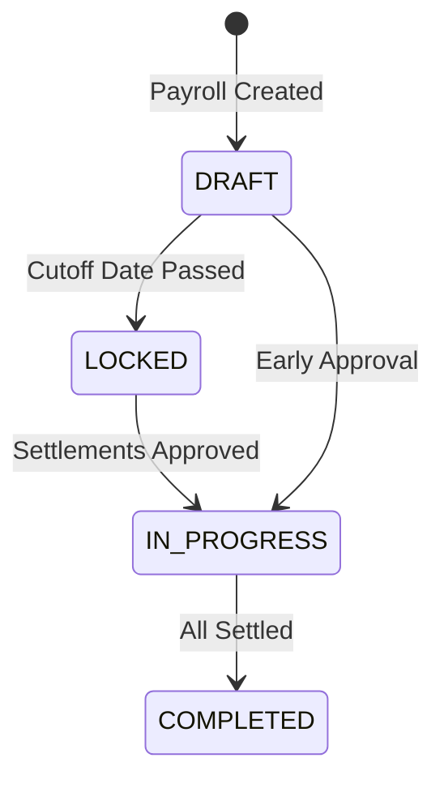
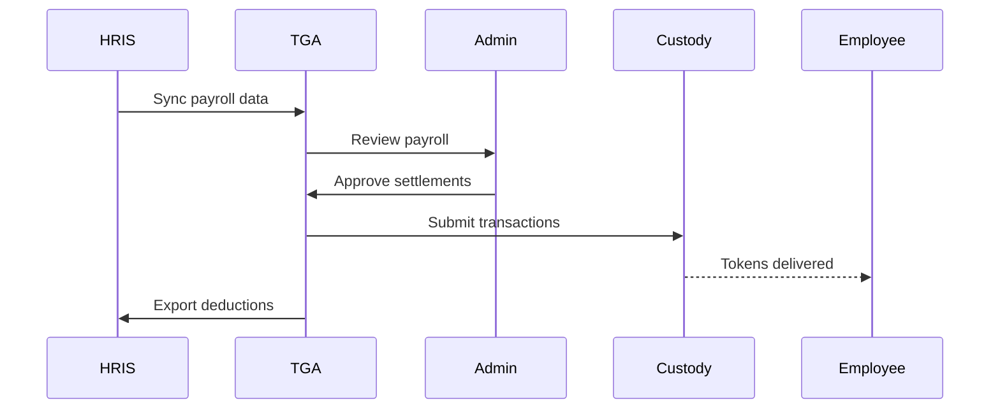

## Overview

TGA provides comprehensive payroll solutions for organizations that want to pay employees and contractors in digital assets. The platform supports both token-based payroll and stablecoin payroll, with integrations to major HRIS systems for seamless data synchronization.

## Payroll Types

### Token Payroll

Traditional token compensation where employees receive project tokens as part of their salary:

| Feature | Description |
|---------|-------------|
| **Token distribution** | Pay salary portions in native tokens |
| **Wallet allocations** | Employees configure receiving wallets |
| **Exchange rate handling** | Real-time rate locking at settlement |
| **Tax withholding** | Automatic tax calculation support |

### Stablecoin Payroll

Pay employees in stablecoins (USDC, USDT, etc.) for consistent value:

| Feature | Description |
|---------|-------------|
| **Stable value** | Pegged to fiat for predictable compensation |
| **Multi-token** | Support for various stablecoins |
| **Network choice** | Multiple blockchain networks available |
| **Fast settlement** | Direct blockchain transfers |

## Payroll Lifecycle



## Payroll States

| State | Description |
|-------|-------------|
| `DRAFT` | Payroll created, modifications allowed |
| `LOCKED` | Past cutoff date, no wallet changes |
| `IN_PROGRESS` | Settlements being processed |
| `COMPLETED` | All payments delivered |

## Key Concepts

### Payroll Entity

Groups payrolls by legal entity, country, and currency:

```typescript
interface PayrollEntity {
    payrollEntityID: string;
    orgID: string;
    name: string;               // e.g., "Acme Inc USA"
    country: CountryCode;
    reportingCurrency: TaxCurrencyCode;
}
```

### Token Payroll

Represents a payroll run with contributors and settlements:

```typescript
interface TokenPayroll {
    tokenPayrollID: string;
    name: string;
    payPeriodStart: Date;
    payPeriodEnd: Date;
    payDate: Date;
    fiatCurrency: string;
    state: PayrollState;
    type: PayrollType;          // ON_CYCLE, OFF_CYCLE, INVOICE_PAYMENT

    // Contributors in this payroll
    contributorsInTokenPayroll: ContributorInPayroll[];

    // Settlement configuration
    settlementMethod: SettlementMethod;
}
```

### Contributors

Employees/contractors included in a payroll run:

```typescript
interface ContributorInTokenPayroll {
    contributorInTokenPayrollID: string;
    roleInOrgID: string;

    // Amounts
    totalPayrollAmount: Decimal;
    totalDeductionAmount: Decimal;
    netPayrollAmount: Decimal;

    // Currency
    currency: string;

    // Settlements
    settlementOrders: Settlement[];
}
```

## Payroll Cycle Types

### ON_CYCLE (Regular Payroll)

Standard scheduled payroll runs:
- Follows regular pay schedule
- Uses employee wallet allocations
- Supports multiple tokens per employee
- Automatic distribution based on percentages

### OFF_CYCLE (Ad-hoc Payroll)

Special payroll runs outside regular schedule:
- Bonuses, commissions, corrections
- Single token type per payroll
- Override employee allocations
- Immediate processing

### INVOICE_PAYMENT

Contractor invoice settlements:
- Tied to approved invoices
- Specific amounts per invoice
- Flexible token selection
- Audit trail maintained

## Payroll Cutoff

Organizations can configure cutoff dates to lock allocations:

```typescript
// Cutoff calculation
const cutoffDate = payDate - payrollCutOffDaysBeforeApprovalDate;

// After cutoff:
// - Wallet allocations locked
// - No new contributors can be added
// - Exchange rates locked at approval
```

## Settlement Methods

| Method | Description |
|--------|-------------|
| `MANUAL` | Admin manually executes transactions |
| `PROPOSE` | Creates proposals in multi-sig (Squads, Safe) |
| `AUTO` | Automated settlement via custody provider |

## Data Flow



## HRIS Integration

TGA integrates with major HRIS platforms:

| Platform | Features |
|----------|----------|
| **ADP** | Payroll sync, deduction export |
| **Workday** | Employee sync, payroll import |
| **UKG** | Position mapping, payroll data |
| **BambooHR** | Employee data synchronization |

## Related Features

- **[Token Payroll](/features/payroll/token-payroll)** - Token compensation details
- **[Stablecoin Payroll](/features/payroll/stablecoin-payroll)** - Stablecoin payments
- **[Settlement](/features/payroll/settlement)** - Settlement processing
- **[HRIS Integration](/integrations/hris/overview)** - HRIS setup guides
