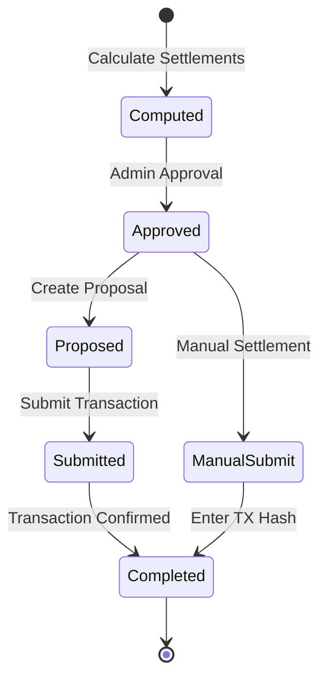
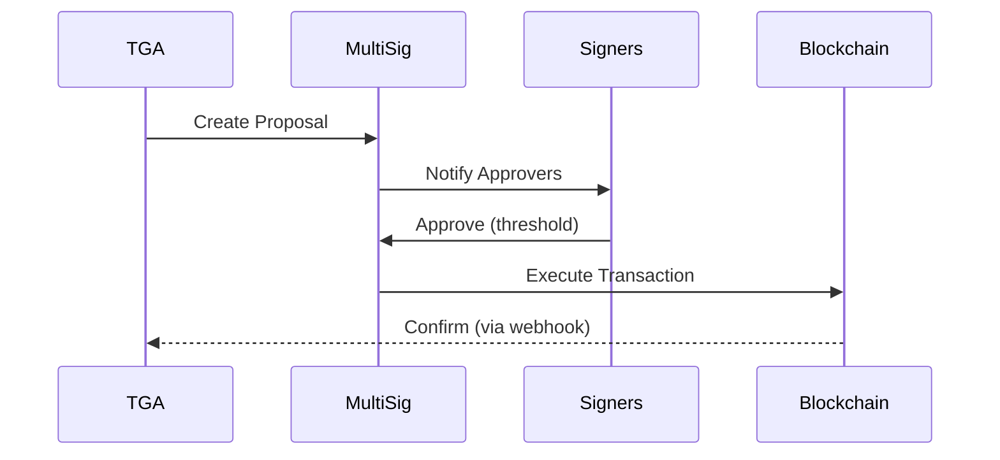

## Overview

Settlement is the process of actually transferring tokens from the organization's custody to employee wallets. TGA supports multiple settlement methods depending on your custody provider and organizational requirements.

## Settlement Lifecycle



## Settlement Methods

### Manual Settlement

Admin executes transactions through external tools:

| Step | Action |
|------|--------|
| 1 | Export settlement details |
| 2 | Execute via custody provider |
| 3 | Enter transaction hash in TGA |
| 4 | System marks as complete |

### Propose Settlement

Create proposals in multi-sig wallets for approval:



### Automated Settlement

Direct integration with custody providers:

| Provider | Method |
|----------|--------|
| Coinbase Prime | API submission |
| Fireblocks | Vault transaction |
| Squads | Multisig proposal |
| Safe | Transaction bundle |

## Settlement Computation

### Pending Settlement Calculation

```typescript
interface PendingSettlementRecord {
    roleInOrgID: string;
    contributorInTokenPayrollID: string;
    walletAddress: string;
    tokenID: string;
    tokenAmount: Decimal;
    fiatAmount: Decimal;
    fiatCurrency: string;
    exchangeRate: Decimal;
    exchangeRateDate: Date;
}

// Compute settlements
const settlements = await computePendingSettlementsService.computePendingSettlements({
    payrollID: tokenPayrollID
});
```

### Exchange Rate Locking

Rates are locked at 15-second intervals for consistency:

```typescript
// Rate fetching intervals: 0, 15, 30, 45 seconds
const rateTimestamp = getRoundedTimestamp(new Date(), 15);

// All settlements in batch use same rate timestamp
const exchangeRates = await fetchExchangeRates(
    currencyPairs,
    rateTimestamp
);
```

## Settlement Record

### Data Model

```typescript
interface TokenSettlementForContributorTokenPayroll {
    // Identifiers
    settlementOrderForContributorTokenPayrollID: string;
    contributorInTokenPayrollID: string;
    roleInOrgID: string;

    // Token details
    tokenID: string;
    address: string;            // Destination wallet
    tokenAmount: Decimal;

    // Fiat reference
    fiatAmount: Decimal;
    currencyCode: string;

    // Exchange rate audit trail
    exchangeRate: Decimal;
    exchangeRateSource: ExchangeRateSource;
    exchangeRateRefetchedAt?: Date;

    // Transaction tracking
    transactionHash?: string;
    transactionLink?: string;
    dateFulfilled?: Date;
    dateCreated: Date;

    // Integration tracking
    deductionsPosted: boolean;
    exportedAt?: Date;
    invoicePaymentID?: string;
}
```

### Status Tracking

| Field | Indicates |
|-------|-----------|
| `dateCreated` | Settlement approved |
| `transactionHash` | Transaction submitted |
| `dateFulfilled` | Transaction confirmed |
| `deductionsPosted` | Synced to HRIS |

## Batch Settlement

### Tokens in Payroll

Get all unique tokens requiring settlement:

```typescript
const tokens = await stablecoinPayrollService.getTokensInPayroll(
    tokenPayrollID
);

// Returns token details with network information
// for batch transaction preparation
```

### Mark Complete

After transactions are confirmed:

```typescript
await stablecoinPayrollService.markSettlementsComplete([
    {
        tokenSettlementForContributorTokenPayrollID: 'settlement-1',
        transactionHash: '0x123...'
    },
    {
        tokenSettlementForContributorTokenPayrollID: 'settlement-2',
        transactionHash: '0x456...'
    }
]);
```

## Multi-Sig Integration

### Squads (Solana)

```typescript
// Create Squads proposal
const proposal = await squadsService.createProposal({
    multisig: multisigAddress,
    transactions: settlements.map(s => ({
        to: s.address,
        amount: s.tokenAmount,
        token: s.tokenID
    }))
});

// Track proposal status
// Webhook updates when approved/executed
```

### Safe (EVM)

```typescript
// Create Safe transaction bundle
const safeTx = await safeService.createBatchTransaction({
    safeAddress,
    transactions: settlements.map(s => ({
        to: s.address,
        value: s.tokenAmount,
        data: erc20TransferData
    }))
});

// Propose to Safe for signing
await safeService.proposeTransaction(safeTx);
```

## Settlement Validation

### Pre-Settlement Checks

| Check | Description |
|-------|-------------|
| Balance | Sufficient tokens in custody |
| Address | Valid blockchain address |
| Amount | Non-zero token amount |
| Network | Token supported on network |

### Allocation Validation

TGA validates allocations don't exceed net pay:

```typescript
// Check for over-allocation
if (totalDeductionsAlreadyApproved > netPayrollAmount) {
    payrollAllocationErrors.push({
        error: 'Approved amount exceeds net payroll',
        computedSettlement
    });
}
```

## Transaction Links

### Block Explorer URLs

TGA generates explorer links automatically:

```typescript
const transactionLink = network.blockExplorerBaseUrl
    ? `${network.blockExplorerBaseUrl}/tx/${transactionHash}`
    : '';
```

### Supported Explorers

| Network | Explorer |
|---------|----------|
| Ethereum | Etherscan |
| Polygon | Polygonscan |
| Arbitrum | Arbiscan |
| Solana | Solscan |

## HRIS Deduction Sync

### Post-Settlement Steps

1. **Mark deductions posted**
   ```typescript
   await service.markDeductionsAsPosted(tokenPayrollID);
   ```

2. **Export for HRIS**
   ```typescript
   await service.markSettlementsAsExported(tokenPayrollID);
   ```

3. **Generate export file**
   - ADP format
   - Workday format
   - Generic CSV

## Payroll Completion

### Completion Check

TGA automatically marks payroll complete when all settlements are done:

```typescript
// Check all settlements fulfilled
const allSettlementsCompleted = contributors.every(
    c => c.settlements.every(s => s.dateFulfilled)
);

if (allSettlementsCompleted) {
    await prisma.tokenPayroll.update({
        where: { tokenPayrollID },
        data: {
            state: PayrollState.COMPLETED,
            isTokenPayrollComplete: true
        }
    });
}
```

## Error Recovery

### Transaction Failed

If a transaction fails:

1. Check blockchain for actual status
2. Verify gas/fee settings
3. Retry with updated parameters
4. Contact support if persistent

### Partial Settlement

If some settlements fail:

1. Identify failed settlements
2. Check specific error reasons
3. Fix issues (wallet, balance, etc.)
4. Reprocess failed settlements only

## Notifications

### Settlement Events

TGA sends notifications for:

| Event | Recipients |
|-------|------------|
| Settlement approved | Admin |
| Transaction submitted | Admin |
| Payment received | Employee |
| Settlement failed | Admin |

### Payment Confirmation

Employees receive confirmation emails:

```typescript
await paymentConfirmationService.sendBulkPaymentConfirmationEmails(
    tokenPayrollID,
    completedSettlementIDs
);
```

## Audit Trail

### Settlement History

Every settlement action is tracked:

| Field | Purpose |
|-------|---------|
| `dateCreated` | When approved |
| `exchangeRateRefetchedAt` | Rate lock time |
| `dateFulfilled` | Transaction confirmed |
| `exportedAt` | HRIS sync time |

### Exchange Rate Audit

```typescript
// Each settlement records:
{
    exchangeRate: Decimal,
    exchangeRateSource: 'COINMARKETCAP' | 'ORACLE_ERP' | 'MANUAL',
    exchangeRateRefetchedAt: Date
}
```

## Troubleshooting

<AccordionGroup>
<Accordion title="Transaction pending for too long">
**Cause:** Network congestion or low gas.

**Solutions:**
1. Check transaction on block explorer
2. Speed up with higher gas (if supported)
3. Wait for network conditions to improve
4. Cancel and resubmit if stuck
</Accordion>

<Accordion title="Wrong amount settled">
**Cause:** Exchange rate changed or calculation error.

**Solutions:**
1. Review exchange rate at approval time
2. Check settlement calculation logs
3. Contact support for correction
</Accordion>

<Accordion title="Settlement to wrong address">
**Cause:** Employee wallet changed mid-process.

**Solutions:**
1. Verify cutoff date was enforced
2. Check historical wallet allocations
3. Contact support - may need manual recovery
</Accordion>
</AccordionGroup>
