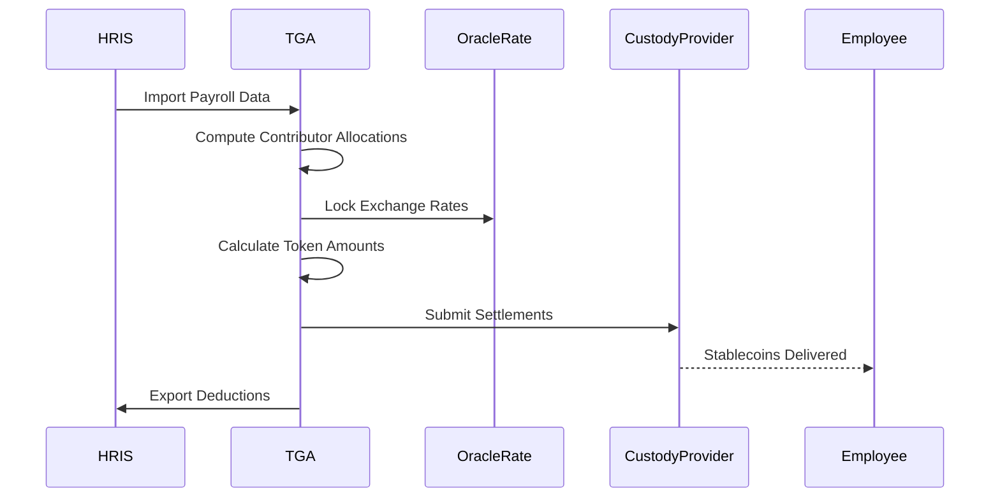

## Overview

Stablecoin payroll enables organizations to pay employees in price-stable digital assets like USDC, USDT, or other stablecoins. This provides the benefits of blockchain payments while avoiding the volatility of traditional cryptocurrencies.

## Benefits

| Benefit | Description |
|---------|-------------|
| **Price stability** | Value pegged to fiat currencies |
| **Fast settlement** | Direct blockchain transfers |
| **Low fees** | Cheaper than traditional wire transfers |
| **Global reach** | Pay anyone with a wallet address |
| **Transparency** | On-chain transaction records |

## Supported Stablecoins

| Stablecoin | Networks | Peg |
|------------|----------|-----|
| USDC | Ethereum, Polygon, Arbitrum, Solana | USD |
| USDT | Ethereum, Polygon, Tron | USD |
| DAI | Ethereum, Polygon | USD |
| EURC | Ethereum | EUR |

## How It Works

### Allocation Configuration

Employees configure stablecoin allocations:

```typescript
interface StablecoinAgreement {
    stablecoinAgreementID: string;
    roleInOrgID: string;
    walletID: string;

    // Distribution settings
    distributionType: 'PERCENTAGE' | 'FIXED_AMOUNT';
    distributionRatio?: Decimal;
    fixedAmount?: Decimal;

    // Audit trail
    createdAt: Date;
}
```

### Processing Flow



## Service Architecture

The StableCoinPayrollService handles all stablecoin payroll operations:

```typescript
class StableCoinPayrollService {
    // Core operations
    async getTokenPayrollByID(tokenPayrollID: string): Promise<TokenPayroll>;
    async getAllTokenPayrolls(): Promise<TransformedTokenPayroll[]>;

    // Settlement operations
    async approveContributorInTokenPayrolls(ids: string[]): Promise<void>;
    async markSettlementsComplete(settlements: Settlement[]): Promise<void>;

    // Exchange rate operations
    async refreshExchangeRatesForPayroll(payrollID: string): Promise<Result>;
}
```

## Settlement Computation

### Exchange Rate Handling

Exchange rates are computed using currency pairs:

```typescript
// Build unique currency pairs
const uniquePairs: CurrencyPair[] = [
    { from: 'USD', to: 'USDC' },
    { from: 'EUR', to: 'USDC' },
    // etc.
];

// Fetch rates (uses org's configured source)
const exchangeRates = await computeExchangeRatesForCurrencyPairs(
    uniquePairs,
    orgID
);
```

### Rate Sources

| Source | Priority | Use Case |
|--------|----------|----------|
| Oracle ERP | 1 | Organization-configured rates |
| CoinMarketCap | 2 | Real-time market rates |
| Manual | 3 | Admin override |

### Token Amount Calculation

```typescript
// Calculate token amount
const tokenAmount = new Decimal(fiatAmount)
    .div(exchangeRate.exchangeRate)
    .toFixed(6);  // 6 decimal precision

// Example:
// $1,000 USD / 1.0 USDC rate = 1,000 USDC
```

## Cutoff Date Management

### Cutoff Calculation

```typescript
function calculatePayrollCutoffDate(
    payDate: Date,
    cutoffDays: number
): { cutoffDate: Date; isPassedCutoffDate: boolean } {
    const cutoffDate = new Date(payDate);
    cutoffDate.setDate(cutoffDate.getDate() - cutoffDays);

    return {
        cutoffDate,
        isPassedCutoffDate: new Date() > cutoffDate
    };
}
```

### Post-Cutoff Behavior

After cutoff date:
- Wallet allocations are frozen
- New wallets cannot be added
- Historical allocations used for calculations
- Exchange rates locked at approval time

## Settlement Methods

### Manual Settlement

Admin executes transactions manually:

1. Review approved settlements
2. Export transaction details
3. Execute via custody provider
4. Enter transaction hashes
5. Mark as complete

### Propose Settlement (Multi-sig)

Create proposals in multi-sig wallets:

```typescript
// For Squads (Solana)
const proposal = await squadsService.proposeSettlement(
    settlements,
    multisigAddress
);

// For Coinbase Prime
const transaction = await coinbasePrimeService.submitSettlement(
    settlements,
    portfolioID
);
```

### Automated Settlement

Direct integration with custody providers:

1. TGA submits settlements to provider
2. Provider handles signing and broadcasting
3. Webhooks update settlement status
4. Automatic completion tracking

## Settlement Record

Each settlement creates a detailed record:

```typescript
interface TokenSettlementForContributorTokenPayroll {
    settlementOrderForContributorTokenPayrollID: string;
    contributorInTokenPayrollID: string;
    roleInOrgID: string;

    // Token details
    tokenID: string;
    address: string;
    tokenAmount: Decimal;

    // Fiat details
    fiatAmount: Decimal;
    currencyCode: string;

    // Exchange rate audit
    exchangeRate: Decimal;
    exchangeRateSource: ExchangeRateSource;
    exchangeRateRefetchedAt: Date;

    // Settlement status
    transactionHash?: string;
    transactionLink?: string;
    dateFulfilled?: Date;

    // Deduction tracking
    deductionsPosted: boolean;
    exportedAt?: Date;
}
```

## Rate Refresh

Refresh exchange rates for pending settlements:

```typescript
const result = await stablecoinPayrollService.refreshExchangeRatesForPayroll(
    tokenPayrollID
);

// Result:
// {
//     success: true,
//     refreshedCount: 15,
//     failedCount: 0,
//     message: "Successfully refreshed 15 settlements"
// }
```

## Deduction Export

### Mark Deductions Posted

After syncing to HRIS:

```typescript
await stablecoinPayrollService.markDeductionsAsPosted(tokenPayrollID);
```

### Mark Settlements Exported

Track which settlements have been exported:

```typescript
await stablecoinPayrollService.markSettlementsAsExported(tokenPayrollID);
```

## ADP Integration

### Deduction Export

Generate ADP-compatible deduction files:

```typescript
// Export format configurable per organization
const exportData = await adpExportGenerator.generateDeductionExport(
    tokenPayrollID,
    exportConfig
);
```

### Position Mapping

Map TGA users to ADP positions:

```typescript
interface ContributorMapping {
    positionID: string;      // ADP Position ID
    payrollGroup: string;    // ADP Payroll Group
    externalEmployeeID: string;
}
```

## Troubleshooting

<AccordionGroup>
<Accordion title="Settlement stuck in pending">
**Cause:** Transaction not confirmed on blockchain.

**Solutions:**
1. Check custody provider for transaction status
2. Verify sufficient funds in source wallet
3. Check network congestion
4. Contact support if issue persists
</Accordion>

<Accordion title="Exchange rate mismatch">
**Cause:** Rate changed between approval and settlement.

**Solutions:**
1. Use rate refresh before final approval
2. Configure Oracle ERP for stable rates
3. Process settlements quickly after approval
</Accordion>

<Accordion title="Missing wallet allocation">
**Cause:** Employee wallet not configured or not verified.

**Solutions:**
1. Check wallet verification status
2. Ensure wallet is marked as current
3. Verify token type matches payroll token
</Accordion>

<Accordion title="Deduction export failed">
**Cause:** HRIS integration issue.

**Solutions:**
1. Check HRIS credentials
2. Verify export format configuration
3. Review error logs for specific failures
</Accordion>
</AccordionGroup>

## Best Practices

1. **Verify allocations early** - Confirm employee wallet setup before payroll
2. **Use cutoff dates** - Lock allocations to prevent last-minute changes
3. **Refresh rates** - Update exchange rates close to settlement time
4. **Track deductions** - Always export to HRIS for tax compliance
5. **Test first** - Run small test payrolls before full deployment
