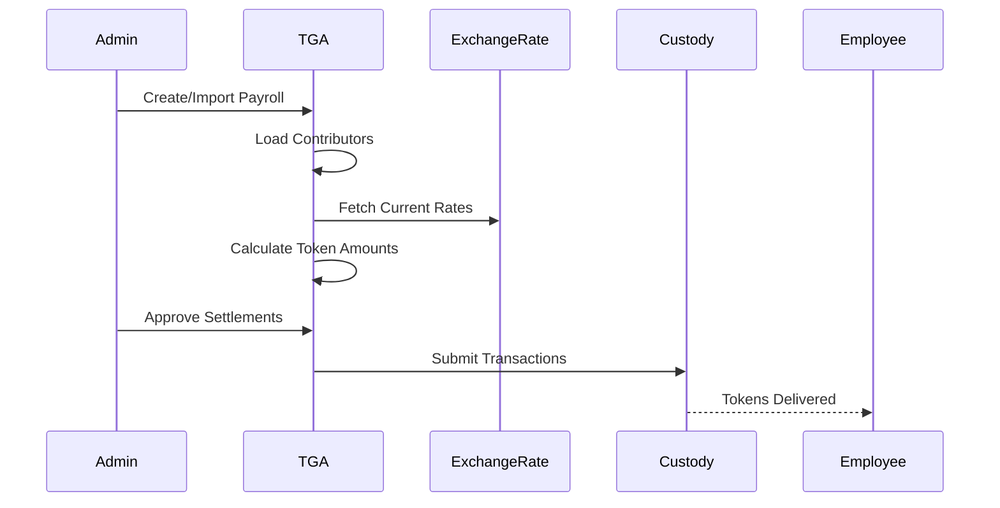

## Overview

Token payroll allows organizations to pay employees partially or fully in project tokens. Employees configure their wallet allocations, and TGA handles the conversion and settlement process.

## How It Works

### Employee Allocation Setup

Employees configure how much of their salary they want in tokens:

```typescript
interface TokenWalletReference {
    walletReferenceID: string;
    roleInOrgID: string;
    walletID: string;

    // Distribution configuration
    distributionType: 'PERCENTAGE' | 'FIXED_AMOUNT';
    distributionRatio?: Decimal;  // e.g., 0.25 for 25%
    fixedAmount?: Decimal;        // Fixed amount per pay period
}
```

### Payroll Processing



## Creating Token Payroll

### Step 1: Payroll Import

Import payroll data from HRIS or CSV:

```typescript
interface PayrollRow {
    externalPayrollID: string;
    externalEmployeeID?: string;
    email: string;
    totalPayrollAmount: string;
    totalDeductionAmount: string;
    netPayrollAmount: string;
    payPeriodStartDate: string;
    payPeriodEndDate: string;
    payDate: string;
    fiatCurrency: string;
    country: string;
}
```

### Step 2: Contributor Validation

TGA validates all contributors:

| Validation | Description |
|------------|-------------|
| Employee exists | User has TGA profile |
| Role in org | Has USER role in organization |
| Wallet configured | Has verified wallet |
| Currency match | Payroll currency supported |

### Step 3: Settlement Computation

For each contributor, TGA computes settlements:

```typescript
// ON_CYCLE: Use employee's configured allocations
const distributions = await computeOnCycleTokenDistributions(
    walletReferences
);

// OFF_CYCLE: Use single selected token
const distributions = await computeOffCycleTokenDistributions(
    walletReferences,
    selectedToken
);
```

## Payroll Types

### ON_CYCLE Payroll

Regular scheduled payroll with multiple tokens:

| Feature | Description |
|---------|-------------|
| Allocation-based | Uses employee wallet preferences |
| Multi-token | Different tokens per employee |
| Percentage split | Distribute across multiple wallets |
| Automatic | Follows configured ratios |

**Example:**
```
Employee: John Smith
Net Pay: $10,000 USD

Allocations:
- 50% → ETH wallet → $5,000 in ETH
- 30% → USDC wallet → $3,000 in USDC
- 20% → Fiat → $2,000 traditional payroll
```

### OFF_CYCLE Payroll

Ad-hoc payroll with single token:

| Feature | Description |
|---------|-------------|
| Single token | One token type per payroll |
| Override allocations | Admin selects token |
| Bonus/Commission | Special payments |
| Immediate | Process outside schedule |

## Exchange Rate Management

### Rate Fetching

Exchange rates fetched at settlement time:

```typescript
// Compute exchange rates for all currency pairs
const exchangeRates = await computeExchangeRatesForCurrencyPairs(
    uniquePairs,  // e.g., USD → ETH, USD → USDC
    orgID         // Uses org's configured rate source
);
```

### Rate Sources

| Source | Description |
|--------|-------------|
| CoinMarketCap | Default real-time rates |
| Oracle ERP | Organization-configured rates |
| Manual | Admin-entered rates |

### Token Amount Calculation

```typescript
// Calculate token amount from fiat
const tokenAmount = fiatAmount / exchangeRate;

// Example:
// $5,000 USD / $2,500 ETH rate = 2.0 ETH
```

## Validation Rules

### Minimum Fiat Pay

Organizations can set minimum fiat requirements:

```typescript
interface PayrollSetting {
    minimumFiatPayInUSD: Decimal;  // e.g., 50000 annual
}

// Validation checks annual equivalent
const annualizedNetPayFiat = netPayFiat * frequencyMultiplier;
const meetsMinimumWage = annualizedNetPayFiat >= MINIMUM_ANNUAL_WAGE;
```

### Wallet Verification

All wallets must be verified before settlement:

| Check | Description |
|-------|-------------|
| Status | Wallet status is VERIFIED |
| Current | Wallet is marked as current |
| Token match | Wallet supports the token type |
| Address valid | Blockchain address is valid |

## Bulk Operations

### Bulk Import

Import multiple payrolls at once:

```typescript
const results = await tokenPayrollService.bulkAddTokenPayrolls(
    payrollRows,
    orgID,
    { ignoreMissingEmails: false }
);
```

### Bulk Approval

Approve multiple contributors simultaneously:

```typescript
await stablecoinPayrollService.approveContributorInTokenPayrolls(
    contributorInTokenPayrollIDs
);
```

## Reporting

### Employee View

Recipients can see:
- Pending payrolls
- Historical payments
- Settlement status
- Transaction details

### Admin View

Admins can see:
- All payrolls by status
- Contributor details
- Settlement progress
- Allocation errors

## Error Handling

### Common Issues

| Error | Cause | Solution |
|-------|-------|----------|
| Insufficient net pay | Allocations exceed paycheck | Reduce allocations |
| Missing wallet | No verified wallet | Configure wallet |
| Rate unavailable | Exchange rate API issue | Retry or manual rate |
| Employee not found | Not in TGA | Import employee first |

### Allocation Errors

TGA tracks allocation errors per contributor:

```typescript
interface PayrollAllocationError {
    contributorInTokenPayrollID: string;
    error: string;  // e.g., "Insufficient net pay"
    computedSettlement: ContributorSettlement;
}
```

## Best Practices

1. **Verify wallets early** - Ensure employees have verified wallets before payroll cutoff
2. **Lock allocations** - Use cutoff dates to prevent last-minute changes
3. **Monitor rates** - Check exchange rates before final approval
4. **Test with small amounts** - Run test payrolls before full deployment
5. **Export deductions** - Sync deductions back to HRIS for tax compliance
