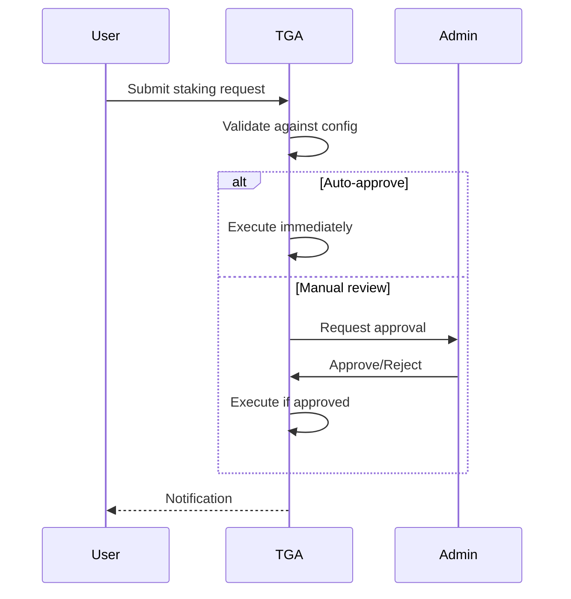

## Overview

This guide covers how to configure staking for your organization, including setting limits, enabling protocols, and managing staking workflows.

## Configuration Setup

### Creating a Configuration

<Steps>
<Step title="Navigate to Settings">
  Go to **Settings** > **Staking Configuration**
</Step>

<Step title="Set Maximum Stake">
  Define the maximum percentage of vested tokens that can be staked.

  ```typescript
  maxStakePercentage: 80  // 80% max
  ```
</Step>

<Step title="Configure Buffer Period">
  Set days after vesting before staking is allowed.

  ```typescript
  bufferPeriod: 30  // 30 days after vesting
  ```
</Step>

<Step title="Set Cooldown Period">
  Define the unstaking cooldown duration.

  ```typescript
  cooldownPeriod: 14  // 14 days to unstake
  ```
</Step>

<Step title="Enable Staking Types">
  Select which staking protocols to enable.

  ```typescript
  stakingTypesEnabled: ['native', 'liquid']
  ```
</Step>
</Steps>

## Configuration Parameters

### Maximum Stake Percentage

Controls how much recipients can stake:

| Setting | Risk Level | Use Case |
|---------|------------|----------|
| 50% | Low | Conservative approach |
| 80% | Medium | Balanced participation |
| 100% | High | Full flexibility |

**Considerations:**
- Lower limits reduce protocol risk exposure
- Higher limits increase recipient flexibility
- Consider tax implications of staking

### Buffer Period

Time after vesting before staking allowed:

| Period | Purpose |
|--------|---------|
| 0 days | Immediate staking |
| 30 days | Tax planning window |
| 90 days | Extended planning period |

**Considerations:**
- Allows recipients time for tax decisions
- Prevents immediate lock-up of newly vested tokens
- Aligns with exercise windows for options

### Cooldown Period

Time required to complete unstaking:

| Period | Protocol Type |
|--------|---------------|
| 0 days | Liquid staking |
| 7 days | Standard protocols |
| 21+ days | Long-term staking |

**Considerations:**
- Match to underlying protocol requirements
- Consider liquidity needs
- Balance security with flexibility

## Staking Types

### Native Staking

Direct staking to protocol validators:

| Feature | Value |
|---------|-------|
| Rewards | Protocol native |
| Lock-up | Varies by protocol |
| Risk | Protocol risk |

### Liquid Staking

Stake while maintaining liquidity:

| Feature | Value |
|---------|-------|
| Rewards | Through liquid token |
| Lock-up | None (liquid token) |
| Risk | Additional smart contract risk |

### Delegated Staking

Delegate to third-party validators:

| Feature | Value |
|---------|-------|
| Rewards | Shared with validator |
| Lock-up | Varies |
| Risk | Validator risk |

## Viewing Configuration

### Get Active Configuration

```typescript
const config = await stakingService.getActiveStakingConfiguration(orgID);

// Response:
{
    isValid: true,
    activeStakingConfig: {
        maxStakePercentage: 80,
        bufferPeriod: 30,
        cooldownPeriod: 14,
        stakingTypesEnabled: ['native', 'liquid']
    },
    message: 'Active configuration found'
}
```

### List All Configurations

```typescript
const configs = await stakingService.getStakingConfigurations();
// Returns all configurations (active and historical)
```

## Updating Configuration

Changes to staking configuration:

| Change | Impact |
|--------|--------|
| Increase max % | Existing stakes unaffected |
| Decrease max % | New requests limited |
| Change buffer | Applies to new vesting only |
| Change cooldown | Applies to new unstake requests |

<Note>
Configuration changes do not retroactively affect existing staking positions.
</Note>

## Approval Workflows

### Request Review

Admins can configure approval requirements:

| Setting | Behavior |
|---------|----------|
| Auto-approve | Requests approved automatically |
| Manual review | Admin approval required |
| Threshold-based | Auto-approve below amount |

### Approval Process



## Distribution Configuration

### Setting Up Distributions

Configure how staking rewards are distributed:

```typescript
interface DistributionConfig {
    frequency: 'DAILY' | 'WEEKLY' | 'MONTHLY';
    minimumAmount: Decimal;
    autoDistribute: boolean;
}
```

### Distribution Methods

| Method | Description |
|--------|-------------|
| **Direct** | Rewards sent directly to wallet |
| **Reinvest** | Rewards automatically restaked |
| **Grant** | Rewards issued as new grants |

## Reporting Configuration

### Available Metrics

| Metric | Description |
|--------|-------------|
| Total staked | Sum of all staked tokens |
| Stake rate | % of eligible tokens staked |
| Reward APY | Annualized reward rate |
| Pending unstakes | Tokens in cooldown |

### Report Access

Configure who can view staking reports:

| Role | Access |
|------|--------|
| TOKU_ADMIN | Full access |
| CLIENT_ORG_ADMIN | Organization reports |
| USER | Own staking only |

## Troubleshooting

<AccordionGroup>
<Accordion title="Configuration not active">
**Cause:** No active configuration set.

**Solution:**
1. Create a staking configuration
2. Ensure `isActive` is true
3. Verify organization ID is correct
</Accordion>

<Accordion title="Staking requests rejected">
**Cause:** Request exceeds configuration limits.

**Solutions:**
1. Check max stake percentage
2. Verify buffer period has passed
3. Confirm staking type is enabled
</Accordion>

<Accordion title="Unstaking not completing">
**Cause:** Cooldown period not elapsed.

**Solutions:**
1. Check cooldown end date
2. Verify cooldown period setting
3. Wait for cooldown to complete
</Accordion>
</AccordionGroup>

## Best Practices

1. **Start conservative** - Begin with lower limits, increase over time
2. **Document terms** - Include staking terms in grant agreements
3. **Regular review** - Periodically review and adjust configuration
4. **Monitor participation** - Track staking adoption rates
5. **Clear communication** - Notify recipients of configuration changes
