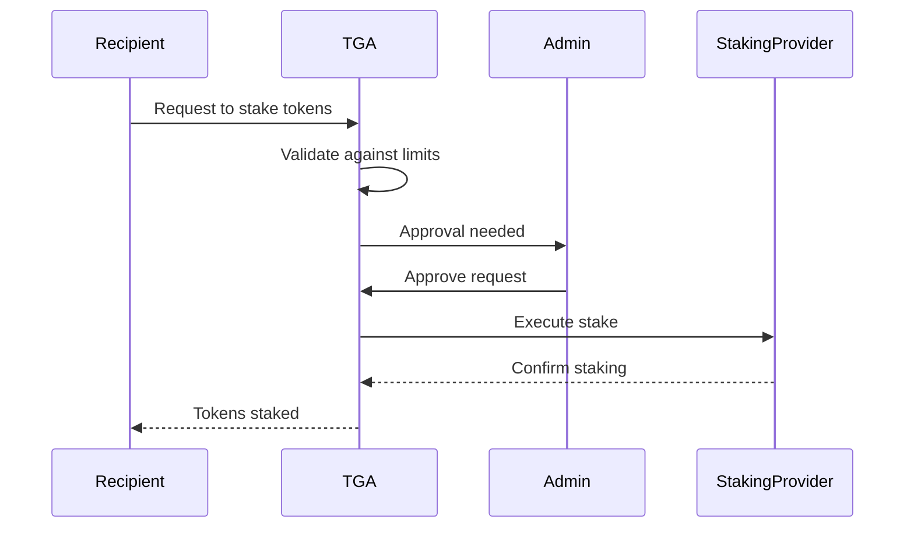
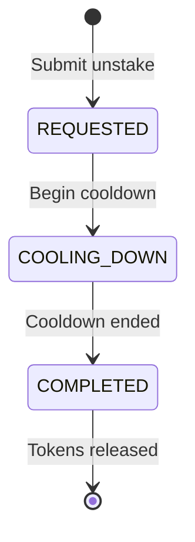

## Overview

TGA supports token staking, allowing grant recipients to stake their vested tokens directly within the platform. Organizations can configure staking parameters to control maximum stake percentages, buffer periods, and cooldown periods.

## How Staking Works



## Staking Configuration

Organizations configure staking parameters:

```typescript
interface StakingConfiguration {
    stakingConfigurationID: string;
    orgID: string;

    // Limits
    maxStakePercentage: Decimal;    // Max % of vested tokens
    bufferPeriod: number;           // Days before staking allowed
    cooldownPeriod: number;         // Days before unstaking completes

    // Options
    stakingTypesEnabled: string[];  // Enabled staking protocols

    // Status
    isActive: boolean;
    createdAt: Date;
}
```

### Configuration Parameters

| Parameter | Description | Example |
|-----------|-------------|---------|
| `maxStakePercentage` | Maximum percentage that can be staked | 80% |
| `bufferPeriod` | Days after vesting before staking allowed | 30 days |
| `cooldownPeriod` | Days required for unstaking | 14 days |
| `stakingTypesEnabled` | Allowed staking protocols | ['native', 'liquid'] |

## Staking Requests

### Request Model

```typescript
interface StakingRequest {
    stakingRequestID: string;
    grantID: string;
    roleInOrgID: string;

    // Amount
    stakingAmount: Decimal;

    // Status
    status: StakingRequestStatus;

    // Timestamps
    requestedAt: Date;
    approvedAt?: Date;
    executedAt?: Date;
}
```

### Request Statuses

| Status | Description |
|--------|-------------|
| `PENDING` | Request submitted, awaiting approval |
| `APPROVED` | Approved, pending execution |
| `EXECUTED` | Staking completed |
| `REJECTED` | Request denied |
| `CANCELLED` | Request cancelled by user |

## Staking Process

### Step 1: Check Eligibility

Before creating a request, the system checks:

- Grant is in ACCEPTED status
- Sufficient vested tokens available
- Request within max stake percentage
- Buffer period has passed since vesting

### Step 2: Submit Request

```typescript
const request = await stakingService.createStakingRequest(
    stakingAmount,
    grantID
);
```

### Step 3: Admin Approval

Admins review and approve staking requests:

```typescript
await stakingService.updatePendingStakingRequest(
    requestID,
    StakingRequestStatus.APPROVED
);
```

### Step 4: Execute Staking

Once approved, staking is executed:

```typescript
// Tokens transferred to staking contract
// Staking rewards begin accruing
```

## Unstaking

### Unstaking Flow



### Cooldown Period

Unstaking requires waiting through the cooldown period:

```typescript
interface UnstakingRequest {
    unstakingRequestID: string;
    stakingRequestID: string;

    // Amount
    unstakingAmount: Decimal;

    // Timing
    requestedAt: Date;
    cooldownEndsAt: Date;
    completedAt?: Date;

    status: UnstakingStatus;
}
```

## Staking Distributions

### Reward Distribution

Staking rewards are distributed periodically:

```typescript
interface StakingDistribution {
    distributionID: string;
    stakingRequestID: string;

    // Reward
    rewardAmount: Decimal;
    rewardTokenID: string;

    // Period
    periodStart: Date;
    periodEnd: Date;

    distributedAt: Date;
}
```

### Distribution Schedule

| Frequency | Use Case |
|-----------|----------|
| Daily | High-frequency protocols |
| Weekly | Standard staking |
| Monthly | Long-term staking |
| On-demand | Manual distributions |

## Staking Reports

### Available Reports

| Report | Description |
|--------|-------------|
| **Pending Requests** | All pending staking requests |
| **Active Stakes** | Currently staked positions |
| **Pending Unstakes** | Unstaking in cooldown |
| **Distribution History** | Historical reward distributions |
| **Available Balance** | Tokens available for staking |

### Balance Calculation

```typescript
// Available staking balance
const availableBalance = await stakingService.getAvailableStakingBalance(
    roleInOrgID,
    grantID
);

// Returns:
// - Total vested tokens
// - Currently staked
// - In unstaking cooldown
// - Available to stake
```

## Reward Grants

Staking rewards can be issued as grants:

```typescript
interface StakingRewardGrant {
    grantID: string;
    sourceStakingRequestID: string;
    rewardAmount: Decimal;
    vestingSchedule: string;  // Often immediate
}
```

## Best Practices

1. **Set reasonable limits** - Balance participation with risk management
2. **Buffer periods** - Allow time for tax planning after vesting
3. **Cooldown periods** - Align with protocol requirements
4. **Regular distributions** - Keep recipients informed of rewards
5. **Clear communication** - Document staking terms in grant agreements

## Related Features

- **[Staking Configuration](/features/staking/configuration)** - Setup guide
- **[Grants](/features/grants/overview)** - Grant management
- **[Vesting](/features/grants/vesting)** - Vesting schedules
