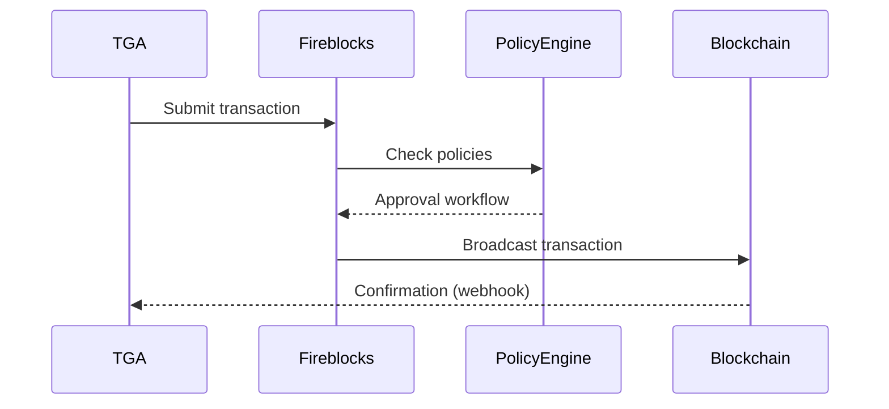
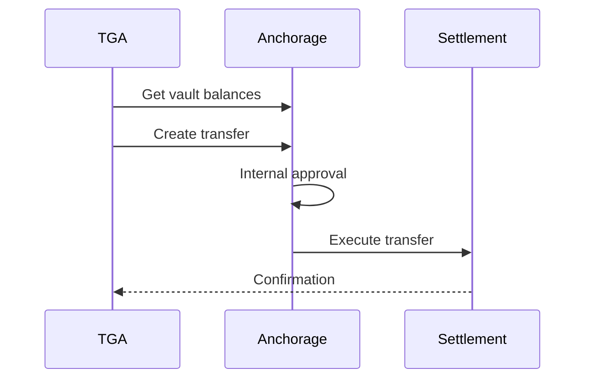

## Overview

TGA integrates with institutional custody providers for organizations that require enterprise-grade security, compliance, and insurance for digital assets. Custody wallets are managed by the provider, with TGA orchestrating transactions and tracking balances.

## Supported Providers

| Provider | Type | Chains | Use Case |
|----------|------|--------|----------|
| **Fireblocks** | MPC/Custody | 50+ chains | Enterprise treasury |
| **Anchorage** | Qualified Custody | BTC, ETH, SOL, etc. | Institutional custody |
| **Coinbase Prime** | Prime Broker | 200+ assets | Exchange + Custody |
| **Paxos** | Regulated Custody | Select assets | Fiat on/off-ramp |

## Fireblocks Integration

### Overview

Fireblocks provides MPC-based custody with policy engine for transaction approval:



### Configuration

```typescript
interface FireblocksIntegration {
    orgID: string;
    apiKey: string;           // Encrypted
    apiSecret: string;        // Encrypted
    vaultAccountID: string;   // Source vault
    isEnabled: boolean;
}
```

### Vault Structure

| Component | Purpose |
|-----------|---------|
| **Vault Account** | Top-level container |
| **Wallet** | Per-asset wallets within vault |
| **External Wallet** | Whitelisted destinations |

### Features

- Transaction policy engine
- Multi-signature support
- Hardware key signing
- Real-time balance tracking
- Webhook notifications

## Anchorage Integration

### Overview

Anchorage Digital is a federally chartered crypto bank providing qualified custody:

### Configuration

```typescript
interface AnchorageIntegration {
    orgID: string;
    apiKey: string;
    accountID: string;
    organizationID: string;
}
```

### Settlement Flow



### Features

- Qualified custody status
- Insurance coverage
- Regulatory compliance
- Staking support
- Governance participation

## Coinbase Prime Integration

### Overview

Coinbase Prime combines trading, custody, and prime broker services:

### Configuration

```typescript
interface CoinbasePrimeIntegration {
    orgID: string;
    apiKey: string;
    apiSecret: string;
    passphrase: string;
    portfolioID: string;
    walletID: string;
}
```

### Features

| Feature | Description |
|---------|-------------|
| **Trading** | Buy/sell directly |
| **Custody** | Cold storage |
| **Financing** | Credit lines |
| **Reporting** | Audit reports |

### Transaction Flow

```typescript
// Submit withdrawal
const transaction = await coinbasePrimeService.submitSettlement({
    portfolioID: config.portfolioID,
    amount: settlement.tokenAmount,
    asset: settlement.tokenID,
    destination: settlement.address
});

// Track status via webhook or polling
const status = await coinbasePrimeService.getTransactionStatus(
    transaction.primeTransactionID
);
```

## Paxos Integration

### Overview

Paxos provides regulated custody with fiat on/off-ramp capabilities:

### Features

| Feature | Description |
|---------|-------------|
| **Amplify** | Stablecoin issuance |
| **Deposit** | Crypto deposits |
| **Withdrawal** | Crypto withdrawals |
| **Conversion** | Fiat to crypto |

### Deposit Flow

```typescript
// Prepare deposit address
const deposit = await paxosService.preparePaxosDeposit({
    asset: 'USDC',
    network: 'ethereum'
});

// Returns deposit address for organization
```

### Withdrawal Flow

```typescript
// Execute withdrawal
const withdrawal = await paxosService.preparePaxosWithdraw({
    asset: 'USDC',
    amount: '10000',
    destinationAddress: wallet.address
});
```

## Wallet Reports

### Fireblocks Report

View Fireblocks wallet status:

```typescript
const report = await getFireblocksWalletReport({
    vaultAccountID: config.vaultAccountID
});

// Returns balance, transactions, status
```

### Anchorage Report

View Anchorage wallet status:

```typescript
const report = await getAnchorageWalletReport({
    accountID: config.accountID
});
```

## Balance Aggregation

Aggregate balances across custody providers:

```typescript
interface AggregatedWalletBalance {
    tokenTypeID: string;
    tokenName: string;
    totalBalance: Decimal;
    balanceByProvider: {
        fireblocks?: Decimal;
        anchorage?: Decimal;
        coinbasePrime?: Decimal;
        paxos?: Decimal;
    };
    valueInUSD: Decimal;
}
```

## Transaction Tracking

### Status Updates

Custody providers send webhook notifications:

| Event | Trigger |
|-------|---------|
| `PENDING` | Transaction submitted |
| `CONFIRMING` | Awaiting confirmation |
| `COMPLETED` | Transaction confirmed |
| `FAILED` | Transaction failed |
| `CANCELLED` | Transaction cancelled |

### Reconciliation

TGA reconciles custody balances:

```typescript
// Scheduled reconciliation job
await custodyWalletReconciliation({
    orgID,
    providers: ['fireblocks', 'anchorage']
});
```

## Security Best Practices

1. **Rotate API keys** - Regular key rotation schedule
2. **IP whitelisting** - Restrict API access by IP
3. **Approval workflows** - Multi-signature requirements
4. **Transaction limits** - Daily/per-transaction limits
5. **Audit logging** - Track all operations

## Troubleshooting

<AccordionGroup>
<Accordion title="Transaction pending for long time">
**Cause:** Approval workflow or network congestion.

**Solutions:**
1. Check custody provider dashboard
2. Verify approval requirements met
3. Check blockchain network status
</Accordion>

<Accordion title="Balance mismatch">
**Cause:** Reconciliation lag or pending transactions.

**Solutions:**
1. Run manual reconciliation
2. Check for pending transactions
3. Review transaction history
</Accordion>

<Accordion title="API connection failed">
**Cause:** Invalid credentials or network issue.

**Solutions:**
1. Verify API keys are current
2. Check IP whitelist settings
3. Confirm provider status
</Accordion>

<Accordion title="Webhook not received">
**Cause:** Webhook URL misconfigured or blocked.

**Solutions:**
1. Verify webhook URL in provider settings
2. Check firewall/security group rules
3. Review webhook logs
</Accordion>
</AccordionGroup>
