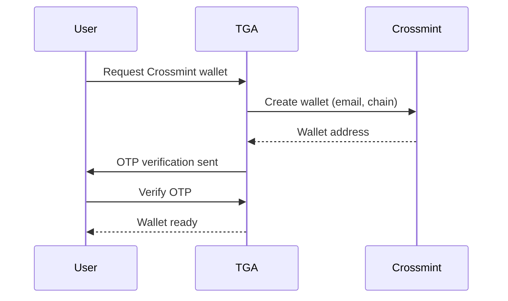

## Overview

Embedded wallets provide a seamless onboarding experience for users who don't have existing cryptocurrency wallets. TGA integrates with Privy and Crossmint to create wallets that are accessible through the platform without requiring users to manage private keys.

## Supported Providers

| Provider | Chains | Features |
|----------|--------|----------|
| **Privy** | EVM chains, Solana | Social login, email recovery |
| **Crossmint** | EVM chains, Solana | Email-based, custodial |

## Privy Integration

### How It Works

1. User authenticates via email or social login
2. Privy creates a wallet tied to user's identity
3. Wallet address registered in TGA
4. User can transact without managing keys

### Wallet Creation

```typescript
interface CreatePrivyWalletRequest {
    walletAddress: string;
    networkId: string;
    tokenId?: string;
    walletName?: string;
}

// Wallet created with VERIFIED status immediately
// No test transaction required
```

### Key Features

| Feature | Description |
|---------|-------------|
| **Social recovery** | Recover via email/social accounts |
| **No seed phrase** | User-friendly key management |
| **Multi-chain** | Single identity, multiple chains |
| **Instant setup** | Create wallet in seconds |

### Reactivation

Archived Privy wallets can be reactivated:

```typescript
// Reactivate archived Privy wallet
await reactivatePrivyWallet({
    walletID: existingWallet.walletID
});

// Validation:
// - Only one active wallet per token/network
// - Must have been previously a Privy wallet
```

## Crossmint Integration

### How It Works

1. User provides email address
2. TGA requests wallet creation from Crossmint
3. OTP verification sent to user email
4. Wallet created and registered

### Wallet Creation Flow



### API Integration

```typescript
interface CreateCrossmintWalletRequest {
    email: string;
    chainType: string;     // 'ethereum', 'solana'
    networkID?: string;
    tokenTypeID?: string;
}

interface CreateCrossmintWalletResponse {
    walletID: string;
    address: string;
    success: boolean;
}
```

### OTP Verification

Crossmint requires email verification:

```typescript
// Send OTP
await sendCrossmintOTP({
    email: user.email
});

// Verify OTP
await verifyCrossmintOTP({
    email: user.email,
    otp: '123456'
});
```

### Token Transfers

Transfer tokens to external wallets:

```typescript
interface SendCrossmintTokenRequest {
    walletID: string;
    toAddress: string;
    tokenAmount: string;
    tokenID: string;
}

// Crossmint handles gas fees
await sendCrossmintToken(request);
```

## Comparison

| Feature | Privy | Crossmint |
|---------|-------|-----------|
| **Auth method** | Social login, email | Email OTP |
| **Key storage** | Client-side encrypted | Custodial |
| **Recovery** | Social recovery | Email-based |
| **Gas handling** | User pays | Platform can sponsor |
| **Best for** | Web3 users | Complete beginners |

## Configuration

### Organization Setup

Enable embedded wallets in organization settings:

```typescript
interface OrgWalletConfig {
    privyEnabled: boolean;
    crossmintEnabled: boolean;
    defaultProvider?: 'PRIVY' | 'CROSSMINT';
    supportedChains: string[];
}
```

### Network Mapping

Map embedded wallet chains to TGA networks:

| Chain Type | Networks |
|------------|----------|
| `ethereum` | Ethereum Mainnet, Polygon, Arbitrum |
| `solana` | Solana Mainnet |
| `base` | Base Mainnet |

## User Experience

### Onboarding Flow

<Steps>
<Step title="Select Wallet Type">
  User chooses to create embedded wallet or connect existing.
</Step>

<Step title="Authenticate">
  Login via email, Google, or other social provider.
</Step>

<Step title="Wallet Created">
  Wallet automatically created and registered.
</Step>

<Step title="Configure Allocation">
  Set distribution percentage for the wallet.
</Step>
</Steps>

### Managing Wallets

| Action | Process |
|--------|---------|
| View balance | Check holdings in platform |
| Transfer out | Send to external wallet |
| Archive | Deactivate wallet |
| Reactivate | Re-enable archived wallet |

## Security Considerations

### Privy Security

- **MPC architecture** - Keys split across multiple parties
- **Client-side encryption** - Keys never leave user device
- **Social recovery** - No single point of failure

### Crossmint Security

- **Custodial model** - Crossmint manages keys
- **Email verification** - Two-factor auth
- **Enterprise grade** - SOC 2 compliant

## Best Practices

1. **Default for new users** - Recommend embedded wallets for onboarding
2. **Enable multiple chains** - Support user's preferred networks
3. **Explain custody model** - Clarify key management approach
4. **Offer alternatives** - Allow self-custody for advanced users
5. **Test transfers** - Verify token transfers work before payroll

## Troubleshooting

<AccordionGroup>
<Accordion title="Wallet creation fails">
**Cause:** Network issue or provider unavailable.

**Solutions:**
1. Check provider status page
2. Retry after a few minutes
3. Try alternative provider
</Accordion>

<Accordion title="OTP not received">
**Cause:** Email delivery issue.

**Solutions:**
1. Check spam folder
2. Verify email address is correct
3. Request new OTP
</Accordion>

<Accordion title="Cannot reactivate wallet">
**Cause:** Active wallet exists for same token/network.

**Solutions:**
1. Archive the existing active wallet first
2. Then reactivate the desired wallet
</Accordion>

<Accordion title="Transfer fails">
**Cause:** Insufficient balance or network issue.

**Solutions:**
1. Check wallet balance
2. Verify destination address is valid
3. Check network status
</Accordion>
</AccordionGroup>
