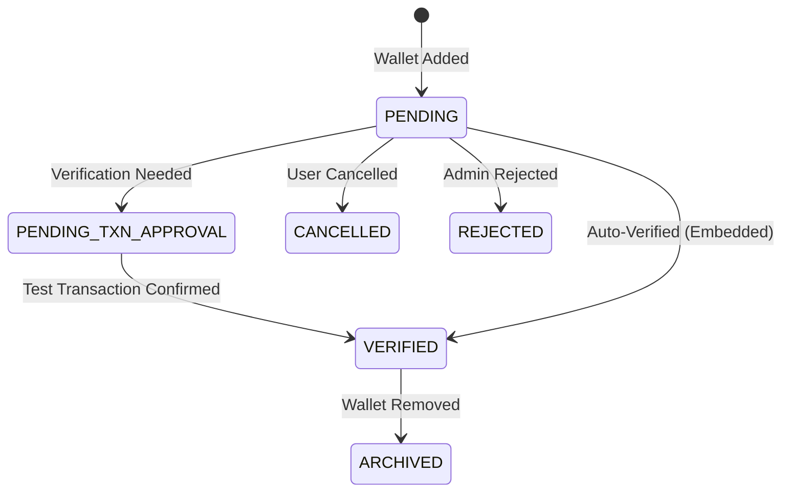

## Overview

Wallets are essential for receiving token compensation in TGA. The platform supports multiple wallet types including self-custody wallets, embedded wallets (Privy, Crossmint), and custody provider wallets. This guide covers wallet management fundamentals.

## Wallet Types

| Type | Description | Use Case |
|------|-------------|----------|
| **Self-Custody** | User-owned external wallets | Advanced users, existing wallets |
| **Embedded** | Platform-managed wallets | Easy onboarding, non-crypto users |
| **Custody** | Provider-managed wallets | Institutional custody, compliance |

## Wallet Lifecycle



## Wallet Statuses

| Status | Description |
|--------|-------------|
| `PENDING` | Wallet submitted, awaiting verification |
| `PENDING_TXN_APPROVAL` | Test transaction sent, awaiting confirmation |
| `VERIFIED` | Wallet verified and active |
| `ARCHIVED` | Wallet deactivated but retained for history |
| `CANCELLED` | Request cancelled by user |
| `REJECTED` | Request rejected by admin |

## Wallet Model

```typescript
interface Wallet {
    walletID: string;
    address: string;
    roleInOrgID: string;
    orgNetworkID: string;
    tokenTypeID?: string;

    // Status
    status: WalletStatus;
    isCurrent: boolean;

    // Metadata
    walletName?: string;
    createdAt: Date;
    updatedAt: Date;

    // Relationships
    tokenType?: TokenType;
    orgNetwork?: OrgNetwork;
    tokenWalletReferences?: TokenWalletReference[];
}
```

## Wallet References

Link wallets to compensation allocation:

```typescript
interface TokenWalletReference {
    walletReferenceID: string;
    walletID: string;
    roleInOrgID: string;

    // Distribution configuration
    distributionType: 'PERCENTAGE' | 'FIXED_AMOUNT';
    distributionRatio?: Decimal;  // 0.25 = 25%
    fixedAmount?: Decimal;

    createdAt: Date;
}
```

## Network Configuration

Organizations configure supported networks:

```typescript
interface OrgNetwork {
    networkID: string;
    orgID: string;
    name: string;              // "Ethereum Mainnet"
    chainType: ChainType;      // EVM, SOLANA, etc.
    evmChainID?: number;
    rpcUrl?: string;
    blockExplorerBaseUrl?: string;
    icon?: string;
}
```

## Token Types

Define supported tokens per network:

```typescript
interface TokenType {
    tokenTypeID: string;
    orgID: string;
    name: string;              // "USDC"
    currencyCode: string;      // "USDC"
    address?: string;          // Contract address
    decimalPlaces?: number;    // 6 for USDC
    networkID: string;
    icon?: string;
    isTokenEnabled: boolean;
}
```

## Wallet Verification

### Self-Custody Verification

1. User submits wallet address
2. TGA sends test transaction (small amount)
3. User confirms receipt
4. Wallet marked as verified

### Embedded Wallet Verification

1. User creates wallet through platform
2. Wallet automatically verified
3. User can access immediately

### Custody Wallet Verification

1. Organization configures custody integration
2. Wallets created through custody provider API
3. Automatic verification via integration

## Distribution Configuration

### Percentage-Based

Allocate a percentage of compensation:

```typescript
{
    distributionType: 'PERCENTAGE',
    distributionRatio: 0.50  // 50% of paycheck
}
```

### Fixed Amount

Allocate a fixed amount:

```typescript
{
    distributionType: 'FIXED_AMOUNT',
    fixedAmount: 1000  // $1,000 per pay period
}
```

### Multiple Wallets

Split compensation across wallets:

```
Paycheck: $10,000

Wallet 1 (USDC): 40% → $4,000
Wallet 2 (ETH): 30% → $3,000
Fiat: 30% → $3,000
```

## Wallet Operations

### For Recipients

| Operation | Description |
|-----------|-------------|
| Add wallet | Submit new wallet for verification |
| View wallets | See active and historical wallets |
| Update allocation | Modify distribution ratios |
| Archive wallet | Deactivate a wallet |

### For Admins

| Operation | Description |
|-----------|-------------|
| View all wallets | See wallets across organization |
| Approve/Reject | Manage wallet requests |
| Bulk upload | Import wallets via CSV |
| Send reminders | Notify users to verify wallets |

## Best Practices

1. **Verify before payroll** - Ensure wallets are verified before cutoff dates
2. **Single token/network** - One active wallet per token/network combination
3. **Test allocations** - Verify distribution percentages sum correctly
4. **Keep updated** - Archive old wallets, add new ones as needed
5. **Use embedded wallets** - Recommend for users unfamiliar with crypto

## Related Features

- **[Embedded Wallets](/features/wallets/embedded-wallets)** - Privy and Crossmint wallets
- **[Custody Wallets](/features/wallets/custody-wallets)** - Fireblocks, Anchorage integration
- **[Safe Wallets](/features/wallets/safe-wallets)** - Multi-sig wallet support
