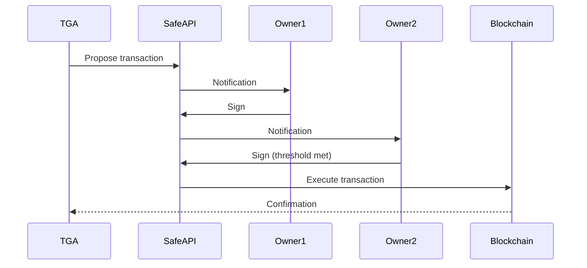

## Overview

Safe (formerly Gnosis Safe) wallets enable multi-signature security for organizational treasury management. TGA integrates with Safe to create, manage, and execute transactions through multi-sig wallets.

## How Safe Works

A Safe wallet requires M of N signatures to execute transactions:

```
Example: 2 of 3 Multi-sig

Owners: Alice, Bob, Carol
Threshold: 2 signatures required

Alice proposes → Bob signs → Transaction executes
```

## Integration Features

| Feature | Description |
|---------|-------------|
| **Create Safes** | Deploy new Safe contracts |
| **Batch transactions** | Multiple transfers in one |
| **Proposal flow** | Create and sign proposals |
| **Transaction bundling** | Efficient gas usage |

## Safe Configuration

```typescript
interface SafeWallet {
    safeAddress: string;
    owners: string[];
    threshold: number;
    networkID: string;
    chainID: number;
}

// Network-specific addresses
interface SafeNetworkConfig {
    multiSendCallOnlyAddress: Address;
    safeSingletonAddress: Address;
    safeFactoryAddress: Address;
    safeAppBaseUrl?: string;
}
```

## Creating a Safe

### Deploy New Safe

```typescript
const safeConfig = {
    owners: [
        '0xAlice...',
        '0xBob...',
        '0xCarol...'
    ],
    threshold: 2,
    chainID: 1  // Ethereum Mainnet
};

const safe = await safeService.createSafe(safeConfig);
// Returns deployed Safe address
```

### Import Existing Safe

Organizations can connect existing Safe wallets:

1. Provide Safe address
2. TGA verifies ownership
3. Safe linked to organization

## Transaction Flow



## Batch Transactions

Combine multiple transfers into one transaction:

```typescript
interface BatchTransfer {
    to: string;
    value: string;
    data: string;
}

// Create batch for payroll settlements
const batch: BatchTransfer[] = settlements.map(s => ({
    to: tokenContract,
    value: '0',
    data: encodeERC20Transfer(s.address, s.tokenAmount)
}));

// Submit as single transaction
await safeService.createBatchTransaction({
    safeAddress,
    transactions: batch
});
```

## Proposal Management

### Create Proposal

```typescript
const proposal = await safeService.proposeTransaction({
    safeAddress,
    to: destinationAddress,
    value: amount,
    data: transferData,
    nonce: nextNonce
});
```

### Sign Proposal

```typescript
await safeService.signProposal({
    safeAddress,
    safeTxHash: proposal.safeTxHash
});
```

### Execute Proposal

Once threshold is met:

```typescript
await safeService.executeTransaction({
    safeAddress,
    safeTxHash: proposal.safeTxHash
});
```

## Settlement with Safe

### Settlement Method: PROPOSE

When organization uses Safe for settlements:

```typescript
// Settlement method detection
const settlementMethod = await stablecoinPayrollService.getOrgSettlementMethod(orgID);

if (settlementMethod === SettlementMethod.PROPOSE) {
    // Create Safe proposal for settlements
    await safeService.createSettlementProposal(settlements);
}
```

### Tracking Proposals

TGA tracks proposal status:

| Status | Description |
|--------|-------------|
| `PENDING` | Proposal created, awaiting signatures |
| `AWAITING_EXECUTION` | Threshold met, ready to execute |
| `EXECUTED` | Transaction confirmed on-chain |
| `FAILED` | Transaction reverted |

## Supported Networks

| Network | Chain ID | Safe Apps URL |
|---------|----------|---------------|
| Ethereum | 1 | app.safe.global |
| Polygon | 137 | app.safe.global |
| Arbitrum | 42161 | app.safe.global |
| Optimism | 10 | app.safe.global |
| Base | 8453 | app.safe.global |

## Organization Setup

### Enable Safe Integration

1. Navigate to **Settings** > **Integrations**
2. Enable Safe integration
3. Deploy or import Safe wallet
4. Configure owners and threshold

### Owner Management

| Action | Impact |
|--------|--------|
| Add owner | New signer can approve |
| Remove owner | Signer removed |
| Change threshold | Modify required signatures |

## Safe Apps

TGA supports Safe Apps for direct interaction:

```typescript
// Generate Safe App URL
const safeAppUrl = `${network.safeAppBaseUrl}/transactions/tx?safe=${safeAddress}&id=${safeTxHash}`;
```

Users can:
- View pending proposals
- Sign directly in Safe UI
- Execute transactions

## Best Practices

1. **Reasonable threshold** - Balance security with efficiency
2. **Diverse owners** - Distribute signing authority
3. **Backup owners** - Plan for unavailable signers
4. **Regular audits** - Review owner list periodically
5. **Test transactions** - Verify flow before large amounts

## Security Considerations

| Risk | Mitigation |
|------|------------|
| Key compromise | Multi-sig requirement |
| Owner collusion | Independent owner selection |
| Stuck funds | Emergency recovery process |
| Phishing | Verify Safe App URLs |

## Transaction Links

TGA generates block explorer links for executed transactions:

```typescript
const transactionLink = `${network.blockExplorerBaseUrl}/tx/${transactionHash}`;

// Example:
// https://etherscan.io/tx/0x123...
```

## Troubleshooting

<AccordionGroup>
<Accordion title="Proposal not appearing for owners">
**Cause:** Safe Transaction Service sync delay.

**Solutions:**
1. Refresh Safe App
2. Wait a few minutes for sync
3. Check Safe Transaction Service status
</Accordion>

<Accordion title="Transaction execution fails">
**Cause:** Insufficient gas or state change.

**Solutions:**
1. Check Safe has ETH for gas
2. Verify nonce is correct
3. Check token balances
</Accordion>

<Accordion title="Signature rejected">
**Cause:** Wrong network or invalid data.

**Solutions:**
1. Verify connected to correct network
2. Check transaction data is valid
3. Ensure signer is Safe owner
</Accordion>

<Accordion title="Batch transaction reverts">
**Cause:** One transfer in batch failed.

**Solutions:**
1. Check all destination addresses valid
2. Verify token allowances
3. Check balance for entire batch
</Accordion>
</AccordionGroup>

## API Reference

### Safe Service Methods

| Method | Description |
|--------|-------------|
| `createSafe` | Deploy new Safe |
| `proposeTransaction` | Create proposal |
| `signProposal` | Add signature |
| `executeTransaction` | Execute approved tx |
| `createBatchTransaction` | Multi-transfer bundle |
| `getProposalStatus` | Check proposal state |
