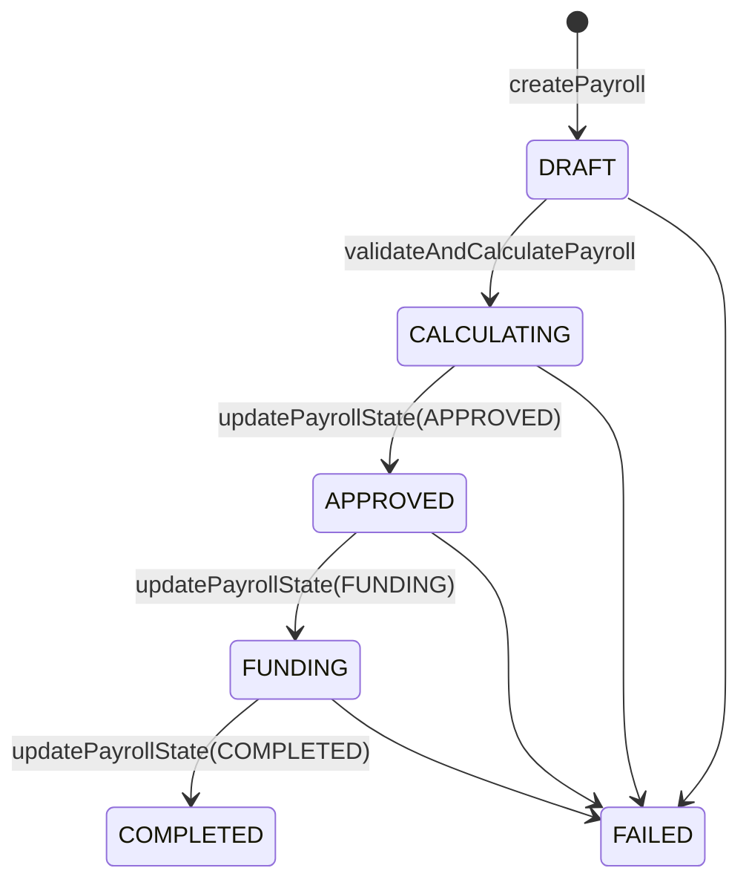

## Overview

A payroll run moves through a defined set of states before funds reach employees. Each state transition is explicit — your integration drives the run from draft creation through validation, approval, and funding.

## Payroll State Machine



| State | Meaning |
|-------|---------|
| `DRAFT` | Run created; employee data not yet validated |
| `CALCULATING` | `validateAndCalculatePayroll` called; net pay computed |
| `APPROVED` | Payroll approved; ready to fund |
| `FUNDING` | Funding transfer in progress |
| `COMPLETED` | Employees paid; run closed |
| `FAILED` | Terminal error; create a new run to retry |

---

## Payroll Run Lifecycle

<Steps>
  <Step title="Create the payroll run">
    Call `POST /createPayroll` to open a new run in `DRAFT` state. Specify the pay period, currency, and entity.

    ```bash
    curl -X POST https://app.toku.com/api/tokuApi/v1/createPayroll \
      -H "Authorization: Bearer toku_live_..." \
      -H "x-role-type: PAYROLL_ADMIN" \
      -H "Content-Type: application/json" \
      -d '{
        "payrollName": "April 2026 — Global Engineering",
        "payrollStartDate": "2026-04-01T00:00:00.000Z",
        "payrollEndDate": "2026-04-30T23:59:59.000Z",
        "payrollPayDate": "2026-05-02T00:00:00.000Z",
        "payrollFiatCurrency": "USD",
        "tokenTypeID": "usdc-mainnet",
        "payrollEntity": "entity-uuid"
      }'
    ```

    The response includes a `payrollId` you'll use in every subsequent call.
  </Step>

  <Step title="Validate and calculate net pay">
    Submit employee compensation data to `POST /validateAndCalculatePayroll`. This step validates employee records and computes gross-to-net figures for each employee before any funds move.

    ```json
    {
      "payrollId": "payroll-uuid",
      "employeeData": [
        {
          "employeeId": "emp-uuid-001",
          "grossSalary": 8000,
          "currency": "USD"
        },
        {
          "employeeId": "emp-uuid-002",
          "grossSalary": 6500,
          "currency": "USD"
        }
      ]
    }
    ```

    A successful response transitions the run to `CALCULATING` and returns per-employee net pay figures. Fix any validation errors before proceeding.
  </Step>

  <Step title="Approve the payroll run">
    Call `POST /updatePayrollState` with `state: "APPROVED"` to confirm the calculated figures.

    ```json
    {
      "payrollId": "payroll-uuid",
      "state": "APPROVED"
    }
    ```
  </Step>

  <Step title="Initiate funding">
    Move the run to `FUNDING` state to trigger the disbursement transfer. For stablecoin-funded payrolls, see [Stablecoin Funding](/integration-guide/guides/stablecoin-funding) for wallet pre-funding requirements.

    ```json
    {
      "payrollId": "payroll-uuid",
      "state": "FUNDING"
    }
    ```
  </Step>

  <Step title="Mark as completed">
    Once the platform confirms funds have been disbursed, update the state to `COMPLETED`.

    ```json
    {
      "payrollId": "payroll-uuid",
      "state": "COMPLETED"
    }
    ```
  </Step>
</Steps>

---

## Off-Cycle Runs

Not all payrolls follow the standard monthly schedule. Use the `type` field on `createPayroll` to differentiate run types:

| Type | Use case |
|------|----------|
| `REGULAR` | Standard scheduled payroll |
| `BONUS` | One-time bonus payments outside the regular cycle |
| `CORRECTION` | Retroactive corrections to a prior run |
| `TERMINATION` | Final pay for departing employees |

Off-cycle runs follow the same lifecycle — create, validate, approve, fund, complete — but can be initiated at any time.

---

## Multi-Currency Payrolls

Contracts are denominated in a local fiat currency specified by `payrollFiatCurrency` (e.g., `"USD"`, `"SGD"`, `"EUR"`). The platform handles FX conversion internally.

For payrolls funded via stablecoin, set `tokenTypeID` to the desired token (e.g., `"usdc-mainnet"`). The funding step debits the pre-loaded stablecoin wallet and converts to local currency for each employee.

<Note>
`payrollFiatCurrency` and `tokenTypeID` must be set at run creation and cannot be changed after the run leaves `DRAFT`.
</Note>

---

## Employee Validation

`validateAndCalculatePayroll` performs these checks before net pay is computed:

- Employee records are active and linked to the payroll entity
- Required compensation fields are present and within allowed ranges
- Currency codes match the contract currency for each employee

Validation errors are returned per-employee in the response. Correct the data and resubmit — the run stays in `DRAFT` until validation passes.

---

## Retrieving Payroll Runs

- **List all runs** — `GET /getAllPayroll` returns every payroll run for your organization, including state and metadata.
- **Fetch a single run** — `POST /getPayroll` with a `payrollId` returns the full run object including per-employee results after validation.

---

## Next Steps

<CardGroup cols={2}>
  <Card title="Create Payroll" icon="plus" href="/integration-guide/endpoints/payroll/create-payroll">
    Endpoint reference for opening a new run
  </Card>
  <Card title="Validate & Calculate" icon="calculator" href="/integration-guide/endpoints/payroll/validate-calculate-payroll">
    Endpoint reference for employee validation and net pay
  </Card>
  <Card title="Update Payroll State" icon="arrow-right" href="/integration-guide/endpoints/payroll/update-payroll-state">
    Endpoint reference for state transitions
  </Card>
  <Card title="Stablecoin Funding" icon="coins" href="/integration-guide/guides/stablecoin-funding">
    Pre-fund your wallet before initiating payroll
  </Card>
</CardGroup>
