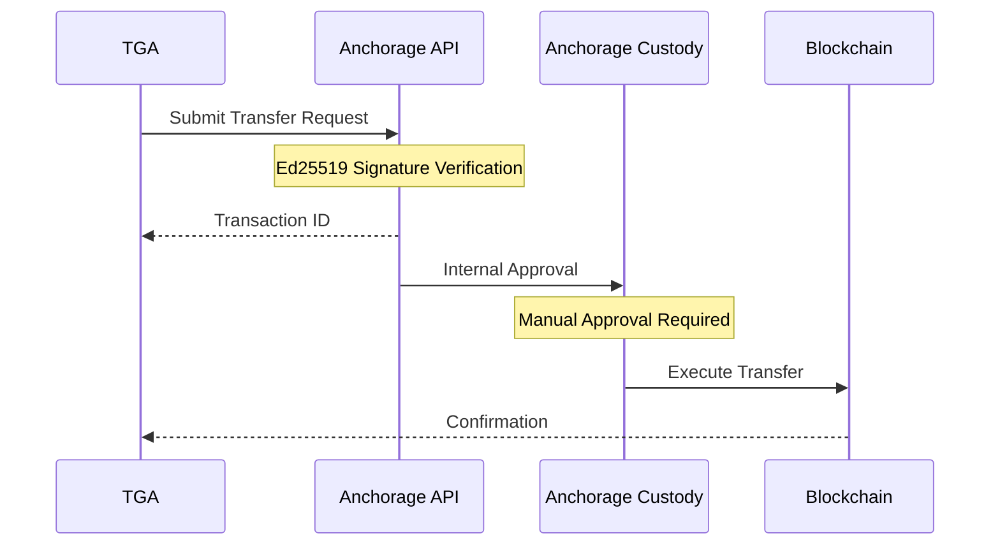

## Overview

TGA integrates with [Anchorage Digital](https://www.anchorage.com/) for institutional-grade custody services. Anchorage provides qualified custodian services for digital assets, meeting the regulatory requirements for institutional investors.

## Capabilities

| Feature | Support |
|---------|---------|
| **Wallet Management** | List and manage vault wallets |
| **Token Transfers** | Submit settlement transactions |
| **Balance Tracking** | Real-time balance updates |
| **Settlement** | Automated settlement processing |
| **Authentication** | Ed25519 signature authentication |

## Prerequisites

Before configuring Anchorage:

1. Active Anchorage Digital custody account
2. API credentials (API Key + Signer Key)
3. Vault ID for your organization
4. Admin access to your TGA organization

## Supported Networks

| Network | Chain Type | Asset Types |
|---------|------------|-------------|
| **Ethereum** | EVM | ETH, ERC-20 tokens |

## Configuration

### Step 1: Obtain Anchorage Credentials

Contact your Anchorage relationship manager to obtain:

- **API Key**: For API authentication
- **Signer Key**: Ed25519 private key for request signing
- **Vault ID**: Your organization's vault identifier

<Note>
Anchorage uses Ed25519 signatures for API authentication, providing strong cryptographic security.
</Note>

### Step 2: Configure in TGA

<Steps>
<Step title="Navigate to Integrations">
  Go to **Organization Settings** > **Integrations** > **Anchorage**
</Step>

<Step title="Enter Credentials">
  Provide the following:
  - **API Key**
  - **Signer Key** (Ed25519 private key)
  - **Vault ID**
  - **Asset Type** (e.g., ETH, USDC)
</Step>

<Step title="Select Environment">
  Choose your Anchorage environment:
  - **Production**: `api.anchorage.com`
  - **Staging**: `api.anchorage-staging.com`
</Step>

<Step title="Test Connection">
  Click **Test Connection** to verify the integration.
</Step>
</Steps>

## Transaction Flow



## Automated Settlement

TGA includes automated settlement processing for Anchorage:

### Settlement Cron Job

A scheduled job runs periodically to:

1. Check for pending distributions
2. Submit settlement transactions to Anchorage
3. Update distribution status based on transaction results

### Settlement Statuses

| Status | Description |
|--------|-------------|
| `PENDING` | Settlement queued for processing |
| `SUBMITTED` | Transaction submitted to Anchorage |
| `PENDING_APPROVAL` | Awaiting manual approval in Anchorage |
| `COMPLETED` | Settlement completed successfully |
| `FAILED` | Settlement failed |

## API Authentication

Anchorage uses Ed25519 cryptographic signatures for API authentication:

```typescript
// Authentication flow (simplified)
1. Create request payload
2. Sign payload with Ed25519 private key
3. Include signature in request headers
4. Anchorage verifies signature with public key
```

### Required Headers

| Header | Description |
|--------|-------------|
| `Api-Access-Key` | Your Anchorage API key |
| `Api-Signature` | Ed25519 signature of request |
| `Api-Timestamp` | Request timestamp |

## Balance Updates

TGA automatically syncs wallet balances with Anchorage:

- **Scheduled Updates**: Balance sync runs via cron job
- **On-Demand**: Balances update when viewing wallet details
- **Post-Transaction**: Balances refresh after settlements

## Troubleshooting

<AccordionGroup>
<Accordion title="Connection Test Fails">
**Possible Causes:**
- Invalid API Key or Signer Key
- Incorrect Vault ID
- Network connectivity issues

**Solutions:**
1. Verify all credentials are correct
2. Ensure Signer Key is a valid Ed25519 private key
3. Check you're using the correct environment (Production vs Staging)
4. Contact Anchorage support if issues persist
</Accordion>

<Accordion title="Transaction Stuck in PENDING_APPROVAL">
**Cause:** Anchorage requires manual approval for transactions based on your custody policies.

**Solution:**
1. Log in to your Anchorage dashboard
2. Navigate to pending transactions
3. Complete the approval workflow
</Accordion>

<Accordion title="Balance Not Updating">
**Possible Causes:**
- Cron job not running
- API rate limits
- Network delays

**Solutions:**
1. Wait for the next scheduled balance sync
2. Manually trigger a balance refresh
3. Check the settlement cron job logs for errors
</Accordion>

<Accordion title="Settlement Failed">
**Possible Causes:**
- Insufficient balance
- Invalid destination address
- Policy violation

**Solutions:**
1. Verify sufficient balance in the source wallet
2. Confirm destination address is valid
3. Review Anchorage policy settings
4. Check error details in the settlement record
</Accordion>
</AccordionGroup>

## Security Considerations

<Warning>
Anchorage is a qualified custodian. Follow all security best practices for institutional custody.
</Warning>

1. **Secure credential storage** - Store API keys and signer keys in secure vaults
2. **Access control** - Limit who can configure Anchorage integration
3. **Audit logging** - Review all settlement activities regularly
4. **Policy compliance** - Ensure transactions comply with your custody agreement
5. **Key rotation** - Rotate credentials according to your security policy

## Environment URLs

| Environment | Base URL |
|-------------|----------|
| **Production** | `https://api.anchorage.com` |
| **Staging** | `https://api.anchorage-staging.com` |

## Support

- **Anchorage Support**: Contact your relationship manager
- **API Documentation**: Available through your Anchorage account
- **TGA Support**: [tga-support@toku.com](mailto:tga-support@toku.com)
