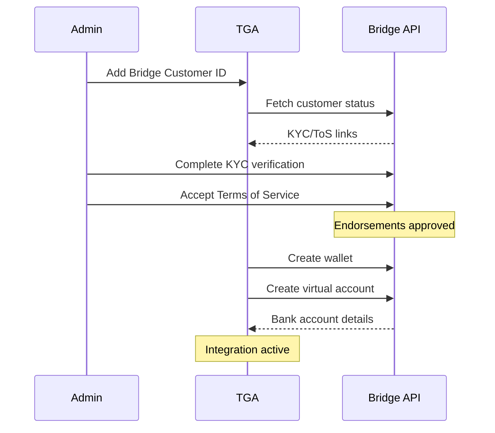
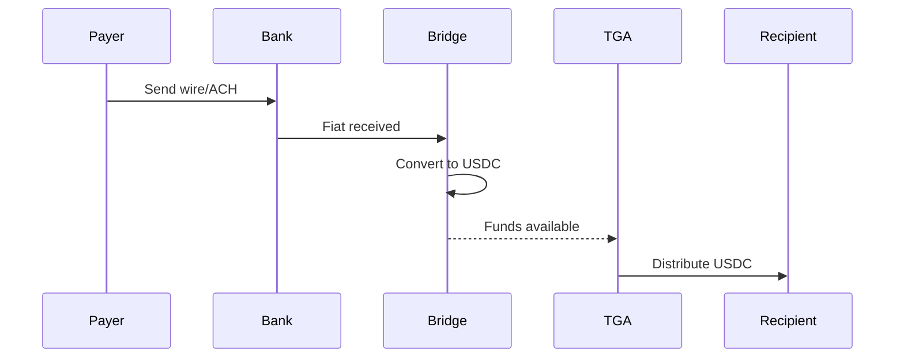
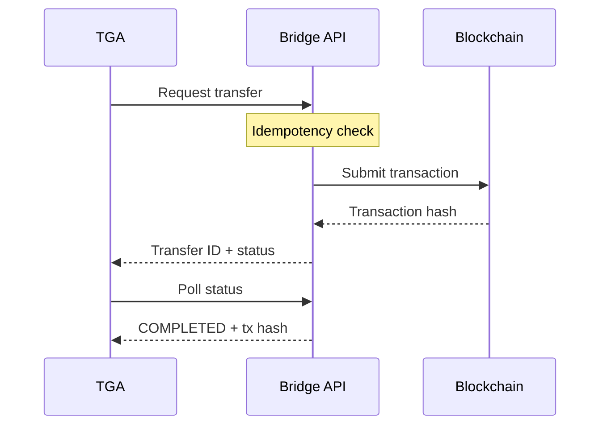

## Overview

TGA integrates with [Bridge](https://www.bridge.xyz/) (by Stripe) for fiat-to-crypto on-ramping and stablecoin transfers. Bridge enables organizations to receive fiat deposits via bank transfer and automatically convert them to stablecoins for payroll and distributions.

## Capabilities

| Feature | Support |
|---------|---------|
| **Fiat Deposits** | Receive USD via ACH/Wire/SEPA |
| **Auto-Conversion** | USD to USDC on Base |
| **Virtual Bank Accounts** | Dedicated bank account per organization |
| **Crypto Transfers** | Transfer stablecoins to any address |
| **KYC/KYB** | Built-in compliance workflows |

## Prerequisites

Before configuring Bridge:

1. Bridge API key from Toku
2. Completed KYC/KYB verification in Bridge
3. Admin access to your TGA organization

## Supported Payment Rails

| Rail | Currency | Description |
|------|----------|-------------|
| **ACH** | USD | US bank transfers (1-3 business days) |
| **Wire** | USD | US wire transfers (same day) |
| **SEPA** | EUR | European transfers (1-2 business days) |

## Supported Networks

| Network | Asset | Description |
|---------|-------|-------------|
| **Base** | USDC | Primary settlement network |

## Configuration

### Step 1: Connect Bridge Customer

<Steps>
<Step title="Navigate to Integrations">
  Go to **Organization Settings** > **Integrations** > **Bridge**
</Step>

<Step title="Add Bridge Customer ID">
  Enter your Bridge customer ID (provided by Toku or created via Bridge dashboard).
</Step>

<Step title="Complete KYC/KYB">
  Complete the verification process:
  - **KYC Link**: Identity verification
  - **ToS Link**: Terms of service acceptance
</Step>

<Step title="Verify Endorsements">
  Wait for endorsement approvals:
  - **Base Endorsement**: Required for Base network transactions
  - **SEPA Endorsement**: Required for European bank transfers (optional)
</Step>
</Steps>

### Step 2: Virtual Bank Account Setup

Once KYC/KYB is complete, TGA automatically creates:

1. **Bridge Wallet** - Crypto wallet on Base network
2. **Virtual Bank Account** - Dedicated bank account for receiving fiat

## Onboarding Flow



## Customer Status Flow

| Status | Description | Next Step |
|--------|-------------|-----------|
| `PENDING_KYC` | Customer needs to complete KYC | Complete verification via KYC link |
| `PENDING_VIRTUAL_ACCOUNT` | KYC complete, setting up bank | Wait for automatic setup |
| `ACTIVE` | Ready to receive deposits | Start using the integration |
| `ERROR` | Setup failed | Contact support |

## Deposit Flow



### Virtual Bank Account Details

After setup, you'll receive:

```typescript
{
    // Bank details for deposits
    bankName: "Bridge Bank Partner",
    bankAddress: "123 Finance St...",
    bankRoutingNumber: "XXXXXXXX",
    bankAccountNumber: "XXXXXXXX",
    bankBeneficiaryName: "Your Org Name",

    // For SEPA (if enabled)
    iban: "DE89XXXXXXXXXXXXX",
    bic: "BICXXXXXXX"
}
```

## Transfer Flow



### Transfer Parameters

| Parameter | Description |
|-----------|-------------|
| `symbol` | Token symbol (e.g., "usdc") |
| `network` | Network identifier (e.g., "base") |
| `amount` | Amount to transfer |
| `destinationAddress` | Recipient wallet address |
| `transactionID` | Unique ID for idempotency |

## Fees

| Operation | Fee | Description |
|-----------|-----|-------------|
| **Deposit** | 0.5% | Fiat to USDC conversion |
| **Transfer** | 0.5% | Outbound crypto transfer |

## Troubleshooting

<AccordionGroup>
<Accordion title="'No Bridge integration found'">
**Cause:** The organization hasn't been connected to Bridge.

**Solution:**
1. Navigate to integrations settings
2. Enter your Bridge customer ID
3. Complete the setup process
</Accordion>

<Accordion title="KYC/ToS not completing">
**Cause:** Verification steps are incomplete.

**Solutions:**
1. Click the KYC link and complete identity verification
2. Click the ToS link and accept terms
3. Wait up to 15 minutes for status to update
4. Contact support if stuck after 24 hours
</Accordion>

<Accordion title="'Virtual account does not exist'">
**Cause:** The virtual bank account hasn't been created yet.

**Solutions:**
1. Ensure KYC/KYB is fully approved
2. Ensure Terms of Service is accepted
3. Wait for automatic account creation
4. Check for error messages in integration status
</Accordion>

<Accordion title="'Failed to create virtual USD account'">
**Cause:** Bridge rejected the virtual account creation.

**Solutions:**
1. Check error message for details
2. Verify all endorsements are approved
3. Contact Toku support for assistance
</Accordion>

<Accordion title="Transfer failed">
**Cause:** Transfer couldn't be completed.

**Possible reasons:**
- Insufficient balance
- Invalid destination address
- Network issues

**Solutions:**
1. Check wallet balance
2. Verify destination address format
3. Check Bridge transaction status for details
</Accordion>
</AccordionGroup>

## Security Considerations

<Note>
Bridge is a regulated financial services provider. All transactions are subject to compliance checks.
</Note>

1. **KYC/KYB Required** - All organizations must complete verification
2. **AML Monitoring** - Transactions are monitored for suspicious activity
3. **Sanctions Screening** - Recipients are screened against sanctions lists
4. **Secure API** - All communications are encrypted

## API Reference

### Integration Methods

| Method | Description |
|--------|-------------|
| `getOrgBridgeIntegrationStatus` | Check integration status |
| `addBridgeCustomerToOrg` | Connect Bridge customer |
| `updateBridgeCustomerStatus` | Refresh customer status |
| `getUSDVirtualAccountDetails` | Get bank account details |
| `getUSDBalanceForVirtualAccount` | Check available balance |
| `payStableCoinsOutOfVirtualAccount` | Transfer stablecoins |
| `getBridgeTransactionDetails` | Check transfer status |

### Environment URLs

| Environment | API URL |
|-------------|---------|
| **Production** | `https://api.bridge.xyz/v0` |
| **Sandbox** | `https://api.sandbox.bridge.xyz/v0` |

## Support

- **Bridge Documentation**: [docs.bridge.xyz](https://docs.bridge.xyz/)
- **TGA Support**: [tga-support@toku.com](mailto:tga-support@toku.com)
