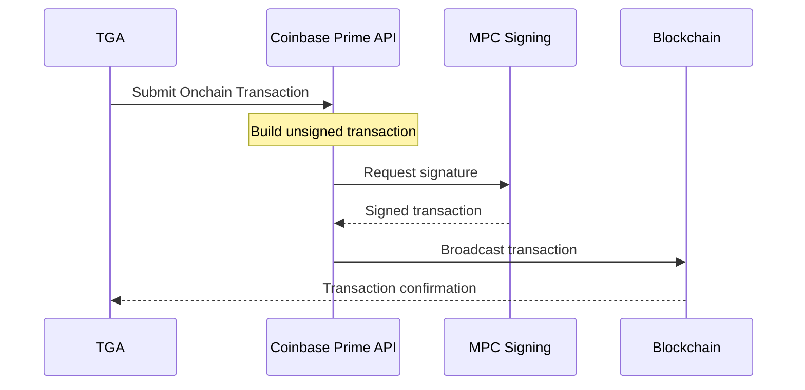

## Overview

TGA integrates with [Coinbase Prime](https://prime.coinbase.com/) for institutional-grade custody and token transfer capabilities. Coinbase Prime provides secure vault infrastructure with MPC (Multi-Party Computation) signing for enterprise crypto operations.

## Capabilities

| Feature | Support |
|---------|---------|
| **Wallet Management** | List portfolios and wallets |
| **Token Transfers** | ERC-20 and SPL token transfers |
| **Multi-Chain** | Ethereum, Polygon, Base, Solana |
| **Batch Transactions** | Smart grouping by network/token |
| **Transaction Tracking** | Real-time status monitoring |

## Prerequisites

Before configuring Coinbase Prime:

1. Active Coinbase Prime account
2. API credentials (Access Key, Secret Key, Passphrase)
3. Portfolio ID and Wallet ID configured
4. Admin access to your TGA organization

## Supported Networks

| Network | Chain Type | Asset Types |
|---------|------------|-------------|
| **Ethereum** | EVM | ETH, ERC-20 tokens |
| **Polygon** | EVM | MATIC, ERC-20 tokens |
| **Base** | EVM | ETH, ERC-20 tokens |
| **Solana** | Solana | SOL, SPL tokens |

## Configuration

### Step 1: Obtain Coinbase Prime Credentials

<Steps>
<Step title="Access Coinbase Prime Console">
  Log in to your Coinbase Prime console at [console.coinbase.com](https://console.coinbase.com)
</Step>

<Step title="Create API User">
  Navigate to **Settings** > **API** > **Create API Key**
  - Select appropriate permissions for wallet and transfer operations
</Step>

<Step title="Save Credentials">
  Securely store your credentials:
  - **Access Key**: Visible in the console
  - **Secret Key**: Shown once during creation
  - **Passphrase**: Set during API key creation
</Step>
</Steps>

<Warning>
Store your Secret Key and Passphrase securely. They cannot be retrieved after initial setup.
</Warning>

### Step 2: Configure in TGA

<Steps>
<Step title="Navigate to Integrations">
  Go to **Organization Settings** > **Integrations** > **Coinbase Prime**
</Step>

<Step title="Enter Credentials">
  Provide the following:
  - **Access Key**
  - **Secret Key**
  - **Passphrase**
</Step>

<Step title="Select Portfolio and Wallet">
  After testing the connection:
  - Select your **Portfolio** from the dropdown
  - Select the **Wallet** to use for transfers
</Step>

<Step title="Test Connection">
  Click **Test Connection** to verify the integration works.
</Step>
</Steps>

## Transaction Flow

## Transaction Types

### EVM Transfers (Ethereum, Polygon, Base)

For EVM chains, TGA builds unsigned ERC-20 transfer transactions:

1. Encodes the `transfer(address, uint256)` function call
2. Submits to Coinbase Prime's onchain transaction API
3. Coinbase Prime handles gas estimation and nonce management
4. MPC signing secures the transaction

### Solana Transfers

For Solana, TGA builds versioned transactions:

1. Creates associated token accounts if needed
2. Supports both SPL Token and Token-2022 programs
3. Handles transfer or transferChecked instructions
4. Coinbase Prime signs and broadcasts

## Batch Transactions

TGA intelligently groups batch transfers:

| Chain Type | Grouping Strategy |
|------------|-------------------|
| **EVM** | One transaction per (network, token) pair |
| **Solana** | Multiple tokens batched per network |

This optimizes gas costs for EVM and transaction fees for Solana.

## Transaction Statuses

| Status | Description | Terminal |
|--------|-------------|----------|
| `PENDING` | Transaction submitted | No |
| `COMPLETED` | Successfully executed | Yes |
| `SETTLED` | Funds settled | Yes |
| `FAILED` | Transaction failed | Yes |
| `CANCELLED` | Transaction cancelled | Yes |
| `REJECTED` | Rejected by policy | Yes |

## Troubleshooting

<AccordionGroup>
<Accordion title="Connection Test Fails">
**Possible Causes:**
- Invalid API credentials
- Incorrect Access Key, Secret Key, or Passphrase
- Network connectivity issues

**Solutions:**
1. Verify all credentials are correct (no extra spaces)
2. Ensure the API key has appropriate permissions
3. Check if the API key is active in Coinbase Prime console
</Accordion>

<Accordion title="No Portfolios Found">
**Cause:** API credentials may not have portfolio access permissions.

**Solution:**
1. Log in to Coinbase Prime console
2. Verify the API key has portfolio read permissions
3. Ensure at least one portfolio exists in your account
</Accordion>

<Accordion title="Transaction Stuck in PENDING">
**Possible Causes:**
- Transaction requires additional approval in Coinbase Prime
- Network congestion
- Insufficient gas (EVM) or SOL (Solana)

**Solutions:**
1. Check Coinbase Prime dashboard for pending approvals
2. Wait for network confirmation
3. Verify source wallet has sufficient funds for gas/fees
</Accordion>

<Accordion title="Insufficient Balance Error">
**Cause:** The source wallet doesn't have enough tokens to complete the transfer.

**Solution:**
1. Check wallet balance in Coinbase Prime
2. Verify the correct wallet is configured
3. Top up the wallet if needed
</Accordion>
</AccordionGroup>

## Security Best Practices

<Tip>
Follow these security recommendations for Coinbase Prime integration.
</Tip>

1. **Use minimum required permissions** - Configure API keys with only necessary access
2. **Rotate credentials regularly** - Generate new API keys periodically
3. **Enable transaction policies** - Set up approval workflows in Coinbase Prime
4. **Monitor transactions** - Review transaction logs regularly
5. **Secure credential storage** - Never commit API keys to version control

## API Reference

### Required Environment Variables

| Variable | Description |
|----------|-------------|
| *Stored in database* | Credentials are encrypted and stored per-organization |

### Integration Methods

| Method | Description |
|--------|-------------|
| `testCoinbasePrimeConnection` | Test API connectivity |
| `listPrimePortfolios` | List available portfolios |
| `listPrimeWallets` | List wallets in a portfolio |
| `executeTokenTransfer` | Execute a single transfer |
| `executeBatchTokenTransfer` | Execute multiple transfers |
| `getTransactionStatus` | Check transaction status |

## Support

- **Coinbase Prime Support**: Available through your Prime account
- **Coinbase Prime Documentation**: [docs.cdp.coinbase.com](https://docs.cdp.coinbase.com/)
- **TGA Support**: [tga-support@toku.com](mailto:tga-support@toku.com)
