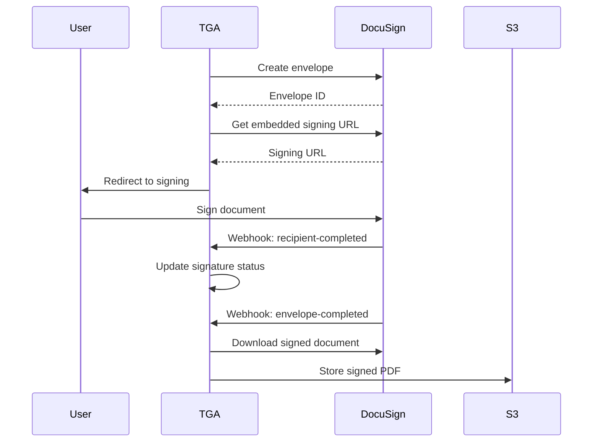

## Overview

TGA integrates with [DocuSign](https://www.docusign.com/) for electronic signature workflows. DocuSign enables secure, legally-binding signatures on grant agreements, exercise notices, warrant documents, and other legal paperwork.

## Capabilities

| Feature | Support |
|---------|---------|
| **Embedded Signing** | In-app signature experience |
| **Multi-Signer** | Multiple parties can sign |
| **Pre-filled Forms** | Automatic field population |
| **Document Storage** | Signed documents saved to S3 |
| **Webhooks** | Real-time status updates |

## Prerequisites

Before configuring DocuSign:

1. DocuSign developer or production account
2. DocuSign API credentials
3. Webhook endpoint configured
4. Admin access to your TGA organization

## Supported Document Types

| Document Type | Description |
|--------------|-------------|
| `GRANT_AGREEMENT` | Token grant agreements |
| `EXERCISE_NOTICE` | Option exercise forms |
| `WARRANT_AGREEMENT` | Warrant exercise documents |
| `OPTION_AGREEMENT` | Stock option agreements |
| `NDA` | Non-disclosure agreements |
| `EMPLOYMENT_AGREEMENT` | Employment contracts |
| `OFFER_LETTER` | Job offer letters |

## Configuration

### Step 1: DocuSign Account Setup

<Steps>
<Step title="Create DocuSign Account">
  Sign up at [developers.docusign.com](https://developers.docusign.com/) for development or [docusign.com](https://www.docusign.com/) for production.
</Step>

<Step title="Create Integration Key">
  Navigate to **Apps and Keys** and create a new app integration:
  - Note your **Integration Key** (Client ID)
  - Generate an **RSA Key Pair**
  - Note your **Account ID**
</Step>

<Step title="Configure Redirect URI">
  Add your application's redirect URI for OAuth callbacks.
</Step>
</Steps>

### Step 2: Environment Configuration

```bash
# Required environment variables
DOCUSIGN_INTEGRATION_KEY=your_integration_key
DOCUSIGN_USER_ID=your_user_id
DOCUSIGN_TARGET_ACCOUNT_ID=your_account_id
DOCUSIGN_RSA_PRIVATE_KEY=your_rsa_private_key_base64
```

<Warning>
Store credentials securely. Never commit private keys to version control.
</Warning>

### Step 3: Webhook Configuration

Configure DocuSign Connect to send events to TGA:

<Steps>
<Step title="Access Connect">
  In DocuSign Admin, go to **Connect** > **Add Configuration**
</Step>

<Step title="Configure Endpoint">
  Set the webhook URL:
  ```
  https://your-tga-domain/api/webhooks/docusign
  ```
</Step>

<Step title="Select Events">
  Enable these events:
  - `envelope-completed`
  - `recipient-completed`
  - `recipient-declined`
</Step>
</Steps>

## Signing Flow



## Document Creation

### Exercise Request Forms

TGA automatically creates exercise request documents with pre-filled data:

| Field | Source |
|-------|--------|
| Full Legal Name | Person record |
| Grant Date | Grant agreement date |
| Exercise Date | Selected exercise date |
| Number of Units | Exercise request amount |
| Redemption Method | Token or cash settlement |
| Bank Information | User-provided details |

### Tab Types

DocuSign tabs define where signatures and data appear:

| Tab Type | Description |
|----------|-------------|
| `SIGN_HERE` | Signature field |
| `INITIAL_HERE` | Initials field |
| `DATE_SIGNED` | Auto-populated date |
| `FULL_LEGAL_NAME` | Pre-filled name |
| `TEXT` | Custom text field |

## Webhook Events

### Envelope Completed

Triggered when all parties have signed:

```typescript
// Webhook payload processing
{
    event: 'envelope-completed',
    envelopeId: 'xxx-xxx-xxx',
    status: 'completed'
}
```

**TGA Actions:**
1. Download signed document
2. Upload to S3 storage
3. Update document record
4. Update exercise request status

### Recipient Completed

Triggered when a single recipient signs:

```typescript
{
    event: 'recipient-completed',
    envelopeId: 'xxx-xxx-xxx',
    recipientId: 'xxx',
    status: 'completed',
    signedDateTime: '2024-01-15T10:30:00Z'
}
```

### Recipient Declined

Triggered when a recipient declines to sign:

```typescript
{
    event: 'recipient-declined',
    envelopeId: 'xxx-xxx-xxx',
    recipientId: 'xxx',
    declinedDateTime: '2024-01-15T10:30:00Z'
}
```

## Embedded Signing

TGA uses embedded signing for seamless in-app experience:

1. **Create Envelope** - Document with all signers
2. **Generate URL** - Short-lived signing URL
3. **Embed in App** - User signs within TGA
4. **Return URL** - User redirected back after signing

### Client ID Requirement

For embedded signing, the first recipient must have a `clientUserId`:

```typescript
{
    name: "John Doe",
    email: "john@example.com",
    clientUserId: roleInOrgID  // Enables embedded signing
}
```

## Troubleshooting

<AccordionGroup>
<Accordion title="'No docusign target account id found'">
**Cause:** The `DOCUSIGN_TARGET_ACCOUNT_ID` environment variable is not set.

**Solution:**
1. Log in to DocuSign admin
2. Find your Account ID in account settings
3. Set the environment variable
</Accordion>

<Accordion title="'No exercise form file found'">
**Cause:** The grant type doesn't have an exercise form template configured.

**Solution:**
1. Upload an exercise form template for the grant type
2. Configure signing tabs on the template
3. Set the template as the exercise form
</Accordion>

<Accordion title="'No signer tabs found'">
**Cause:** The document template doesn't have signature fields configured.

**Solution:**
1. Edit the grant configuration
2. Add signer tabs with position coordinates
3. Mark at least one tab as `isRecipient: true`
</Accordion>

<Accordion title="Signed document not appearing">
**Cause:** Webhook processing failed or S3 upload failed.

**Solutions:**
1. Check webhook logs for errors
2. Verify S3 bucket configuration
3. Check DocuSign Connect logs
4. Manually trigger document download via admin
</Accordion>

<Accordion title="Recipient not found in signature request">
**Cause:** DocuSign recipient ID doesn't match database record.

**Solution:**
1. This can happen with envelopes from other environments
2. Verify the envelope was created by this TGA instance
3. Check recipient ID mapping in database
</Accordion>
</AccordionGroup>

## Security Considerations

<Note>
DocuSign provides legally-binding electronic signatures with comprehensive audit trails.
</Note>

1. **Authentication** - JWT authentication with RSA keys
2. **Encryption** - All documents encrypted in transit and at rest
3. **Audit Trail** - Complete signing history maintained
4. **Compliance** - eIDAS, ESIGN, and UETA compliant
5. **Webhook Security** - Verify webhook signatures

## API Reference

### Service Methods

| Method | Description |
|--------|-------------|
| `createNewDocument` | Create document with optional DocuSign envelope |
| `updateEnvelopeRecipientStatus` | Update signer status from webhook |
| `getEnvelopeRecipients` | Get all recipients and their status |
| `getSignedEnvelopeFromDocumentAndSave` | Download and store signed PDF |
| `createEmbeddedExerciseRequestFormDocusignEnvelope` | Create exercise form for signing |
| `createWarrantExerciseNoticeEnvelope` | Create warrant exercise document |

### Environment Variables

| Variable | Description |
|----------|-------------|
| `DOCUSIGN_INTEGRATION_KEY` | OAuth client ID |
| `DOCUSIGN_USER_ID` | Impersonated user ID |
| `DOCUSIGN_TARGET_ACCOUNT_ID` | DocuSign account ID |
| `DOCUSIGN_RSA_PRIVATE_KEY` | RSA private key (base64) |

## Support

- **DocuSign Developer Center**: [developers.docusign.com](https://developers.docusign.com/)
- **DocuSign Support**: [support.docusign.com](https://support.docusign.com/)
- **TGA Support**: [tga-support@toku.com](mailto:tga-support@toku.com)
