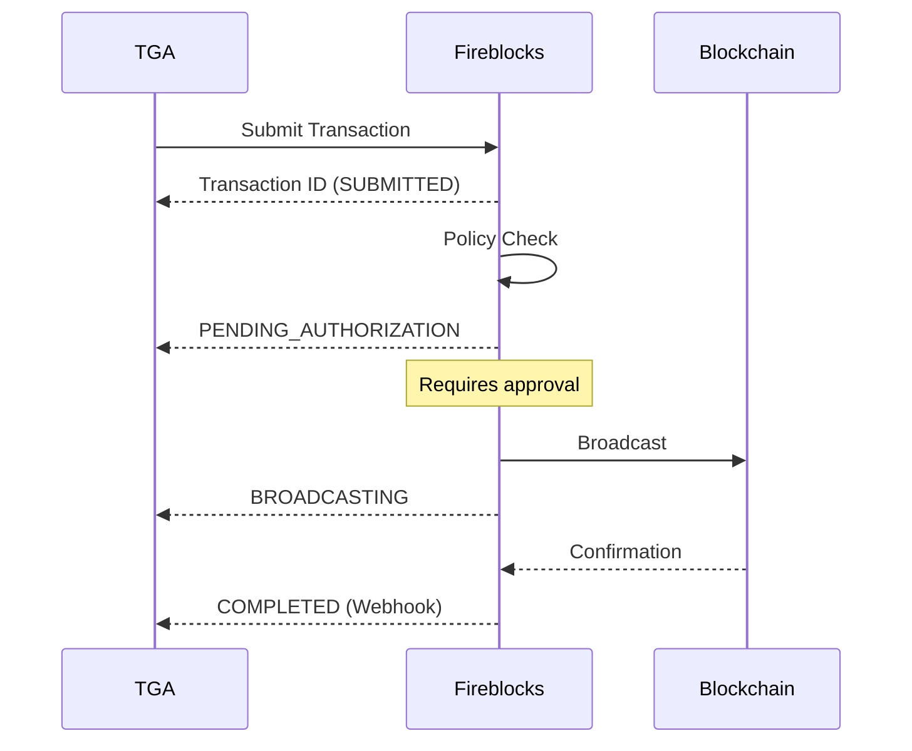

## Overview

TGA integrates with [Fireblocks](https://www.fireblocks.com/) to enable secure custody and stablecoin payroll functionality. Fireblocks provides institutional-grade wallet infrastructure with multi-signature security.

## Capabilities

| Feature | Support |
|---------|---------|
| **Wallet Management** | Create, list, and manage vault accounts |
| **Token Transfers** | Submit and track transactions |
| **Batch Transactions** | Sequential transaction submission |
| **Multi-Chain** | Ethereum, Polygon, Base, Optimism |
| **Webhooks** | Transaction status notifications |

## Prerequisites

Before configuring Fireblocks:

1. Active Fireblocks account (Production or Sandbox)
2. API user credentials (API Key + Secret Key)
3. Admin access to your TGA organization

## Configuration

### Step 1: Get Fireblocks Credentials

<Steps>
<Step title="Access Fireblocks Console">
  Log in to your Fireblocks console:
  - **Production**: [console.fireblocks.io](https://console.fireblocks.io)
  - **Sandbox**: [sandbox.fireblocks.io](https://sandbox.fireblocks.io)
</Step>

<Step title="Create API User">
  Navigate to **Settings** > **Users** > **Add User**
  - Select **API User** type
  - Follow the 3-step wizard to generate credentials
</Step>

<Step title="Download Credentials">
  Save your credentials securely:
  - **API Key**: Visible in the console
  - **Secret Key**: Download during setup (one-time only)
</Step>
</Steps>

<Warning>
Store your Secret Key securely. It cannot be downloaded again after initial setup.
</Warning>

### Step 2: Configure in TGA

<Steps>
<Step title="Navigate to Settings">
  Go to **Organization Settings** > **Integrations** > **Fireblocks**
</Step>

<Step title="Enter Credentials">
  - Paste your **API Key**
  - Paste your **Secret Key** (base64 encoded)
  - Select your environment (Production/Sandbox)
</Step>

<Step title="Test Connection">
  Click **Test Connection** to verify the integration works.
</Step>
</Steps>

## Supported Assets

Fireblocks supports a wide range of assets. Common ones used in TGA:

| Asset ID | Network | Description |
|----------|---------|-------------|
| `ETH` | Ethereum Mainnet | Native Ether |
| `ETH_TEST5` | Goerli Testnet | Test Ether |
| `USDC` | Ethereum Mainnet | USD Coin |
| `USDC_POLYGON` | Polygon | USDC on Polygon |
| `USDC_BASE` | Base | USDC on Base |
| `MATIC_POLYGON` | Polygon | Native MATIC |

## Transaction Flow

## Transaction Statuses

| Status | Description | Terminal |
|--------|-------------|----------|
| `SUBMITTED` | Transaction submitted to Fireblocks | No |
| `QUEUED` | Queued for processing | No |
| `PENDING_AUTHORIZATION` | Awaiting policy approval | No |
| `PENDING_SIGNATURE` | Awaiting signatures | No |
| `BROADCASTING` | Being broadcast to blockchain | No |
| `CONFIRMING` | Awaiting confirmations | No |
| `COMPLETED` | Successfully completed | Yes |
| `FAILED` | Transaction failed | Yes |
| `CANCELLED` | Transaction cancelled | Yes |
| `REJECTED` | Rejected by policy | Yes |

## Webhooks

TGA automatically processes Fireblocks webhooks for transaction status updates.

### Webhook Events

| Event | Description |
|-------|-------------|
| `TRANSACTION_STATUS_UPDATED` | Transaction status changed |
| `TRANSACTION_COMPLETED` | Transaction completed successfully |
| `TRANSACTION_FAILED` | Transaction failed |

### Webhook Configuration

In your Fireblocks console:

1. Go to **Settings** > **Webhooks**
2. Add webhook URL: `https://your-tga-domain/api/webhooks/fireblocks/transactions`
3. Select transaction events to receive
4. Download the webhook public key for signature verification

## Environment Handling

TGA automatically selects the correct Fireblocks environment:

| TGA Environment | Fireblocks API |
|-----------------|----------------|
| `local`, `dev`, `staging` | Sandbox API (`sandbox-api.fireblocks.io`) |
| `production` | Production API (`api.fireblocks.io`) |

## Troubleshooting

<AccordionGroup>
<Accordion title="Connection Test Fails">
**Possible Causes:**
- Invalid API Key or Secret Key
- Network connectivity issues
- Incorrect environment selection

**Solutions:**
1. Verify credentials are correct (no extra spaces)
2. Ensure Secret Key is base64 encoded
3. Check you're using the right environment (Production vs Sandbox)
</Accordion>

<Accordion title="Transaction Stuck in PENDING_AUTHORIZATION">
**Cause:** Transaction requires manual approval per Fireblocks policy.

**Solution:**
1. Log in to Fireblocks console
2. Navigate to **Transactions**
3. Find the pending transaction
4. Approve or reject as needed
</Accordion>

<Accordion title="Rate Limit Errors">
**Cause:** Too many API requests in a short period.

**Solution:**
1. TGA automatically retries with exponential backoff
2. For sustained high volume, contact Fireblocks support for rate limit increase
</Accordion>

<Accordion title="Webhook Not Receiving Updates">
**Possible Causes:**
- Webhook URL not configured correctly
- Firewall blocking incoming requests
- Webhook signature verification failing

**Solutions:**
1. Verify webhook URL is publicly accessible
2. Check firewall/security group settings
3. Ensure webhook public key is configured correctly
</Accordion>
</AccordionGroup>

## Security Best Practices

<Tip>
Follow these security recommendations for Fireblocks integration.
</Tip>

1. **Rotate API Keys regularly** - Generate new credentials periodically
2. **Use minimum required permissions** - Configure API user with only necessary access
3. **Enable transaction policies** - Set up approval workflows for large transactions
4. **Monitor audit logs** - Review Fireblocks audit logs regularly
5. **Secure webhook endpoint** - Always verify webhook signatures

## Support

- **Fireblocks Support**: support@fireblocks.com
- **Fireblocks Documentation**: [docs.fireblocks.com](https://docs.fireblocks.com)
- **TGA Support**: [tga-support@toku.com](mailto:tga-support@toku.com)
