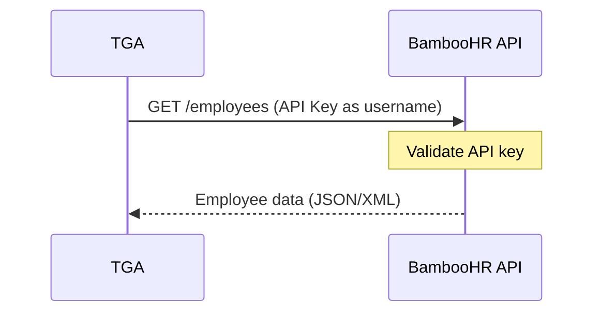

## Overview

TGA integrates with [BambooHR](https://www.bamboohr.com/) for streamlined HR data synchronization. BambooHR is a cloud-based HR platform designed for small and medium-sized businesses, offering employee records management, time-off tracking, and reporting.

## Capabilities

| Feature | Support |
|---------|---------|
| **Employee Sync** | Import and update employee records |
| **Directory Access** | Full employee directory access |
| **Custom Fields** | Map BambooHR custom fields |
| **Simple Auth** | API key authentication |

## Prerequisites

Before configuring BambooHR:

1. BambooHR account with API access
2. API key generated from BambooHR settings
3. Admin access to your TGA organization

## Configuration

### Step 1: Generate API Key

<Steps>
<Step title="Access BambooHR Settings">
  Log in to BambooHR and navigate to **Account** > **API Keys**.
</Step>

<Step title="Create API Key">
  Click **Add New Key**:
  - Enter a descriptive name (e.g., "TGA Integration")
  - Click **Generate Key**
  - Copy the API key immediately (it won't be shown again)
</Step>

<Step title="Note Your Subdomain">
  Your subdomain is the first part of your BambooHR URL:
  ```
  https://{subdomain}.bamboohr.com
  ```
</Step>
</Steps>

<Warning>
Copy your API key immediately after generation. BambooHR will not display it again.
</Warning>

### Step 2: Configure in TGA

<Steps>
<Step title="Navigate to Integrations">
  Go to **Organization Settings** > **Integrations** > **HRIS** > **BambooHR**
</Step>

<Step title="Enter Credentials">
  Provide the following:

  | Field | Description | Example |
  |-------|-------------|---------|
  | **Subdomain** | Your BambooHR subdomain | `acmecorp` |
  | **API Key** | Generated API key | `abc123...` |
  | **Password** | API key password (if set) | Leave blank if none |
</Step>

<Step title="Test Connection">
  Click **Test Connection** to verify the integration.
</Step>

<Step title="Configure Sync">
  Set up employee sync preferences and field mappings.
</Step>
</Steps>

## Authentication

BambooHR uses HTTP Basic Authentication with the API key:



### API Key Usage

The API key is used as the username in Basic Auth:
- **Username**: Your API key
- **Password**: `x` (literal character) or custom password if set

## API Endpoints

TGA uses the following BambooHR API endpoints:

| Endpoint | Purpose |
|----------|---------|
| `/v1/employees/directory` | Employee directory listing |
| `/v1/employees/{id}` | Individual employee details |
| `/v1/employees/changed` | Recently changed employees |
| `/v1/meta/fields` | Available fields metadata |

## Data Mapping

### Standard Fields

| BambooHR Field | TGA Field | Description |
|----------------|-----------|-------------|
| `id` | `externalEmployeeID` | Unique employee ID |
| `displayName` | `fullName` | Full display name |
| `firstName` | `givenName` | First name |
| `lastName` | `familyName` | Last name |
| `workEmail` | `email` | Work email address |
| `status` | `status` | Active/Inactive |
| `hireDate` | `hireDate` | Employment start date |
| `terminationDate` | `terminationDate` | Employment end date |
| `department` | `department` | Department name |
| `division` | `division` | Division name |
| `jobTitle` | `jobTitle` | Job title |
| `location` | `location` | Work location |
| `supervisorId` | `managerID` | Manager's employee ID |

### Custom Fields

BambooHR supports custom fields that can be mapped:

```typescript
{
    bambooField: "customFieldName",
    tgaField: "customAttribute",
    // Optional transformation
    transform: (value) => value.toUpperCase()
}
```

## Sync Behavior

### Directory Sync

TGA syncs the full employee directory:

1. Fetch all employees from directory endpoint
2. Compare with existing TGA records
3. Create new employees
4. Update changed records
5. Mark terminated employees

### Incremental Sync

For efficiency, use the changed employees endpoint:

```
GET /v1/employees/changed?since=2024-01-01T00:00:00Z
```

Returns only employees modified since the specified date.

## Employee Status Mapping

| BambooHR Status | TGA Status | Description |
|-----------------|------------|-------------|
| `Active` | Active | Currently employed |
| `Inactive` | Inactive | Temporarily inactive |
| `Terminated` | Terminated | No longer employed |

## Troubleshooting

<AccordionGroup>
<Accordion title="'Invalid API key'">
**Cause:** The API key is incorrect or has been revoked.

**Solutions:**
1. Verify the API key in BambooHR settings
2. Generate a new API key if needed
3. Ensure no extra spaces in the key
4. Check if the key was revoked
</Accordion>

<Accordion title="'Subdomain not found'">
**Cause:** The subdomain is incorrect.

**Solutions:**
1. Check your BambooHR URL
2. Use only the subdomain, not the full URL
3. Verify the subdomain is spelled correctly
</Accordion>

<Accordion title="'Access denied'">
**Cause:** API key doesn't have sufficient permissions.

**Solutions:**
1. Verify API key permissions in BambooHR
2. Generate a new key with full access
3. Contact BambooHR admin to check restrictions
</Accordion>

<Accordion title="'Employee data missing fields'">
**Cause:** Some fields may not be accessible via API.

**Solutions:**
1. Check field visibility settings in BambooHR
2. Ensure API access includes required fields
3. Review BambooHR field permissions
</Accordion>

<Accordion title="'Rate limit exceeded'">
**Cause:** Too many API requests in a short period.

**Solution:**
1. BambooHR has rate limits
2. TGA automatically handles rate limiting
3. Wait before retrying manual sync
4. Contact support if issue persists
</Accordion>
</AccordionGroup>

## Security Best Practices

<Note>
API keys provide full access to employee data. Protect them accordingly.
</Note>

1. **Unique API key** - Create a dedicated key for TGA
2. **Key naming** - Use descriptive names for API keys
3. **Regular rotation** - Rotate API keys periodically
4. **Access review** - Audit API key usage in BambooHR
5. **Revoke unused keys** - Delete keys no longer in use

## Limitations

| Limitation | Description |
|------------|-------------|
| **Read-only** | TGA does not write data back to BambooHR |
| **No payroll data** | BambooHR doesn't provide payroll APIs |
| **Rate limits** | API calls are rate-limited by BambooHR |
| **Field access** | Some fields may require additional permissions |

## API Reference

### Required Credentials

| Field | Type | Required | Description |
|-------|------|----------|-------------|
| `subdomain` | string | Yes | BambooHR subdomain |
| `apiKey` | string | Yes | BambooHR API key |
| `password` | string | Yes | API key password (or `x`) |

### Documentation Links

- [BambooHR API Documentation](https://documentation.bamboohr.com/reference/getting-started)
- [BambooHR API Reference](https://documentation.bamboohr.com/reference)

## Support

- **BambooHR Support**: support@bamboohr.com
- **BambooHR Documentation**: [documentation.bamboohr.com](https://documentation.bamboohr.com/)
- **TGA Support**: [tga-support@toku.com](mailto:tga-support@toku.com)
