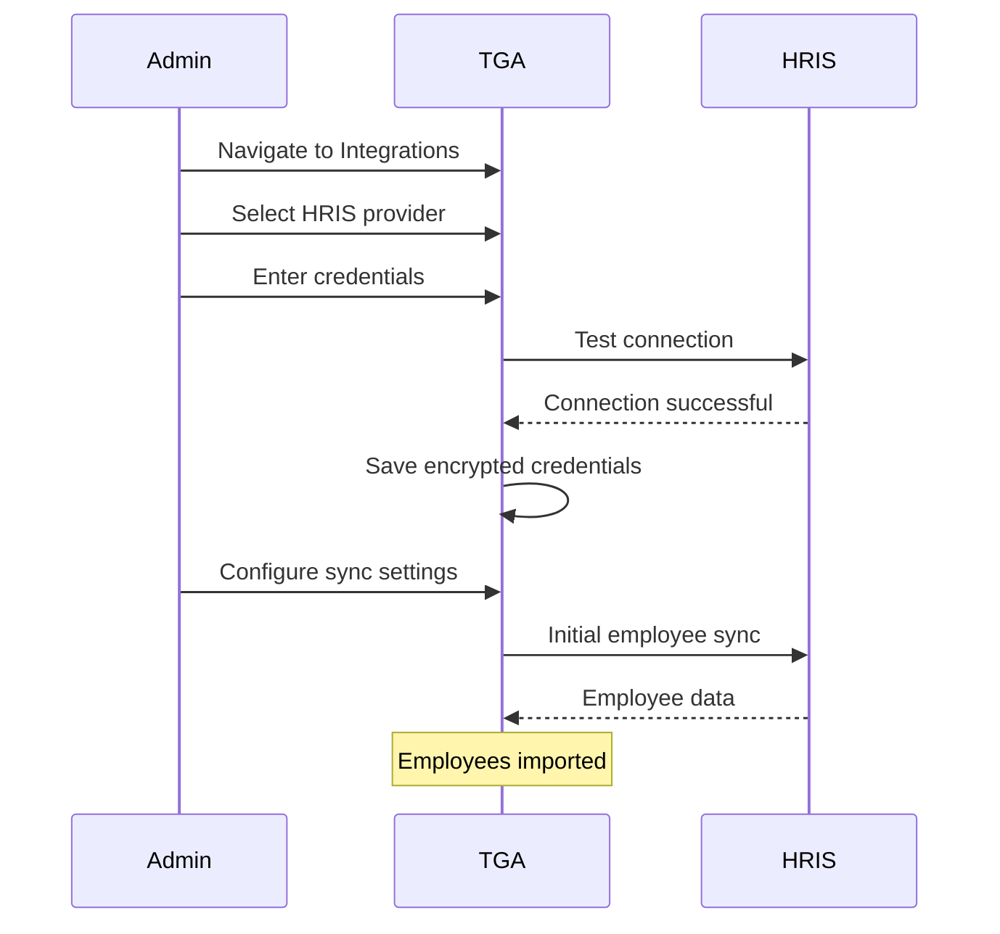

## Overview

TGA integrates with leading Human Resource Information Systems (HRIS) and payroll platforms to automatically sync employee data, enabling seamless token grant administration and payroll processing.

## Supported Integrations

| Platform | Type | Authentication | Status |
|----------|------|----------------|--------|
| [**ADP**](/integrations/hris/adp) | HRIS + Payroll | Client Credentials + Certificate | Active |
| [**Workday**](/integrations/hris/workday) | HRIS + Payroll | RAAS + SOAP/REST | Active |
| [**UKG**](/integrations/hris/ukg) | HRIS + Payroll | Basic Auth + API Key | Active |
| [**BambooHR**](/integrations/hris/bamboohr) | HRIS | API Key | Active |

## Capabilities

### Employee Data Sync

| Feature | Description |
|---------|-------------|
| **Auto-Import** | Automatically import new employees |
| **Profile Updates** | Sync changes to employee information |
| **Termination Handling** | Track employee departures |
| **Custom Fields** | Map custom HRIS fields to TGA |

### Payroll Integration

| Feature | Description |
|---------|-------------|
| **Payroll Data** | Import payroll run information |
| **Deduction Codes** | Configure token payroll deductions |
| **Pay Period Sync** | Align with your payroll calendar |
| **Reporting Groups** | Group employees for payroll submissions |

## Configuration Flow



## Sync History

TGA tracks all synchronization events:

| Field | Description |
|-------|-------------|
| `integrationType` | Which HRIS was synced |
| `syncTimestamp` | When the sync occurred |
| `recordsProcessed` | Total records examined |
| `recordsCreated` | New employees added |
| `recordsUpdated` | Existing employees updated |
| `errors` | Any sync errors |

## Employee Integration Records

For each synced employee, TGA maintains:

```typescript
{
    roleInOrgID: string;           // TGA user reference
    integrationType: 'ADP' | 'WORKDAY' | 'UKG' | 'BAMBOOHR';
    externalEmployeeID: string;    // HRIS employee ID
    externalPayrollID?: string;    // Payroll system ID
    isActive: boolean;
    isPrimary: boolean;
    lastSyncedAt: Date;
    syncedData: JSON;              // Snapshot of last sync
}
```

## Filter Configuration

Create reusable filters to control which employees sync:

| Filter Type | Example |
|-------------|---------|
| **Department** | Only sync Engineering department |
| **Location** | Sync US-based employees only |
| **Employment Type** | Full-time employees only |
| **Custom Field** | Based on HRIS custom fields |

## Credential Security

<Warning>
HRIS credentials provide access to sensitive employee data. Handle with care.
</Warning>

TGA secures integration credentials using:

1. **AES-256 Encryption** - Credentials encrypted at rest
2. **Initialization Vectors** - Unique IV per credential set
3. **Access Control** - Only admins can view/modify
4. **Audit Logging** - All credential access logged

## Best Practices

<Tip>
Follow these recommendations for successful HRIS integration.
</Tip>

1. **Use service accounts** - Don't use personal credentials
2. **Minimum permissions** - Grant only necessary access
3. **Regular rotation** - Rotate credentials periodically
4. **Test in sandbox** - Verify in test environment first
5. **Monitor sync logs** - Review sync history regularly

## Common Use Cases

### Token Grant Administration

1. Employee joins company (synced from HRIS)
2. Admin creates token grant for employee
3. Vesting tracked against employment dates
4. Termination triggers grant handling rules

### Stablecoin Payroll

1. Payroll data imported from HRIS
2. Token compensation calculated
3. Deductions posted back to HRIS
4. Settlement processed via custody

### Compliance Reporting

1. Employee data maintained in sync
2. Tax withholding calculated per jurisdiction
3. Reports generated from unified data
4. Audit trail maintained

## Troubleshooting

<AccordionGroup>
<Accordion title="Connection test fails">
**Possible Causes:**
- Invalid credentials
- Expired API keys or certificates
- Network/firewall issues
- HRIS service unavailable

**Solutions:**
1. Verify credentials are correct
2. Check if certificates have expired
3. Ensure TGA can reach HRIS endpoints
4. Check HRIS status page for outages
</Accordion>

<Accordion title="Employees not syncing">
**Possible Causes:**
- Sync filters excluding employees
- Missing required fields in HRIS
- Sync job not scheduled

**Solutions:**
1. Review filter configuration
2. Check HRIS data completeness
3. Verify sync is enabled and scheduled
4. Check sync history for errors
</Accordion>

<Accordion title="Duplicate employees created">
**Cause:** Employee ID mapping mismatch between HRIS and TGA.

**Solution:**
1. Check `externalEmployeeID` mapping
2. Review matching rules in sync settings
3. Merge duplicate records manually
4. Update HRIS data if needed
</Accordion>
</AccordionGroup>

## Support

- **TGA Support**: [tga-support@toku.com](mailto:tga-support@toku.com)
- Provider-specific support available on individual integration pages
