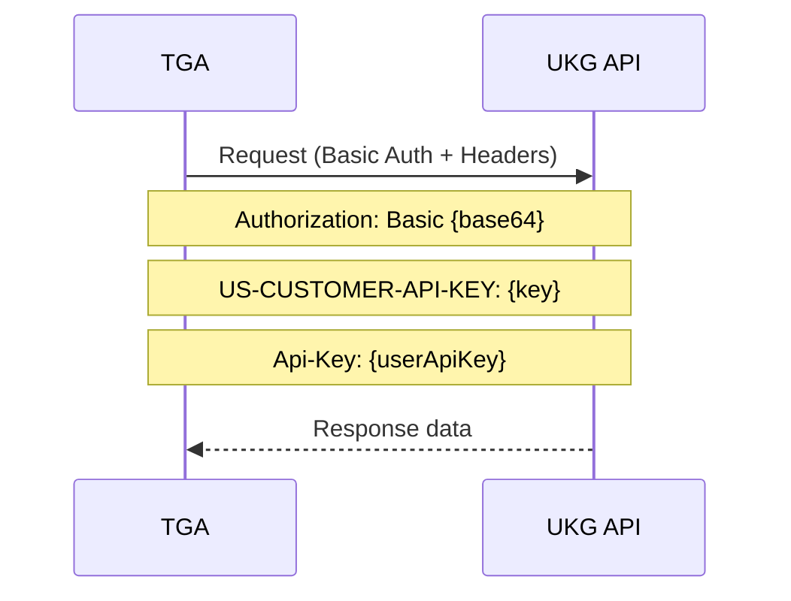
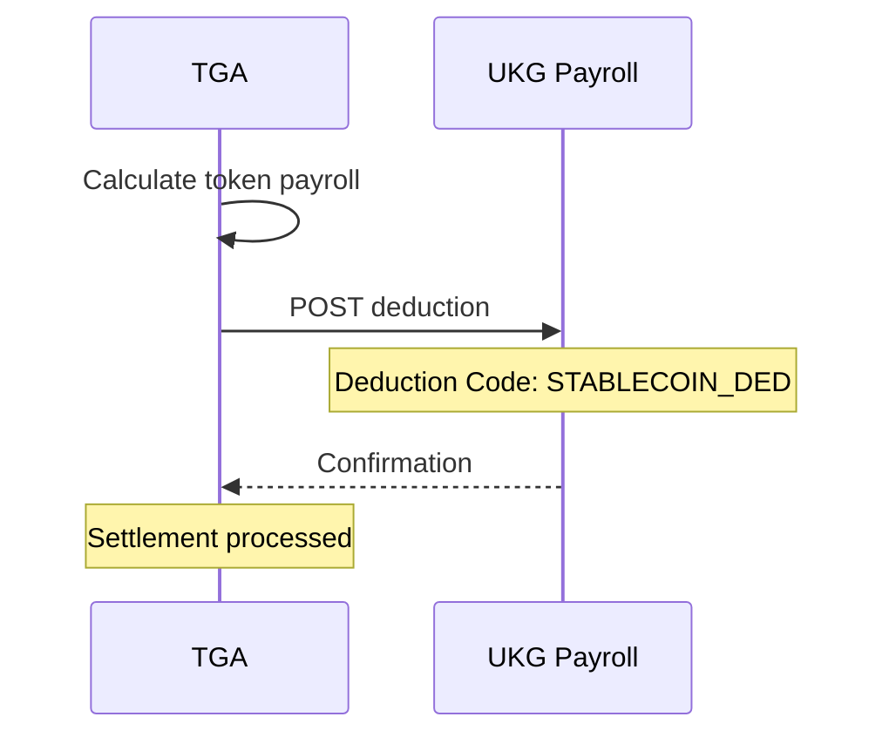

## Overview

TGA integrates with [UKG](https://www.ukg.com/) (Ultimate Kronos Group) for comprehensive HR and payroll data synchronization. UKG Pro provides human capital management solutions including HR, payroll, talent management, and workforce management.

## Capabilities

| Feature | Support |
|---------|---------|
| **Employee Sync** | Import worker records |
| **Payroll Data** | Access payroll and deduction data |
| **Deduction Posting** | Post token payroll deductions |
| **HCM Integration** | Full HCM API v1/v2 support |

## Prerequisites

Before configuring UKG:

1. UKG Pro account with API access
2. Service account credentials
3. API keys from UKG implementation
4. Admin access to your TGA organization

## Configuration

### Step 1: Obtain UKG Credentials

Contact your UKG implementation team to obtain:

<Steps>
<Step title="Service Endpoint URL">
  Your UKG API endpoint, typically:
  ```
  https://service5.ultipro.com/services
  ```
</Step>

<Step title="Tenant ID">
  Your organization's tenant identifier (visible in your UKG Pro URL).
  Example: `ACA100`
</Step>

<Step title="API Keys">
  - **User API Key**: Unique key for your service account
  - **Customer API Key**: 5-character organization identifier
</Step>

<Step title="Service Account">
  Create or obtain a service account with:
  - Username
  - Password
  - Appropriate permissions for HCM/Payroll access
</Step>
</Steps>

### Step 2: Configure in TGA

<Steps>
<Step title="Navigate to Integrations">
  Go to **Organization Settings** > **Integrations** > **HRIS** > **UKG**
</Step>

<Step title="Enter Credentials">
  Provide the following:

  | Field | Description | Required |
  |-------|-------------|----------|
  | **Service Endpoint URL** | UKG API endpoint | Yes |
  | **Tenant ID** | Organization identifier | Yes |
  | **User API Key** | Service account API key | Yes |
  | **Service Account Username** | Basic auth username | Yes |
  | **Service Account Password** | Basic auth password | Yes |
  | **Customer API Key** | 5-character org identifier | Yes |
  | **Deduction Code** | Token payroll deduction code | No |
</Step>

<Step title="Test Connection">
  Click **Test Connection** to verify the integration.
</Step>
</Steps>

## Authentication

UKG Pro uses Basic Authentication with additional API key headers:



### Required Headers

| Header | Value | Description |
|--------|-------|-------------|
| `Authorization` | `Basic {base64(username:password)}` | Service account credentials |
| `US-CUSTOMER-API-KEY` | 5-character code | Organization identifier |
| `Api-Key` | User API key | Service account API key |

## API Endpoints

TGA uses the following UKG Pro API endpoints:

| Endpoint | Version | Purpose |
|----------|---------|---------|
| `/personnel/v1/employees` | HCM v1 | Employee listing |
| `/personnel/v2/employees/{id}` | HCM v2 | Employee details |
| `/payroll/v1/pay-periods` | Payroll v1 | Pay period data |
| `/payroll/v1/employee-deductions` | Payroll v1 | Deduction management |

## Data Mapping

### Employee Fields

| UKG Field | TGA Field | Description |
|-----------|-----------|-------------|
| `employeeId` | `externalEmployeeID` | Unique employee ID |
| `firstName` | `givenName` | First name |
| `lastName` | `familyName` | Last name |
| `emailAddress` | `email` | Work email |
| `hireDate` | `hireDate` | Employment start |
| `terminationDate` | `terminationDate` | Employment end |
| `employeeStatus` | `status` | Active/Inactive/Terminated |
| `supervisorId` | `managerID` | Manager reference |
| `costCenter` | `costCenter` | Cost center |
| `department` | `department` | Department name |

## Deduction Integration

### Token Payroll Deductions

TGA can post deductions to UKG for stablecoin payroll:



### Deduction Code Configuration

Set up a post-tax deduction code in UKG:

| Setting | Value |
|---------|-------|
| **Code** | `STABLECOIN_DED` (or custom) |
| **Type** | Post-tax |
| **Calculation** | Fixed amount |
| **Description** | Token Payroll Deduction |

<Note>
Work with your UKG administrator to configure the deduction code before enabling this feature.
</Note>

## Sync Behavior

### Employee Sync

1. Fetch active employees from HCM API
2. Match against existing TGA records
3. Create new employee records
4. Update changed records
5. Mark terminated employees

### Payroll Sync

1. Fetch pay period information
2. Retrieve employee payroll data
3. Calculate token compensation
4. Post deductions (if configured)
5. Process settlement

## Troubleshooting

<AccordionGroup>
<Accordion title="'Authentication failed'">
**Possible Causes:**
- Incorrect username or password
- Invalid API keys
- Service account locked

**Solutions:**
1. Verify service account credentials
2. Check User API Key and Customer API Key
3. Verify service account is not locked
4. Contact UKG support if issues persist
</Accordion>

<Accordion title="'Invalid tenant ID'">
**Cause:** Tenant ID doesn't match the service endpoint.

**Solutions:**
1. Verify tenant ID from UKG Pro URL
2. Ensure endpoint URL matches your data center
3. Contact UKG implementation team
</Accordion>

<Accordion title="'API key rejected'">
**Cause:** API keys are incorrect or expired.

**Solutions:**
1. Verify Customer API Key (5 characters)
2. Check User API Key with UKG admin
3. Request new keys if needed
</Accordion>

<Accordion title="'Deduction posting failed'">
**Possible Causes:**
- Deduction code not configured in UKG
- Employee not eligible for deduction
- Payroll period closed

**Solutions:**
1. Verify deduction code exists in UKG
2. Check employee eligibility
3. Ensure payroll period is open
4. Review deduction rules in UKG
</Accordion>

<Accordion title="'Insufficient permissions'">
**Cause:** Service account lacks required API access.

**Solutions:**
1. Contact UKG administrator
2. Request HCM and Payroll API access
3. Verify role assignments for service account
</Accordion>
</AccordionGroup>

## Security Best Practices

<Warning>
UKG credentials provide access to sensitive HR and payroll data.
</Warning>

1. **Dedicated service account** - Don't use personal credentials
2. **Minimum permissions** - Grant only required API access
3. **Secure password** - Use strong, unique password
4. **Regular rotation** - Rotate credentials periodically
5. **Audit logging** - Enable UKG audit logs for API access
6. **IP restrictions** - Limit API access to TGA IPs if possible

## API Reference

### Required Credentials

| Field | Type | Required | Description |
|-------|------|----------|-------------|
| `serviceEndpointUrl` | string | Yes | UKG API endpoint URL |
| `tenantId` | string | Yes | Organization tenant ID |
| `userApiKey` | string | Yes | Service account API key |
| `username` | string | Yes | Service account username |
| `password` | password | Yes | Service account password |
| `customerApiKey` | string | Yes | 5-character org identifier |
| `deductionCode` | string | No | Token payroll deduction code |

### Documentation Links

- [UKG Developer Portal](https://developer.ukg.com/)
- [UKG API Authentication](https://developer.ukg.com/docs/authentication)

## Support

- **UKG Support**: Contact through UKG Pro support portal
- **UKG Developer Documentation**: [developer.ukg.com](https://developer.ukg.com/)
- **TGA Support**: [tga-support@toku.com](mailto:tga-support@toku.com)
