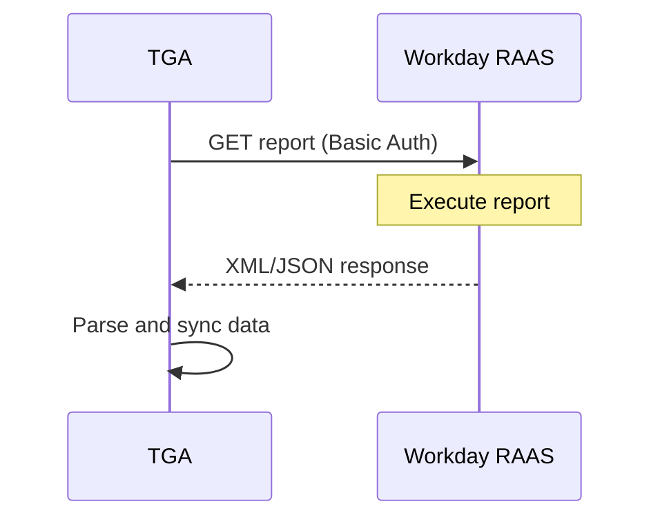
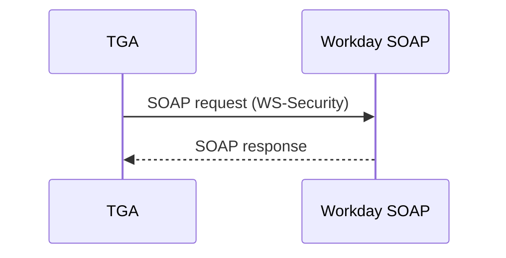
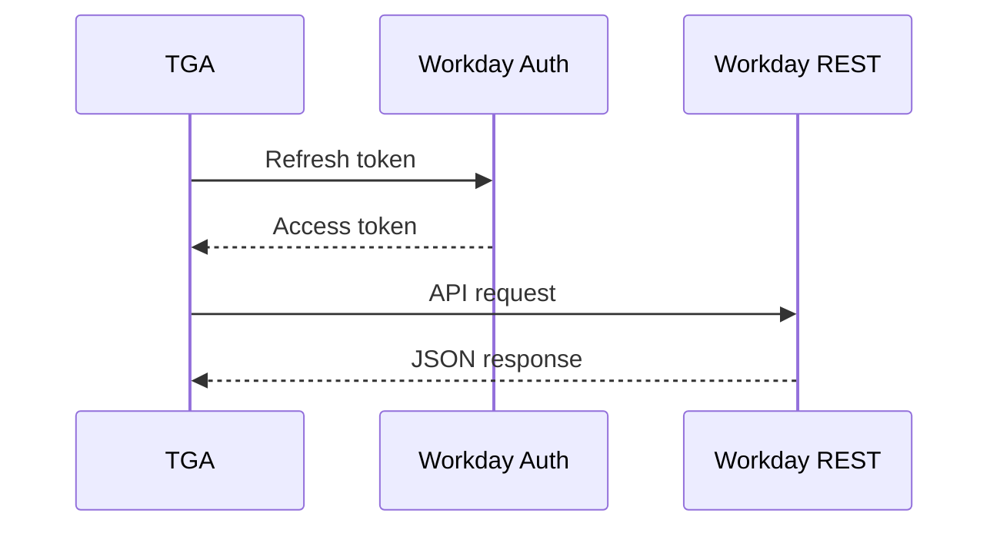

## Overview

TGA integrates with [Workday](https://www.workday.com/) for enterprise HR and payroll data synchronization. Workday provides a unified platform for human capital management, financial management, and planning.

## Capabilities

| Feature | Support |
|---------|---------|
| **Employee Sync** | Import worker records via RAAS |
| **Payroll Data** | Access payroll reports |
| **Custom Reports** | Use custom Workday reports |
| **Multiple Auth** | RAAS, SOAP, and REST options |

## Prerequisites

Before configuring Workday:

1. Workday tenant with API access
2. Integration System User (ISU) account
3. RAAS (Report-as-a-Service) reports configured
4. Admin access to your TGA organization

## Configuration

### Step 1: Create Integration User

<Steps>
<Step title="Access Workday">
  Log in to your Workday tenant as an administrator.
</Step>

<Step title="Create ISU Account">
  Create an Integration System User:
  1. Navigate to **Create Integration System User** task
  2. Set username and password
  3. Assign to appropriate security groups
</Step>

<Step title="Configure Security">
  Grant necessary domain permissions:
  - Worker Data access
  - Payroll data access (if needed)
  - Custom report execution
</Step>
</Steps>

### Step 2: Configure RAAS Reports

<Steps>
<Step title="Create Custom Report">
  Build a custom report with required employee fields or use existing reports.
</Step>

<Step title="Enable Web Service">
  Enable the report as a web service:
  1. Open report definition
  2. Select **Enable As Web Service**
  3. Note the report URL
</Step>

<Step title="Set Permissions">
  Grant the ISU access to execute the report.
</Step>
</Steps>

### Step 3: Configure in TGA

<Steps>
<Step title="Navigate to Integrations">
  Go to **Organization Settings** > **Integrations** > **HRIS** > **Workday**
</Step>

<Step title="Enter Credentials">
  Provide the following:

  | Field | Description | Required |
  |-------|-------------|----------|
  | **Username (RAAS access)** | ISU username | Yes |
  | **Password (RAAS access)** | ISU password | Yes |
  | **Tenant Endpoint URL** | Your Workday tenant URL | Yes |
  | **Reports Owner** | Report owner username | No |
  | **Tenant ID** | Workday tenant identifier | No |
  | **SOAP Username** | SOAP API username (if different) | No |
  | **SOAP Password** | SOAP API password | No |
  | **REST Refresh Token** | OAuth refresh token | No |
</Step>

<Step title="Test Connection">
  Click **Test Connection** to verify the integration.
</Step>
</Steps>

## Authentication Methods

### RAAS (Report-as-a-Service)

Primary method for data access:



### SOAP API

For specific integrations requiring SOAP:



### REST API (Optional)

For modern API endpoints with OAuth:



## Tenant Endpoint URL

Your Workday endpoint URL typically follows this format:

```
https://wd2-impl-services1.workday.com/ccx/service/{tenant}/
```

Or for RAAS reports:

```
https://wd2-impl-services1.workday.com/ccx/service/customreport2/{tenant}/{owner}/{report_name}
```

<Note>
The exact URL depends on your Workday implementation and data center location.
</Note>

## Data Mapping

### Employee Fields

| Workday Field | TGA Field | Description |
|---------------|-----------|-------------|
| `Employee_ID` | `externalEmployeeID` | Unique worker ID |
| `Legal_Name` | `fullName` | Employee legal name |
| `Work_Email` | `email` | Work email address |
| `Worker_Status` | `status` | Active/Terminated |
| `Hire_Date` | `hireDate` | Employment start |
| `Termination_Date` | `terminationDate` | Employment end |
| `Manager_ID` | `managerID` | Manager reference |
| `Cost_Center` | `costCenter` | Cost center code |
| `Department` | `department` | Department name |

### Custom Report Fields

Configure your RAAS report to include:

```xml
<Report_Entry>
    <Employee_ID>12345</Employee_ID>
    <Legal_Name>John Doe</Legal_Name>
    <Work_Email>john.doe@company.com</Work_Email>
    <Hire_Date>2023-01-15</Hire_Date>
    <Worker_Status>Active</Worker_Status>
    <!-- Custom fields -->
    <Token_Grant_Eligible>Yes</Token_Grant_Eligible>
</Report_Entry>
```

## Sync Behavior

### Scheduled Sync

TGA can sync on a schedule:
- Hourly (for real-time needs)
- Daily (recommended)
- Weekly (for stable workforces)

### Manual Sync

Admins can trigger manual syncs:
1. Navigate to HRIS integration
2. Click **Sync Now**
3. Monitor sync progress
4. Review sync results

## Troubleshooting

<AccordionGroup>
<Accordion title="'Authentication failed'">
**Possible Causes:**
- Incorrect username or password
- ISU account locked or disabled
- Password expired

**Solutions:**
1. Verify credentials in Workday
2. Check ISU account status
3. Reset password if expired
4. Verify account not locked due to failed attempts
</Accordion>

<Accordion title="'Report not found'">
**Cause:** RAAS report URL is incorrect or report not enabled as web service.

**Solutions:**
1. Verify report name in URL
2. Confirm report is enabled as web service
3. Check reports owner username
4. Verify ISU has report execution permissions
</Accordion>

<Accordion title="'Insufficient permissions'">
**Cause:** ISU lacks required domain security permissions.

**Solutions:**
1. Review ISU security group membership
2. Add required domain permissions:
   - Worker Data: View
   - Payroll Data: View (if needed)
3. Verify report-level permissions
</Accordion>

<Accordion title="'Timeout during sync'">
**Cause:** Report returns too much data or query is inefficient.

**Solutions:**
1. Add date filters to report
2. Reduce number of fields returned
3. Use incremental sync (modified since date)
4. Contact Workday admin for report optimization
</Accordion>

<Accordion title="'XML parsing error'">
**Cause:** Report format is unexpected or contains special characters.

**Solutions:**
1. Verify report output format (XML vs JSON)
2. Check for special characters in data
3. Review field data types
4. Contact support with sample error
</Accordion>
</AccordionGroup>

## Security Best Practices

<Warning>
Workday contains sensitive employee data. Secure all credentials carefully.
</Warning>

1. **Dedicated ISU** - Create a dedicated Integration System User for TGA
2. **Minimum permissions** - Grant only required domain access
3. **Password policy** - Follow your organization's password requirements
4. **IP restrictions** - Limit ISU access to TGA IP ranges (if possible)
5. **Audit logging** - Enable Workday audit logging for the ISU
6. **Regular review** - Periodically review ISU access and permissions

## API Reference

### Required Credentials

| Field | Type | Required | Description |
|-------|------|----------|-------------|
| `username` | string | Yes | RAAS access username |
| `password` | string | Yes | RAAS access password |
| `tenantEndPoint` | string | Yes | Workday tenant URL |
| `reportOwner` | string | No | Report owner username |
| `tenantID` | string | No | Tenant identifier |
| `soapUsername` | string | No | SOAP API username |
| `soapPassword` | string | No | SOAP API password |
| `restRefreshToken` | string | No | OAuth refresh token |

### Documentation Links

- [Workday Community](https://community.workday.com/)
- [Workday Integration Documentation](https://doc.workday.com/)

## Support

- **Workday Support**: Contact through Workday Community
- **Workday Documentation**: [community.workday.com](https://community.workday.com/)
- **TGA Support**: [tga-support@toku.com](mailto:tga-support@toku.com)
