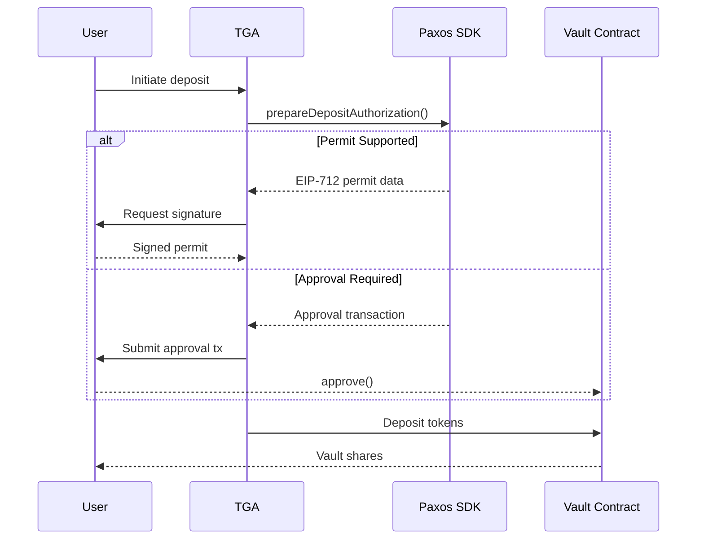
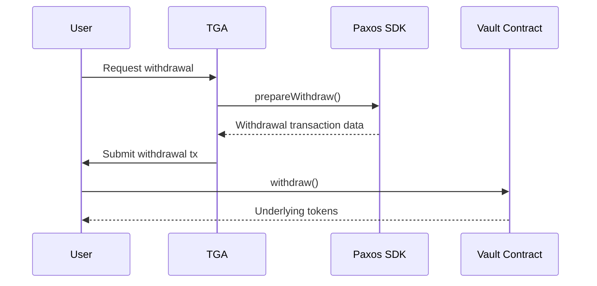

## Overview

TGA integrates with [Paxos Amplify](https://paxos.com/) for stablecoin yield generation. Paxos Amplify enables organizations to earn yield on stablecoin holdings through institutional-grade DeFi strategies.

## Capabilities

| Feature | Support |
|---------|---------|
| **Yield Generation** | Earn yield on stablecoin deposits |
| **Supported Assets** | USDC, USDT, PYUSD, USDG |
| **Deposit Methods** | Permit signatures or ERC-20 approvals |
| **Withdrawals** | Flexible withdrawal with slippage protection |
| **Position Tracking** | Real-time balance and yield monitoring |

## Prerequisites

Before configuring Paxos Amplify:

1. Paxos Amplify API key
2. Ethereum wallet with stablecoins
3. Admin access to your TGA organization

## Supported Assets

| Asset | Network | Token Address |
|-------|---------|---------------|
| **USDC** | Ethereum | `0xa0b86991c6218b36c1d19d4a2e9eb0ce3606eb48` |
| **USDT** | Ethereum | Standard Tether address |
| **PYUSD** | Ethereum | `0x6c3ea9036406852006290770bedfcaba0e23a0e8` |
| **USDG** | Ethereum | Paxos Gold-backed stablecoin |

## Configuration

### Step 1: Obtain Paxos API Key

Contact Paxos to obtain an Amplify API key for your organization.

### Step 2: Configure Environment

Add the API key to your environment:

```bash
# Environment configuration
PAXOS_AMPLIFY_API_KEY=your_api_key_here
```

<Warning>
Never commit API keys to version control. Use secure environment variable management.
</Warning>

## Deposit Flow



## Authorization Methods

TGA automatically detects the optimal authorization method:

| Method | Description | User Experience |
|--------|-------------|-----------------|
| **PERMIT** | EIP-712 gasless signature | Sign message only |
| **APPROVAL** | Standard ERC-20 approval | Submit approval transaction |
| **ALREADY_APPROVED** | Sufficient allowance exists | No action needed |

## Withdrawal Flow



### Slippage Protection

Withdrawals include configurable slippage protection:

| Parameter | Default | Description |
|-----------|---------|-------------|
| `slippage` | 50 bps (0.5%) | Maximum acceptable slippage |

## Position Tracking

Track yield positions with detailed breakdowns:

```typescript
interface PaxosPosition {
    totalValue: number;      // Total current value
    totalEarned: number;     // Total yield earned
    positions: Array<{
        tokenSymbol: string;
        depositedAmount: number;
        currentValue: number;
        apy: number;
        yieldEarned: number;
    }>;
}
```

## Yield Types

| Type | Description |
|------|-------------|
| **CORE** | Default yield strategy with balanced risk/reward |

## Troubleshooting

<AccordionGroup>
<Accordion title="'Paxos API key not configured'">
**Cause:** The `PAXOS_AMPLIFY_API_KEY` environment variable is not set.

**Solution:**
1. Verify the environment variable is set
2. Restart the application after adding the key
3. Check for typos in the variable name
</Accordion>

<Accordion title="'SDK not initialized'">
**Cause:** The Paxos SDK failed to initialize.

**Solutions:**
1. Verify the API key is valid
2. Check network connectivity to Paxos services
3. Review application logs for initialization errors
</Accordion>

<Accordion title="'Vault not found'">
**Cause:** The specified token or network is not supported for yield.

**Solution:**
1. Verify the token is in the supported assets list
2. Ensure you're on Ethereum mainnet
3. Check if the vault is active for the asset
</Accordion>

<Accordion title="'Insufficient allowance'">
**Cause:** The token approval is less than the deposit amount.

**Solution:**
1. The system will automatically prepare an approval transaction
2. User must approve the token spend
3. Retry the deposit after approval
</Accordion>
</AccordionGroup>

## Security Considerations

<Note>
Paxos Amplify uses institutional-grade security measures for yield generation.
</Note>

1. **Non-custodial** - Users retain control of their funds
2. **Audited contracts** - Smart contracts are audited by leading firms
3. **Regulated entity** - Paxos is a regulated financial institution
4. **Transparent yield** - APY and strategies are clearly disclosed

## API Reference

### Service Methods

| Method | Description |
|--------|-------------|
| `getSupportedAssets()` | List supported stablecoins |
| `getUserPosition(address)` | Get user's yield position |
| `prepareDepositAuthorization(params)` | Prepare deposit authorization |
| `prepareWithdraw(params)` | Prepare withdrawal transaction |

### Deposit Parameters

```typescript
interface DepositAuthParams {
    yieldType: 'CORE';           // Yield strategy type
    depositAsset: string;         // Token address
    depositAmount: string;        // Amount to deposit
    toAddress: string;            // Destination address
    chainId: number;              // Chain ID (1 for Ethereum)
}
```

### Withdrawal Parameters

```typescript
interface WithdrawParams {
    yieldType: 'CORE';            // Yield strategy type
    shareAmount: string;          // Vault shares to redeem
    wantAssetAddress: string;     // Desired output token
    userAddress: string;          // User's address
    chainId: number;              // Chain ID
    slippage?: number;            // Slippage in bps (default: 50)
}
```

## Support

- **Paxos Support**: Contact through your Paxos account
- **Paxos Documentation**: [docs.paxos.com](https://docs.paxos.com/)
- **TGA Support**: [tga-support@toku.com](mailto:tga-support@toku.com)
