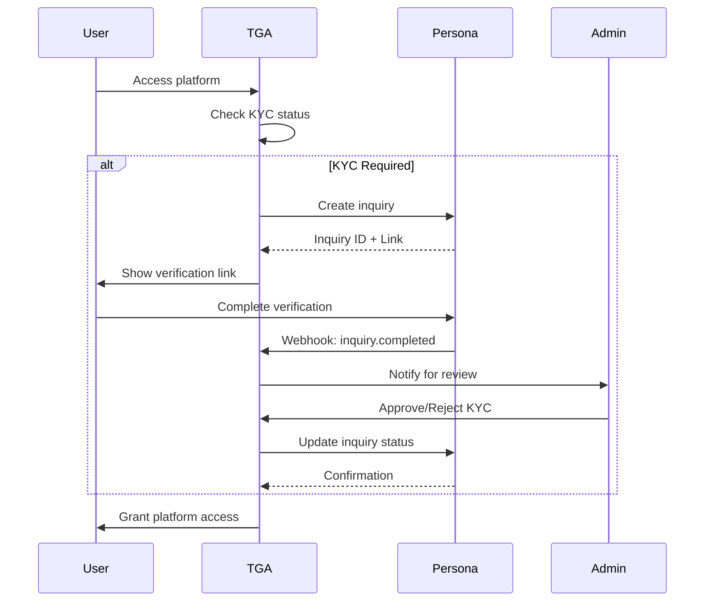

## Overview

TGA integrates with [Persona](https://withpersona.com/) for Know Your Customer (KYC) identity verification. Persona provides comprehensive identity verification workflows for compliance with regulatory requirements.

## Capabilities

| Feature | Support |
|---------|---------|
| **Identity Verification** | Government ID + selfie verification |
| **One-Time Links** | Secure verification URLs |
| **Webhooks** | Real-time status updates |
| **Admin Approval** | Manual review workflow |
| **Inquiry Management** | Approve/reject inquiries |

## Prerequisites

Before configuring Persona:

1. Persona account with API access
2. Inquiry template configured
3. Webhook endpoint configured
4. Admin access to your TGA organization

## Use Cases

| Scenario | KYC Required |
|----------|--------------|
| **Current Employees** | No (verified through HRIS) |
| **Ex-Employees** | Yes (for distributions) |
| **Contractors** | Configurable per organization |
| **Investors** | Yes (for compliance) |

## Configuration

### Step 1: Persona Account Setup

<Steps>
<Step title="Create Persona Account">
  Sign up at [withpersona.com](https://withpersona.com/) and create an organization.
</Step>

<Step title="Create Inquiry Template">
  Design your verification flow:
  - Government ID verification
  - Selfie verification
  - Additional questions (optional)
</Step>

<Step title="Generate API Key">
  Navigate to **Settings** > **API Keys** and create a new key.
</Step>
</Steps>

### Step 2: Environment Configuration

```bash
# Required environment variables
PERSONA_API_KEY=your_api_key
PERSONA_TEMPLATE_ID=your_inquiry_template_id
```

### Step 3: Webhook Configuration

<Steps>
<Step title="Access Webhooks">
  In Persona Dashboard, go to **Settings** > **Webhooks**
</Step>

<Step title="Add Endpoint">
  Configure webhook URL:
  ```
  https://your-tga-domain/api/webhooks/persona
  ```
</Step>

<Step title="Select Events">
  Enable these events:
  - `inquiry.completed`
  - `inquiry.approved`
  - `inquiry.rejected`
  - `inquiry.expired`
</Step>
</Steps>

## Verification Flow



## KYC Statuses

### System Status

| Status | Description |
|--------|-------------|
| `PENDING` | Awaiting user verification |
| `COMPLETED` | User completed verification, awaiting admin review |
| `VERIFIED` | Fully approved |
| `REJECTED` | Verification failed or rejected |

### Admin Approval Status

| Status | Description |
|--------|-------------|
| `PENDING` | Awaiting admin decision |
| `APPROVED` | Admin approved the verification |
| `REJECTED` | Admin rejected the verification |

## Webhook Events

### inquiry.completed

User finished the verification process:

```typescript
{
    event: 'inquiry.completed',
    data: {
        attributes: {
            'inquiry-id': 'inq_xxx',
            status: 'completed'
        }
    }
}
```

**TGA Actions:**
1. Update KYC status to `COMPLETED`
2. Notify organization admins
3. Queue for manual review

### inquiry.approved

Verification approved (if auto-approval enabled):

```typescript
{
    event: 'inquiry.approved',
    data: {
        attributes: {
            'inquiry-id': 'inq_xxx',
            status: 'approved'
        }
    }
}
```

### inquiry.rejected

Verification failed:

```typescript
{
    event: 'inquiry.rejected',
    data: {
        attributes: {
            'inquiry-id': 'inq_xxx',
            status: 'declined'
        }
    }
}
```

### inquiry.expired

Verification link expired:

```typescript
{
    event: 'inquiry.expired',
    data: {
        attributes: {
            'inquiry-id': 'inq_xxx'
        }
    }
}
```

## Admin Review Workflow

### Approving KYC

Organization admins can approve completed verifications:

1. Navigate to **Admin** > **KYC Requests**
2. Review verification details
3. Click **Approve** to grant access

```typescript
// Admin approval action
await kycService.approveKyc(kycDetailsID);
// Updates database status
// Notifies Persona of approval
```

### Rejecting KYC

Admins can reject with a reason:

1. Navigate to **Admin** > **KYC Requests**
2. Review verification details
3. Click **Reject** and provide reason

```typescript
// Admin rejection action
await kycService.rejectKyc(kycDetailsID, "Reason for rejection");
// Updates database status
// Notifies Persona of rejection
```

## One-Time Links

TGA uses one-time links for secure verification:

- **Generated on demand** - Fresh link each time user accesses
- **Short expiration** - Links expire after use
- **Secure** - Cannot be shared or reused

```typescript
// Get one-time verification link
const kycLink = await personaService.getOneTimeLinkForInquiry(inquiryId);
```

## Troubleshooting

<AccordionGroup>
<Accordion title="'Kyc details not found'">
**Cause:** No KYC record exists for the user.

**Solutions:**
1. Verify the user requires KYC (check employment type)
2. Create a new KYC inquiry for the user
3. Check if a previous inquiry was deleted
</Accordion>

<Accordion title="KYC link not working">
**Cause:** One-time links expire after use or after a timeout.

**Solution:**
1. Return to TGA to generate a fresh link
2. Links are one-time use only
3. Contact support if issue persists
</Accordion>

<Accordion title="'Your KYC verification has been rejected'">
**Cause:** Organization admin rejected the verification.

**Solutions:**
1. Contact your organization administrator
2. Request details on rejection reason
3. May need to submit new verification
</Accordion>

<Accordion title="Webhook not updating status">
**Cause:** Webhook delivery failed or isn't configured.

**Solutions:**
1. Verify webhook URL in Persona dashboard
2. Check webhook logs for delivery failures
3. Ensure TGA endpoint is publicly accessible
4. Verify webhook secret is configured correctly
</Accordion>

<Accordion title="Status stuck on 'COMPLETED'">
**Cause:** Awaiting admin approval.

**Solutions:**
1. Contact organization admin to review
2. Admins must manually approve completed verifications
3. Check admin notifications are enabled
</Accordion>
</AccordionGroup>

## Security Considerations

<Warning>
KYC data is sensitive personal information. Handle with appropriate security measures.
</Warning>

1. **Data Minimization** - Only collect necessary information
2. **Access Control** - Limit who can view KYC details
3. **Audit Logging** - Track all KYC approvals/rejections
4. **Data Retention** - Follow regulatory requirements for data retention
5. **Webhook Security** - Validate webhook signatures

## API Reference

### KYC Service Methods

| Method | Description |
|--------|-------------|
| `getKycDetailsForRole` | Get user's KYC status and link |
| `approveKyc` | Admin approve verification |
| `rejectKyc` | Admin reject verification |

### Persona Service Methods

| Method | Description |
|--------|-------------|
| `getOneTimeLinkForInquiry` | Generate secure verification link |
| `approveInquiry` | Send approval to Persona |
| `rejectInquiry` | Send rejection to Persona |

### Data Model

```typescript
interface KycDetails {
    kycDetailsID: string;
    roleInOrgID: string;
    kycID: string;              // Persona inquiry ID
    kycStatus: KycStatus;
    adminKycApprovalStatus: AdminKycApprovalStatus;
    approvedAt?: Date;
    approvedByRoleInOrgID?: string;
    rejectedAt?: Date;
    rejectedByRoleInOrgID?: string;
    adminKycApprovalComment?: string;
}
```

## Support

- **Persona Documentation**: [docs.withpersona.com](https://docs.withpersona.com/)
- **Persona Support**: Available through dashboard
- **TGA Support**: [tga-support@toku.com](mailto:tga-support@toku.com)
