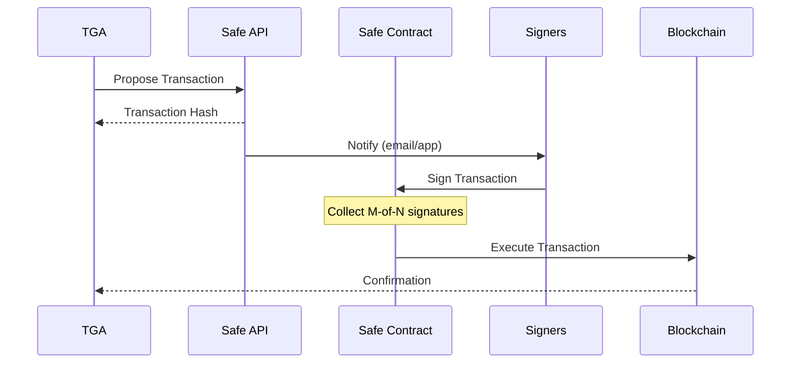

## Overview

TGA integrates with [Safe](https://safe.global/) (formerly Gnosis Safe) to enable multi-signature wallet functionality. Safe provides secure, decentralized custody through smart contract wallets that require multiple approvals for transactions.

## Capabilities

| Feature | Support |
|---------|---------|
| **Wallet Verification** | Verify Safe ownership and signers |
| **Transaction Proposals** | Create transactions requiring multisig approval |
| **Multi-Chain** | Ethereum and Polygon networks |
| **Threshold Management** | Support for any M-of-N configuration |

## Prerequisites

Before using Safe integration:

1. An existing Safe wallet on a supported network
2. Admin access to your TGA organization
3. Safe API key (for higher rate limits)

## Supported Networks

| Network | Chain ID | Safe API |
|---------|----------|----------|
| **Ethereum Mainnet** | 1 | `safe-transaction-mainnet.safe.global` |
| **Polygon** | 137 | `safe-transaction-polygon.safe.global` |

## Configuration

### Step 1: Obtain Safe API Key

<Steps>
<Step title="Access Safe Developer Portal">
  Navigate to [developer.safe.global](https://developer.safe.global)
</Step>

<Step title="Create Account">
  Sign up or log in to your Safe developer account.
</Step>

<Step title="Generate API Key">
  Go to **API Keys** section and generate a new key.

  <Note>
  API keys are JWT tokens valid for 5 years.
  </Note>
</Step>

<Step title="Copy the Key">
  Copy the generated API key for use in TGA configuration.
</Step>
</Steps>

### Step 2: Configure Environment

Add the Safe API key to your environment:

```bash
# .env.local or deployment environment
SAFE_API_KEY=your_jwt_token_here
```

<Warning>
Never commit API keys to version control. Use secure environment variable management.
</Warning>

## Rate Limits

| Authentication | Rate Limit | Notes |
|----------------|------------|-------|
| **No API Key** | 5 req/sec | Default public limit - causes frequent errors |
| **With API Key** | Higher tier | Contact support@safe.global for custom limits |

## Connecting a Safe Wallet

<Steps>
<Step title="Navigate to Wallet Settings">
  In TGA, go to **Settings** > **Wallet Configuration**
</Step>

<Step title="Select Safe Option">
  Choose **Connect Safe Wallet** from the available options.
</Step>

<Step title="Enter Safe Address">
  Paste your Safe wallet address (0x...).
</Step>

<Step title="Select Network">
  Choose the network where your Safe is deployed (Ethereum or Polygon).
</Step>

<Step title="Verify Ownership">
  TGA will verify you're a signer on the Safe.
</Step>
</Steps>

## Transaction Flow

When distributing tokens through a Safe wallet:



## Error Handling

TGA handles common Safe API errors automatically:

| Error Code | Description | User Message |
|------------|-------------|--------------|
| **401** | Unauthorized | Invalid or missing Safe API key |
| **429** | Rate Limited | Too many requests - wait and retry |
| **404** | Not Found | Safe doesn't exist on selected chain |

## Troubleshooting

<AccordionGroup>
<Accordion title="'SAFE_API_KEY environment variable is required'">
**Solution:** Set the `SAFE_API_KEY` environment variable in your deployment environment or `.env.local` file.
</Accordion>

<Accordion title="'Rate limit exceeded' or 'Too Many Requests'">
**Causes:**
- Making too many API requests in a short time
- API key not properly configured

**Solutions:**
1. Verify `SAFE_API_KEY` is set (authenticated requests have higher limits)
2. Wait 60 seconds before retrying
3. Contact support@safe.global for rate limit increase
</Accordion>

<Accordion title="'Unauthorized - Invalid or missing Safe API key'">
**Causes:**
- API key missing, expired, or invalid

**Solutions:**
1. Verify the API key is correctly set
2. Check if the key has expired (valid for 5 years)
3. Generate a new key from the Safe dashboard
4. Ensure no extra spaces or newlines in the key
</Accordion>

<Accordion title="'Safe doesn't exist on selected chain'">
**Cause:** The Safe address doesn't exist on the selected network.

**Solution:**
1. Verify the Safe address is correct
2. Ensure you've selected the correct network (Ethereum vs Polygon)
3. Check the Safe exists on [app.safe.global](https://app.safe.global)
</Accordion>
</AccordionGroup>

## Security Best Practices

1. **Use appropriate thresholds** - Set M-of-N based on your security requirements
2. **Verify signer addresses** - Ensure all signers are trusted parties
3. **Review transactions carefully** - All signers should verify transaction details
4. **Keep signers informed** - Ensure signers know when approvals are needed
5. **Rotate API keys** - Periodically generate new API keys

## Related Resources

- [Safe Global Documentation](https://docs.safe.global/)
- [Safe API Kit Reference](https://docs.safe.global/sdk/api-kit)
- [Safe Transaction Service](https://docs.safe.global/core-api/transaction-service-overview)
- [How to Use API Keys](https://docs.safe.global/core-api/how-to-use-api-keys)

## Support

- **Safe Support**: support@safe.global
- **Rate Limit Increases**: Contact support@safe.global with your use case
- **TGA Support**: [tga-support@toku.com](mailto:tga-support@toku.com)
