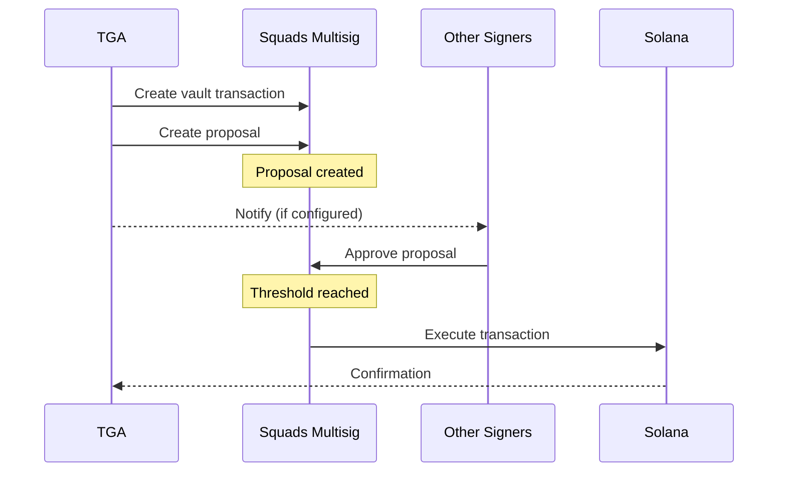

## Overview

TGA integrates with [Squads](https://squads.so/) for Solana multi-signature wallet functionality. Squads provides decentralized treasury management through smart contract wallets that require multiple approvals for transactions.

## Capabilities

| Feature | Support |
|---------|---------|
| **Multi-Sig Wallets** | M-of-N signature threshold |
| **Vault Management** | Multiple vaults per multisig |
| **Token Transfers** | SPL Token and Token-2022 support |
| **Transaction Proposals** | Create and execute proposals |
| **Member Management** | Add/remove signers |

## Prerequisites

Before configuring Squads:

1. Existing Squads multisig on Solana mainnet
2. Ability to add TGA as a signer to the multisig
3. Admin access to your TGA organization
4. Solana test wallet with SOL for transaction fees

## Supported Tokens

| Token | Program | Mint Address |
|-------|---------|--------------|
| **USDC** | SPL Token | Native USDC on Solana |
| **USDT** | SPL Token | Native USDT on Solana |
| **PYUSD** | Token-2022 | `2b1kV6DkPAnxd5ixfnxCpjxmKwqjjaYmCZfHsFu24GXo` |
| **AUSD** | Token-2022 | `AUSD1jCcCyPLybk1YnvPWsHQSrZ46dxwoMniN4N2UEB9` |

## Configuration

### Step 1: Add Squads Integration

<Steps>
<Step title="Navigate to Integrations">
  Go to **Organization Settings** > **Integrations** > **Squads**
</Step>

<Step title="Enter Multisig Address">
  Provide your Squads multisig address or vault address.

  <Note>
  TGA automatically detects whether you've provided a multisig or vault address and discovers the associated accounts.
  </Note>
</Step>

<Step title="Select Vault">
  Choose the vault (account) to use for token distributions.
</Step>

<Step title="Copy Signer Public Key">
  TGA generates a unique signer keypair. Copy the public key displayed.
</Step>
</Steps>

### Step 2: Add TGA Signer to Multisig

<Steps>
<Step title="Open Squads App">
  Navigate to [app.squads.so](https://app.squads.so) and open your multisig.
</Step>

<Step title="Add Member">
  Go to **Settings** > **Members** > **Add Member**
</Step>

<Step title="Enter TGA Public Key">
  Paste the TGA signer public key and set appropriate permissions.

  Required permissions:
  - **Proposer** - Create transaction proposals
  - **Voter** - Approve transactions (optional)
</Step>

<Step title="Approve Changes">
  Other multisig members must approve adding the new signer.
</Step>
</Steps>

### Step 3: Verify Integration

Return to TGA and click **Check Signer Status** to verify the integration is complete.

## Transaction Flow



## Member Permissions

| Permission | Description | TGA Requirement |
|------------|-------------|-----------------|
| **Proposer** | Can create transaction proposals | Required |
| **Voter** | Can approve/reject proposals | Optional |
| **Executor** | Can execute approved proposals | Optional |
| **Almighty** | Full access to all operations | Not recommended |

## Transaction Statuses

| Status | Description |
|--------|-------------|
| `Pending` | Proposal created, awaiting approvals |
| `Approved` | Threshold reached, ready to execute |
| `Executed` | Transaction successfully completed |
| `Cancelled` | Proposal was cancelled |
| `Rejected` | Proposal was rejected |

## Vault Discovery

TGA automatically discovers vaults associated with a multisig:

```typescript
// Vault information returned
{
    index: number;           // Vault index (0, 1, 2, etc.)
    vault: string;           // Vault PDA address
    solBalance: number;      // SOL balance
    tokens: Array<{
        mint: string;        // Token mint address
        amount: string;      // Token balance
        decimals: number;    // Token decimals
    }>;
}
```

## Troubleshooting

<AccordionGroup>
<Accordion title="'Signer not in multisig'">
**Cause:** The TGA signer hasn't been added to the multisig members.

**Solution:**
1. Copy the TGA signer public key from the integration page
2. Add the signer to your multisig in the Squads app
3. Wait for other members to approve
4. Click "Check Signer Status" in TGA
</Accordion>

<Accordion title="'Could not find multisig for vault address'">
**Cause:** The provided address isn't recognized as a Squads vault.

**Solutions:**
1. Verify the address is correct
2. Try using the multisig address instead
3. Ensure the multisig exists on Solana mainnet
</Accordion>

<Accordion title="'Insufficient balance'">
**Cause:** The vault doesn't have enough tokens for the transfer.

**Solution:**
1. Check vault balances in the Squads app
2. Transfer tokens to the vault
3. Verify the correct vault is selected
</Accordion>

<Accordion title="Transaction stuck in 'Pending'">
**Cause:** The transaction hasn't received enough approvals.

**Solution:**
1. Log in to the Squads app
2. Navigate to pending transactions
3. Have other signers approve the transaction
4. Execute once threshold is reached
</Accordion>

<Accordion title="'No Solana test transaction config found'">
**Cause:** TGA needs a fee payer wallet for transaction fees.

**Solution:**
1. Configure a Solana test transaction wallet in organization settings
2. Ensure the wallet has SOL for transaction fees
3. Provide the wallet's private key (JSON array or base58 format)
</Accordion>
</AccordionGroup>

## Security Best Practices

<Warning>
Multi-signature wallets are critical infrastructure. Follow security best practices.
</Warning>

1. **Use appropriate thresholds** - Set M-of-N based on security requirements
2. **Limit TGA permissions** - Only grant Proposer permission unless Voter is needed
3. **Monitor proposals** - Review all transaction proposals carefully
4. **Secure other signers** - Ensure all multisig members follow security practices
5. **Regular audits** - Review member list and permissions periodically

## External User Notifications

TGA can send setup notifications to external users who need to add the TGA signer:

```typescript
// Send setup notification
await sendSquadsSetupNotificationToExternalUser(
    orgID,
    "external@example.com",
    "External User Name"
);
```

The notification includes:
- TGA signer public key to add
- Multisig address
- Step-by-step instructions

## API Reference

### Integration Methods

| Method | Description |
|--------|-------------|
| `getSquadsIntegrationStatus` | Check integration status |
| `addSquadsIntegration` | Configure integration |
| `checkIfSignerIsInMultisig` | Verify signer membership |
| `getMultisigAccounts` | List vaults and balances |
| `getMultisigSigners` | List multisig members |
| `proposeTokenTransfer` | Create transfer proposal |
| `executeTokenTransferProposal` | Submit proposal to chain |
| `getSquadsTransactionStatus` | Check transaction status |

## Support

- **Squads Documentation**: [docs.squads.so](https://docs.squads.so/)
- **Squads App**: [app.squads.so](https://app.squads.so/)
- **TGA Support**: [tga-support@toku.com](mailto:tga-support@toku.com)
