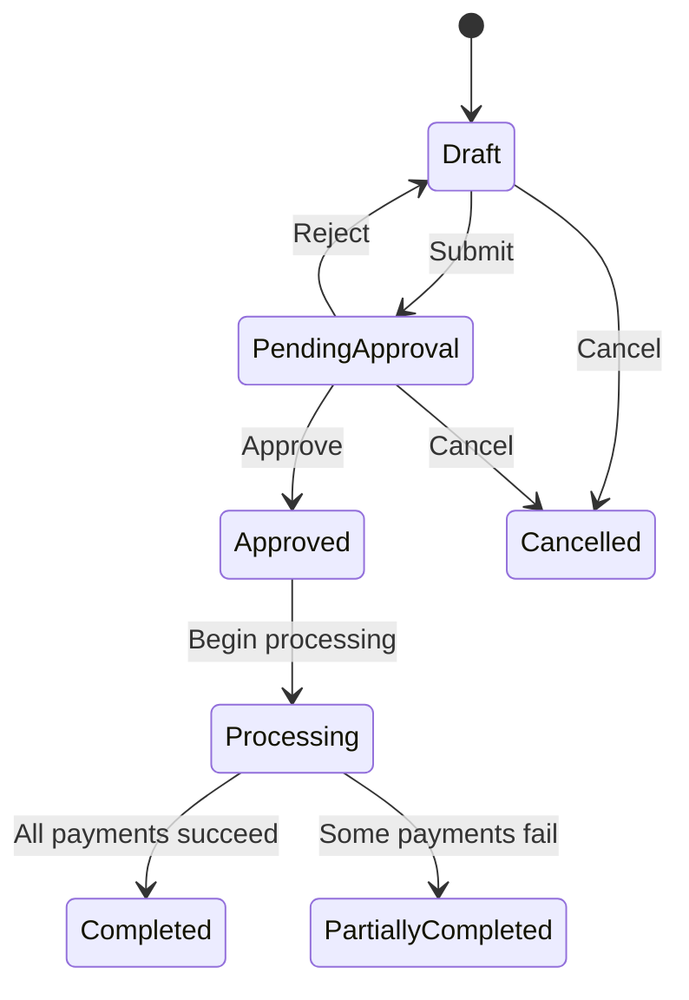

## Overview

Process payroll to pay employees their stablecoin compensation. Toku handles the conversion, tax withholding, and distribution automatically.

---

## Payroll Process

<Steps>
  <Step title="Review payroll data">
    Check that employee data is up to date and stablecoin elections are configured.
  </Step>
  <Step title="Create payroll run">
    Navigate to **Payroll** > **Run Payroll** and create a new payroll.
  </Step>
  <Step title="Set pay period">
    Select the pay period and pay date.
  </Step>
  <Step title="Review calculations">
    Verify gross pay, withholdings, and net amounts.
  </Step>
  <Step title="Approve payroll">
    Review the summary and approve for processing.
  </Step>
  <Step title="Process payments">
    Payments are sent to employee wallets.
  </Step>
</Steps>

---

## Creating a Payroll Run

<Tabs>
  <Tab title="Dashboard">
    <Steps>
      <Step title="Navigate to Payroll">
        Click **Payroll** in the sidebar.
      </Step>
      <Step title="Click Run Payroll">
        Select **Run Payroll** to start a new run.
      </Step>
      <Step title="Select pay period">
        Choose:
        - Pay period start and end dates
        - Pay date
        - Payroll type (regular, bonus, off-cycle)
      </Step>
      <Step title="Review employees">
        See all employees included in this payroll.
      </Step>
    </Steps>
  </Tab>
  <Tab title="API">
    Use the [Create On-Cycle Payroll](/api/payroll/create-on-cycle) or [Create Off-Cycle Payroll](/api/payroll/create-off-cycle) endpoint:

    ```bash
    curl -X POST "https://api.toku.com/api/payroll/createOnCyclePayroll" \
      -H "Authorization: Bearer YOUR_API_KEY" \
      -H "Content-Type: application/json" \
      -d '{
        "orgID": 100,
        "startDate": "2025-02-01",
        "endDate": "2025-02-28",
        "payDate": "2025-02-28"
      }'
    ```

    After creation, [finalize the payroll](/api/payroll/finalize) to approve it for processing.
  </Tab>
</Tabs>

---

## Payroll Calculations

### Gross to Net

For each employee, Toku calculates:

| Component | Description |
|-----------|-------------|
| **Gross Pay** | Total compensation for the period |
| **Tax Withholding** | Federal, state, and local taxes |
| **Deductions** | Benefits, 401k, etc. |
| **Net Pay** | Amount to be distributed |
| **Stablecoin Amount** | Net pay × stablecoin percentage |
| **Fiat Amount** | Net pay × fiat percentage |

### Stablecoin Conversion

1. Net stablecoin amount determined
2. Exchange rate locked at processing time
3. Exact stablecoin amount calculated
4. Amount sent to employee wallet

---

## Review and Approval

### Payroll Summary

Before approving, review:
- Total gross payroll
- Total withholdings
- Total net payroll
- Stablecoin vs. fiat breakdown
- Per-employee details

### Approval Workflow

Depending on your settings:
- Single approver
- Multiple approvers
- Automatic approval below threshold

---

## Payment Processing

### Stablecoin Payments
- Sent immediately upon approval
- Arrive in employee wallets same day
- Transaction hashes provided

### Traditional Payments
- Processed through your bank or payroll provider
- Standard ACH timing applies

---

## Payroll Types

### Regular Payroll
Standard scheduled payroll (weekly, bi-weekly, monthly).

### Bonus Payroll
One-time bonus payments outside regular schedule.

### Off-Cycle Payroll
Corrections, termination pay, or special payments.

---

## Payroll Status



| Status | Description |
|--------|-------------|
| **Draft** | Payroll created, not yet submitted |
| **Pending Approval** | Awaiting approver action |
| **Approved** | Approved, payments processing |
| **Processing** | Payments being sent |
| **Completed** | All payments successful |
| **Partially Completed** | Some payments failed |

---

## After Payroll

Once payroll completes:
- Employees receive payment notifications
- Payslips are generated
- Transaction records are stored
- Reports are updated

---

<Tip>
**Payroll Client Guide** — Step 4 of 5. [Previous: Payroll Integration Setup](/payroll/client/payroll-integration-setup) | [Next: Payroll Reporting](/payroll/client/reporting)
</Tip>

## Next Steps

<CardGroup cols={2}>
  <Card title="Reporting" icon="chart-bar" href="/payroll/client/reporting">
    View payroll reports
  </Card>
  <Card title="Payroll FAQ" icon="circle-question" href="/payroll/faq">
    Common questions
  </Card>
</CardGroup>
