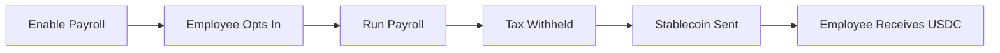

## What is Stablecoin Payroll?

Stablecoin Payroll is Toku's solution for paying employees in digital currencies while maintaining full compliance. It helps organizations:

- Offer stablecoin compensation as an employee benefit
- Process payroll in USDC, USDT, or other stablecoins
- Handle tax withholding and reporting automatically
- Integrate with existing HR and payroll systems
- Provide employees with flexible payout options

---

## Who Uses Stablecoin Payroll?

### Clients (Administrators)
Organization admins enable stablecoin payroll, configure settings, and process payments.

<Card title="Client Guides" icon="user-gear" href="/payroll/client/enabling-stablecoin-payroll">
  Set up stablecoin payroll
</Card>

### Employees
Employees opt into stablecoin payments and receive funds in their crypto wallets.

<Card title="Employee Guides" icon="user" href="/payroll/user/choosing-payout-method">
  Learn about receiving payments
</Card>

---

## How It Works



---

## Key Features

<CardGroup cols={2}>
  <Card title="Multiple Stablecoins" icon="coins">
    Support for USDC, USDT, and other major stablecoins
  </Card>
  <Card title="Tax Compliance" icon="file-invoice-dollar">
    Automatic tax withholding and reporting
  </Card>
  <Card title="HRIS Integration" icon="plug">
    Connect with your existing HR and payroll systems
  </Card>
  <Card title="Employee Choice" icon="hand-pointer">
    Let employees choose their payout mix
  </Card>
  <Card title="Multi-Network" icon="network-wired">
    Deploy on Ethereum, Polygon, and other networks
  </Card>
  <Card title="Instant Payments" icon="bolt">
    Same-day settlement for crypto payments
  </Card>
</CardGroup>

---

## Example: Paying Sarah in USDC

Sarah is a software engineer at Acme Corp. She's elected to receive 40% of her net pay in USDC on Polygon.

**1. Acme runs their bi-weekly payroll.** Toku calculates Sarah's gross pay of $7,500, withholds $2,100 in taxes, and determines her net pay of $5,400.

**2. Toku splits the payout.** Based on Sarah's 40% election:
- **$3,240** is deposited to her bank account via ACH
- **$2,160** is converted to USDC

**3. Stablecoin is sent on-chain.** Toku locks the exchange rate at processing time, converts $2,160 → 2,160.00 USDC, and sends it to Sarah's wallet on Polygon.

```json
{
  "employee": "Sarah Chen",
  "grossPay": 7500.00,
  "taxWithholding": 2100.00,
  "netPay": 5400.00,
  "fiatAmount": 3240.00,
  "stablecoinAmount": 2160.00,
  "stablecoin": "USDC",
  "network": "Polygon",
  "walletAddress": "0x1a2B...9cDE",
  "status": "Completed",
  "txHash": "0xabc123...def456"
}
```

**4. Sarah sees the deposit** in her wallet within minutes. Her payslip shows the full breakdown: gross pay, taxes, fiat deposit, and stablecoin transfer with the on-chain transaction hash.

---

## Supported Stablecoins

| Stablecoin | Networks |
|------------|----------|
| **USDC** | Ethereum, Polygon, Arbitrum, Optimism |
| **USDT** | Ethereum, Polygon, Tron |
| **DAI** | Ethereum, Polygon |

---

## Getting Started

<CardGroup cols={2}>
  <Card title="Enable Stablecoin Payroll" icon="toggle-on" href="/payroll/client/enabling-stablecoin-payroll">
    Set up for your organization
  </Card>
  <Card title="For Employees" icon="user" href="/payroll/user/choosing-payout-method">
    Choose your payout method
  </Card>
</CardGroup>
