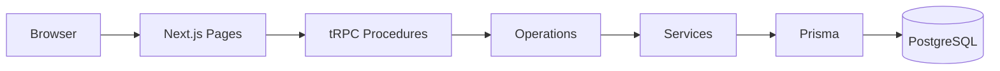
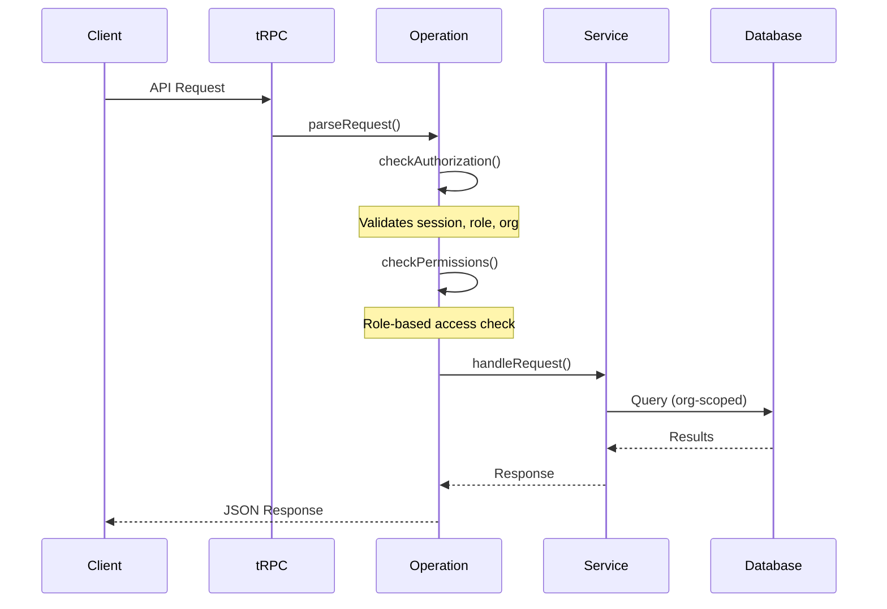
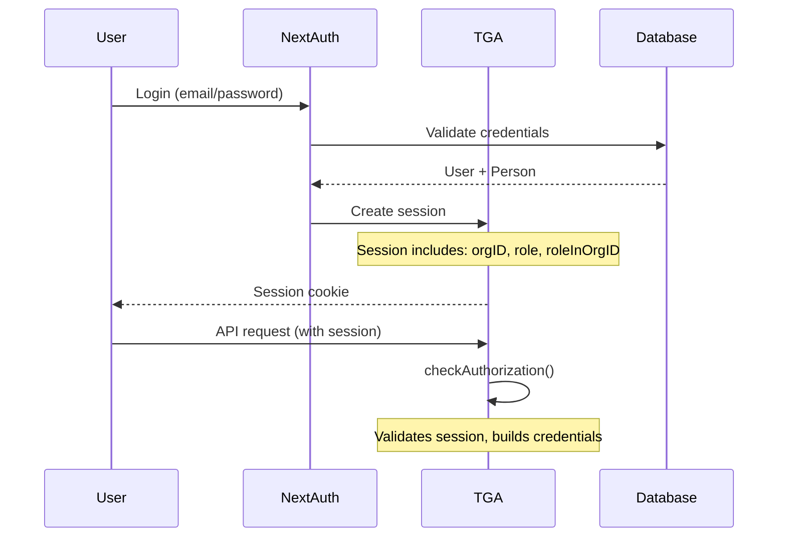

## Overview

TGA (Token Grant Administration) is a comprehensive platform for managing token-based compensation, built on a modern Next.js stack with enterprise-grade security and multi-tenancy support.

## Technology Stack

| Layer | Technology | Purpose |
|-------|------------|---------|
| **Frontend** | Next.js 13 (Pages Router) | Server-side rendered React application |
| **API** | tRPC | Type-safe API layer with TypeScript |
| **Database** | PostgreSQL | Multi-schema relational database |
| **ORM** | Prisma | Type-safe database access with extensions |
| **Auth** | NextAuth.js | Session-based authentication |
| **Monitoring** | New Relic, Sentry | Performance and error monitoring |

## Request Flow



### Layer Responsibilities

| Layer | Responsibility |
|-------|----------------|
| **Pages** | UI rendering, route handling |
| **tRPC Procedures** | Request routing, input validation |
| **Operations** | Authorization, business logic orchestration |
| **Services** | Domain-specific business logic |
| **Prisma** | Database queries with org-scoped filtering |

## Operations Framework

TGA uses an Operations pattern for all API endpoints, providing consistent authorization and audit logging.

### Operation Hierarchy

```
BaseOperation
├── PublicOperation          # No authentication required
└── AuthorisedOperation      # Requires login + org context
    ├── AdminOperation       # TOKU_ADMIN or CLIENT_ORG_ADMIN
    ├── TokuAdminOperation   # TOKU_ADMIN only
    ├── ClientAdminOperation # CLIENT_ORG_ADMIN only
    ├── FinanceAdminOperation# FINANCE_ADMIN, CLIENT_ORG_ADMIN, or TOKU_ADMIN
    ├── InvestorOperation    # INVESTOR role
    └── UserOperation        # Standard user operations
```

### Operation Lifecycle

Every operation follows this lifecycle:



### AuthorisedContext

Every authenticated operation receives context including:

```typescript
interface AuthorisedContext {
    credentials: {
        orgID: string;
        role: Role;
        roleInOrgID: string;
        loggedInUser: { userID: string; email: string };
        person: { personID: string; name: string };
        allRolesForPerson: Role[];
    };
    services: InjectedServices;
    authorisedPrisma: PrismaClient;  // Org-scoped queries
    captureActivityLog: (payload) => void;
    timezone: string;
}
```

## Database Architecture

### Multi-Schema Design

TGA uses PostgreSQL with multiple schemas for data isolation:

| Schema | Purpose | Scope |
|--------|---------|-------|
| `person_owned` | User and Person entities | Global |
| `org_owned` | Organization-level data | Per organization |
| `role_in_org_owned` | Role-scoped data (grants, wallets) | Per user-in-org |
| `workdao` | Core legacy entities | Mixed |
| `payroll` | Payroll processing data | Per organization |
| `tax_engine` | Tax calculation engine | Global |
| `authentication` | Auth tokens and nonces | Global |

### Prisma Extensions

TGA extends Prisma with custom middleware:

| Extension | Purpose |
|-----------|---------|
| `BaseExtension` | Core functionality, computed fields |
| `CredentialsExtension` | Auth-based query filtering |
| `TokuBucketOwnerShipValidationExtension` | Org-scope enforcement |
| `SettlementValidationExtension` | Payment validation rules |

### Automatic Org Filtering

The `authorisedPrisma` client automatically injects organization filters:

```typescript
// Developer writes:
const grants = await authorisedPrisma.grant.findMany({
    where: { status: 'ACTIVE' }
});

// Prisma extension adds:
// WHERE status = 'ACTIVE' AND orgID = {session.orgID}
```

<Note>
TOKU_ADMIN bypasses org filtering for cross-organization access.
</Note>

## Service Layer

### Service Injection

Services are injected into operations via dependency injection:

```typescript
// Services available in AuthorisedContext
services: {
    stakingService: StakingService;
    payrollService: PayrollService;
    walletService: WalletService;
    distributionService: DistributionService;
    settlementService: SettlementService;
    // ... 50+ services
}
```

### P0 Critical Services

These services handle money and security - changes require extra scrutiny:

| Service | Responsibility |
|---------|----------------|
| `fireblocks-service.ts` | Vault management, crypto transactions |
| `custody-management-service.ts` | Allocation, withdrawals |
| `anchorage-digital-service.ts` | Custody integration |
| `nestedSafeService/` | Gnosis Safe transactions |
| `stablecoin-payroll/` | Stablecoin payroll (16 files) |
| `token-payroll/` | Token compensation (18 files) |
| `vesting-service.ts` | Token vesting |
| `lockup-service.ts` | Token lockups |

## Authentication Flow



## Audit Logging

All operations can capture activity logs:

```typescript
authorisedContext.captureActivityLog({
    eventType: 'GRANT_CREATED',
    eventDescription: 'New token grant created',
    resourceType: 'Grant',
    resourceID: grant.grantID,
    metadata: { grantName: grant.grantName }
});
```

Activity logs include:
- Event type and description
- IP address and headers
- Organization and user context
- Resource references

## Environment Configuration

| Environment | API Behavior |
|-------------|--------------|
| `local`, `dev`, `staging` | Sandbox integrations, test data |
| `production` | Production APIs, real transactions |

## Related Platforms

TGA shares infrastructure with Lilith (payroll/HR platform):

| System | Port | Purpose |
|--------|------|---------|
| **TGA** | 3001 | Token grant administration |
| **Lilith** | 3000 | Payroll and HR management |

Both platforms share:
- PostgreSQL database
- Prisma schema (`apps/lilith/apps/nextjs/prisma/schema.prisma`)
- Core services
- Employee/User sync
